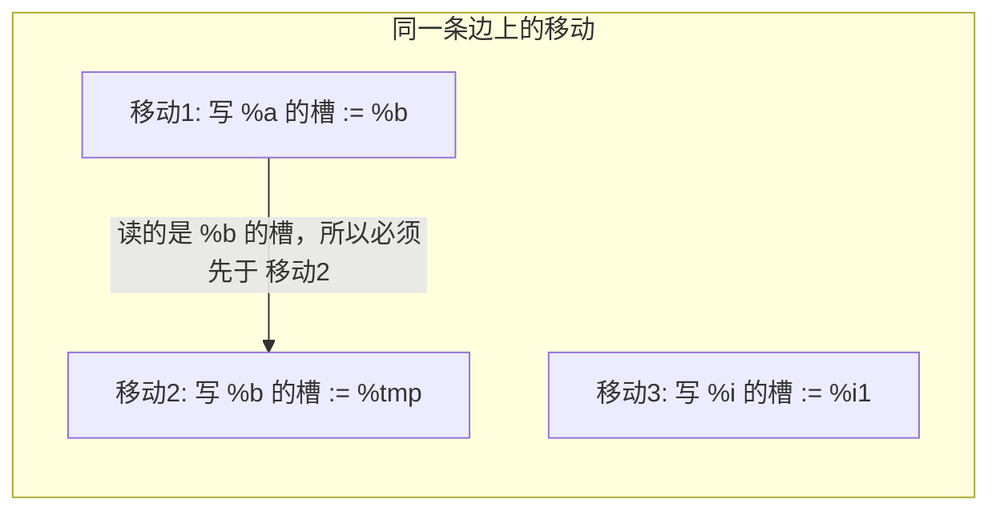
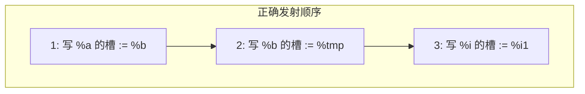

# Phi 移动顺序错误修复说明

**日期**: 2026-03-09
**涉及**: `src/mips/FunctionEmitter.cpp` — `EmitPhiMovesBeforeBranch`
**现象**: case_008 等用例第二行输出 `256`，期望 `55`（fib_iter(10) 与 fib_iter(10) 均应为 55）。

---

## 1. 控制流与 Phi 在做什么

以 `fib_iter` 的 for 循环为例，Mem2Reg 后结构大致如下：

```
                    entry
                      │
                      ▼
    ┌──────────► for.cond (循环头) ◄──────────┐
    │                  │                      │
    │            [phi %a, %b, %i]             │
    │                  │                      │
    │          br for.body / for.after        │
    │                  │                      │
    │    for.body      │      for.after       │
    │        ...       │         ...          │
    │                  │                      │
    │              for.step ◄─────────────────┘
    │                  │
    │            %tmp = %a + %b
    │            %i1  = %i + 1
    │                  │
    └──────────────────┘
```

循环头 `for.cond` 里有三个 phi，表示“从哪条边来就取哪个值”：

| 变量 | 从 entry 来 | 从 for.step 来 |
|:----:|:-----------:|:--------------:|
| %a   | 0           | **%b**（上一轮的 b） |
| %b   | 1           | **%tmp**       |
| %i   | 2           | **%i1**        |

也就是说：**从 for.step 跳回 for.cond 时**，我们需要在 for.step 末尾、跳转前，把「这一轮算好的值」写进 for.cond 里各个 phi 的**结果槽**，这样 for.cond 里用的 %a、%b、%i 才是正确的下一轮初值。

---

## 2. “一条边上的移动”在代码里是什么

在 `EmitPhiMovesBeforeBranch` 里，对**当前前驱块**和**当前分支**，会枚举每个**后继块**。对「前驱 → 后继」这条边：

- **`edge_phis`**：这条边上要做哪些“写槽”动作。
  每个元素是一对：**(要写入的 phi, 要取的值)**。
  - 代码类型：`std::pair<const ir::PhiInst*, const ir::Value*>`
  - 含义：把第二个值（可能来自前驱块里的某条指令/常量）写到第一个 phi 的栈槽里。

收集方式（与源码对应）：

```cpp
// 375-386 行：遍历后继块顶部的 phi，若某 phi 有一条边来自当前前驱，就记一笔
for (const auto& inst : succ->GetInstructions()) {
    auto* phi = dynamic_cast<const ir::PhiInst*>(inst.get());
    ...
    if (phi->GetIncomingBlock(i) == pred_block) {
        edge_phis.push_back({phi, phi->GetIncomingValue(i)});  // (写哪个phi的槽, 用哪个值)
        break;
    }
}
```

对「for.step → for.cond」这条边，`edge_phis` 里就有三条“移动”：

| 写谁的槽（phi） | 用的值（从哪里取） |
|:---------------:|:-------------------:|
| %a 的 phi       | %b                  |
| %b 的 phi       | %tmp                |
| %i 的 phi       | %i1                 |

后面我们会给这些“移动”一个**发射顺序**（先写谁、后写谁），然后按顺序生成：

- `LoadValueToReg(用的值, "$t0")`
- `sw $t0, value_offset_[写谁的phi]($sp)`

**这条边上“移动”的依赖关系**（谁必须比谁先写）：



即：**写 %a 的槽** 必须在 **写 %b 的槽** 之前执行，否则 %a 会读到已被覆盖的 %b。

---

## 3. 问题：顺序错了会怎样

关键点：**%a 的槽要写的是“当前 %b 的值”**，而 %b 的槽在这一条边上也会被写（写成 %tmp）。
所以：

- 若**先**执行「%b 的槽 := %tmp」，
- **再**执行「%a 的槽 := 从 %b 的槽读出来的值」，

那时 %b 的槽已经被覆盖成 %tmp 了，%a 就会错误地拿到 %tmp，递推错，结果变成 256 等。

正确做法：**先**把“从 %b 读出来写进 %a 的槽”做完，**再**把 %tmp 写进 %b 的槽。即：

- 先写「接收 b 的人」：%a 的槽 := %b；
- 后写「b 的生产者」：%b 的槽 := %tmp。

下面用两张图概括“错误顺序”和“正确顺序”。

**错误顺序（先写 b 再写 a）：**

```
  for.step 末尾、跳转前：

  1) %b 的槽 := %tmp     →  %b 的槽被覆盖
  2) %a 的槽 := 从 %b 的槽读  →  读到的已是 %tmp  ❌  (%a、%b 都变成 tmp)
  3) %i 的槽 := %i1
```

**正确顺序（先写 a 再写 b）：**

```
  1) %a 的槽 := %b       →  此时 %b 的槽还是上一轮的 b  ✓
  2) %b 的槽 := %tmp
  3) %i 的槽 := %i1
```

**顺序约束小结（Mermaid）：**



---

## 4. 修复思路：用“谁读谁”决定顺序

我们要的是一个**发射顺序**（sorted），使得：

- 若某次移动是「把 phi_B 的槽里的值写到 phi_A 的槽」（即 A 从 B 的槽“接收”），
- 则**所有这种“从 B 接收”的移动**都必须排在「把新值写进 B 的槽」的移动**之前**。

换句话说：

- **“接收者”先写**（先写 a 的槽 := b），
- **“生产者”后写**（后写 b 的槽 := tmp）。

实现方式：在往 `sorted` 里加“写 B 的槽”的移动时，检查：**所有“从 B 的槽读并写到别人槽里”的移动，是否都已经在 sorted 里**；只有都在了，才允许把“写 B 的槽”加入 sorted。这样按 sorted 顺序发射时，自然就是先写接收者、后写生产者。

### 和“块内 phi 谁先谁后”有关系吗？

**没有。** 决定发射顺序的只是**数据依赖**，不是后继块里 phi 指令的书写顺序。

- **块内顺序**：在 for.cond 里，IR 可能是 `%a = phi ...` 在 `%b = phi ...` 前面，也可能反过来。这只是编译器/前端生成 IR 时的顺序，**不表示**“应该先写 a 的槽再写 b 的槽”或反之。
- **我们关心的是**：在前驱块（for.step）末尾，我们要发射的是「写 a 的槽 := 从 b 读」「写 b 的槽 := tmp」。其中**写 a 的槽**会**读 b 的槽**，所以只要“写 b 的槽”在前面执行，a 就会读到被覆盖后的值，就错了。因此**必须**先写 a、再写 b，和 for.cond 里先写 %a 还是先写 %b 无关。

如果“写 %b 的槽 := %tmp”在“写 %a 的槽 := %b”**前面**发射，那就是**错误**顺序（正是本修复要避免的），会导致 a、b 都变成 tmp。正确做法永远是：**谁要读谁的槽，谁就先写；被读的那个槽后写**。

### 误区澄清：没有“来自本块”的 incoming，本质是可并行的

沿「for.step → for.cond」这条边，**所有要写进 phi 槽的值都来自前驱块 for.step**：%b 的当前值、%tmp、%i1 都在 for.step 里已经算好。不存在“从后继块 for.cond 本块刚算出来的值”作为这条边的 incoming——也就是说，**不可能有“来自本块”的 incoming**。
虽然 IR 上写的是「%a = phi [ %b, for.step ]」，这里的 **%b** 指的是“b 的槽里**当前**存的那份值”，这份值要么是 entry 时写的，要么是上一轮 for.step 末尾写进去的，所以从“数据从哪来”的角度，**也是来自前驱/上一轮**，不是 for.cond 本块新算的。

因此可以这样理解：

- **phi_a 和 phi_b 要填的值都来自 for.step**，在“数据来源”的意义上两者是独立的，**可以理解为可并行算**。
- 之所以不能随便先发射哪条，**唯一**原因是：其中一条移动要**读** b 的槽（写 a 的槽 := 从 b 的槽 load），另一条要**写** b 的槽（写 b 的槽 := tmp），所以必须“读”在“写”之前，即先发射写 a、再发射写 b。
- 没有这种“读/写同一槽”关系的移动，**先发射后发射都对**。例如「写 %i 的槽 := %i1」和「写 %a / 写 %b」之间没有依赖，顺序任意；只有「写 a（读 b 的槽）」和「写 b（写 b 的槽）」之间必须固定顺序。

**小结**：不是“块内 phi 有定义顺序所以要先写谁”；而是**只看谁读谁的槽**——读的必须先写，被读的必须后写；其余移动可视为可并行，顺序无关。

一句话：**对生成的 LLVM IR 来说这两条 phi 顺序可变，但翻译成 MIPS 时必须在同一条边上先写 a 的槽、再写 b 的槽**（因为我们的实现里“写 a”会读 b 的槽，“写 b”会覆盖 b 的槽）。

---

## 5. 代码里怎么表达“谁从谁接收”

**命名对照**（代码里用的是 pair，这里统一含义）：

| 代码 | 含义 |
|------|------|
| `p.first`  | 这条移动要**写**的 phi（写的是它的栈槽） |
| `p.second` | 这条移动要**取**的值（load 到 $t0 再 store 到 p.first 的槽） |

在代码里，一条移动用 `(phi, value)` 表示：

- **第一个**：要写入的 phi（写的是这个 phi 的栈槽）；
- **第二个**：要取的值（从哪 load 到 $t0 再 store）。

“A 从 B 的槽接收”在 `edge_phis` 里就是：存在另一条移动 `q`，其中 **q 要取的值是 phi_B**，即 `q.second == phi_B`，而 q 要写的槽是 phi_A，即 `q.first == phi_A`。

所以：

- 当前我们在考虑要不要把移动 `p` 加入 sorted；`p` 表示「写 p.first 的槽 := p.second」。
- 若 `p.first == phi_B`（即 p 是“写 B 的槽”），那么：
  - “从 B 接收”的移动就是所有满足 `q.second == p.first` 的 `q`；
  - 这些 `q` 的“接收者”是 `q.first`（要写的 phi）。
- 我们要求：所有这样的 `q.first` 都已经在 sorted 里（即这些 q 已经加入 sorted），才允许把 p 加入 sorted。

对应到“先写 a 再写 b”：

- p = (phi_b, %tmp)：写 b 的槽 := tmp。
  q = (phi_a, phi_b)：写 a 的槽 := 从 b 读。
  q.second == p.first（都是 phi_b），所以“从 b 接收”的是 phi_a。
  只有 sorted 里已经有 (phi_a, %b) 时，才把 (phi_b, %tmp) 加入 sorted。

---

## 6. 与源码逐段对应

### 6.1 数据结构

- **edge_phis**：本条边上所有移动 `(写哪个 phi 的槽, 用哪个值)`。
- **sorted**：同一条边上的移动，按“正确顺序”排好的列表（接收者在前，生产者在后）。

### 6.2 拓扑序构造（正确实现，见 FunctionEmitter 修复版）

```cpp
// 约 400-426 行
while (sorted.size() < edge_phis.size()) {
    bool added = false;
    for (const auto& p : edge_phis) {
        // 已排过则跳过
        if (已在 sorted 中) continue;

        // “写 p.first 的槽”的移动能否加入？仅当所有“从 p.first 接收”的移动都已加入
        bool all_receivers_of_me_ready = true;
        for (const auto& q : edge_phis) {
            if (q.second != p.first) continue;   // q 不是从 p.first 接收
            if (q.first 还不在 sorted 中) {
                all_receivers_of_me_ready = false;
                break;
            }
        }
        if (!all_receivers_of_me_ready) continue;

        sorted.push_back(p);
        added = true;
    }
    assert(added && "phi cycle in same block");
}
```

含义小结：

- `p`：当前候选移动「写 p.first 的槽 := p.second」。
- `q.second == p.first`：q 这条移动要取的值是 p.first（即从 p.first 的槽“接收”）。
- 只有所有这样的 `q` 都已进入 sorted（即 `q.first` 都已出现在 sorted 里），才把 `p` 加入 sorted，从而保证先发射“接收者”再发射“写 p.first 的槽”。

### 6.3 按序发射

```cpp
// 约 429-432 行
for (const auto& p : sorted) {
    LoadValueToReg(p.second, "$t0");   // 把“要取的值” load 到 $t0
    os_ << "sw    $t0, " << value_offset_.at(p.first) << "($sp)\n";  // 存到 phi 的槽
}
```

这里 `p.second` 和 `p.first` 可能不同：例如先 (phi_a, %b)，再 (phi_b, %tmp)；第一次写的是 a 的槽，第二次写的是 b 的槽，所以必须按 sorted 顺序执行。

---

## 7. 错误实现长什么样（避免搞反）

**错误逻辑**（已在本修复中废弃）：
若当前移动的“要取的值”是同块里的另一个 phi_B，就要求 **phi_B 对应的移动已经先加入 sorted**。
那样会得到“先写 B 的槽，再写 A 的槽”，和上面要求的“先写 A 再写 B”相反，导致 a、b 都变成 tmp，结果 256。

正确实现应依赖的是：**“写 B 的槽”的移动要等所有“从 B 接收”的移动都进 sorted 后再加入**（即接收者先、生产者后），见第 5、6 节。

---

## 8. 小结表

| 项目 | 说明 |
|------|------|
| 出错条件 | 后继块内有 phi_A 从同块 phi_B 接收，且同一条边上还会写 B 的槽（例如 b := tmp） |
| 错误表现 | 先写 B 再写 A，A 读到的是新值，递推错（如 fib_iter 返回 256） |
| 正确顺序 | 先写“从 B 接收”的 A，再写“写 B 的槽”的移动 |
| 实现要点 | 只有所有“从 p.first 接收”的 q 都已入 sorted，才把 p 入 sorted；然后按 sorted 顺序 LoadValueToReg + sw |
| 涉及代码 | `EmitPhiMovesBeforeBranch` 中构建 `sorted` 的 while 循环（约 400-426 行）及随后的 for 发射（约 429-432 行） |
