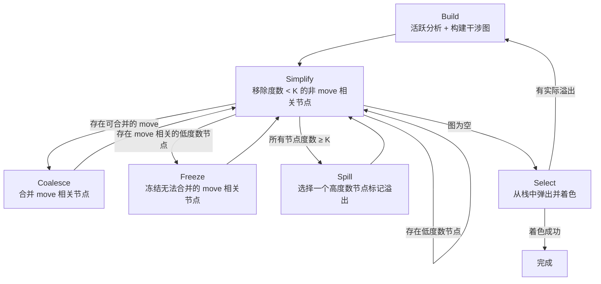
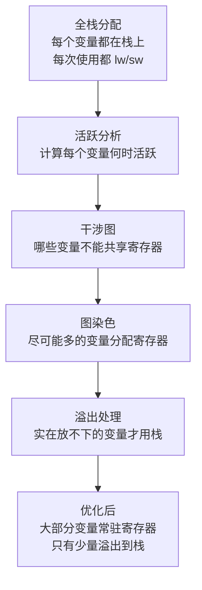

# 图染色寄存器分配：原理详解

本文档从零开始解释图染色寄存器分配（Graph Coloring Register Allocation）的完整理论。不假设读者有任何图染色或寄存器分配的先验知识，但假设读者理解基本的汇编概念（寄存器、栈、load/store）和编译器中间表示的基本概念（基本块、控制流图）。

---

## 1. 问题的起源：为什么需要寄存器分配

### 1.1 寄存器 vs 内存

CPU 能直接操作的数据只能在**寄存器**中。寄存器访问速度极快（1 个时钟周期），但数量极少——MIPS 只有 32 个通用寄存器，其中能自由使用的更少（我们的编译器中只有 18 个可分配）。而内存（栈）容量几乎无限，但每次访问都需要 `lw`/`sw` 指令，代价高出数倍。

### 1.2 "全栈分配"策略的代价

最简单的代码生成策略是：给每个变量分配一个栈上的槽位，每次用到这个变量时从栈上 `lw` 到临时寄存器，计算完立刻 `sw` 回去。这就是我们编译器目前的做法。

以一个简单的三地址码 `c = a + b` 为例：

```mips
# 全栈分配策略
lw   $t0, offset_a($sp)    # 从栈加载 a
lw   $t1, offset_b($sp)    # 从栈加载 b
addu $t2, $t0, $t1         # 计算 a + b
sw   $t2, offset_c($sp)    # 结果存回栈
```

如果 `a`、`b`、`c` 后面还会被多次使用，每次都要重复 `lw`。在一个循环体中，这种开销会被放大成百上千倍。

### 1.3 理想情况

如果我们能让 `a` 一直待在 `$s0`，`b` 一直待在 `$s1`，`c` 一直待在 `$s2`，那同样的运算只需要：

```mips
# 寄存器分配后
addu $s2, $s0, $s1          # 一条指令搞定
```

**寄存器分配的目标就是：尽可能多地让变量"常驻"在寄存器中，减少不必要的 `lw`/`sw`。**

### 1.4 为什么这件事不简单

困难在于：变量的数量远大于寄存器的数量。一个函数可能有几十甚至上百个 SSA 变量，但可用寄存器只有 18 个。我们必须让多个变量"共享"同一个寄存器——前提是它们的**生命期不重叠**。

这就引出了核心问题：**哪些变量可以共享同一个寄存器，哪些不可以？** 要回答这个问题，我们需要两个前置概念：**活跃性分析**和**干涉图**。

---

## 2. 活跃性分析（Liveness Analysis）

### 2.1 什么是"活跃"

一个变量在程序的某个点是**活跃的（live）**，当且仅当：从这个点出发，存在一条执行路径，在到达该变量的下一次**定义**之前会**使用**到它的当前值。

直观地说：一个变量是活跃的 = 它现在持有的值未来还有用。

```
1:  a = 1          ← a 在这里被定义
2:  b = 2          ← a 活跃（第 4 行要用），b 刚被定义
3:  c = 3          ← a, b 活跃
4:  d = a + b      ← a, b, c 活跃。执行完后 a, b 死亡（后面没人用了）
5:  e = c + d      ← c, d 活跃
6:  return e       ← e 活跃
```

在第 4 行执行之后，`a` 和 `b` 的值就不再被需要了——它们**死亡（dead）**了。这意味着第 5 行起，`a`、`b` 之前占用的寄存器可以被 `c`、`d`、`e` 复用。

### 2.2 活跃区间（Live Range / Live Interval）

一个变量从定义到最后一次使用之间的区间叫做它的**活跃区间**。重叠的活跃区间意味着两个变量在某个时刻同时活跃，因此**不能**共用同一个寄存器。

```
指令:    1    2    3    4    5    6
  a:     |-------- ---------|
  b:          |--- ---------|
  c:               |------- ---------|
  d:                    |--- ---------|
  e:                              |---|
```

从图中可以看到：`a` 和 `b` 的区间重叠（它们在第 2~4 行同时活跃），所以不能放在同一个寄存器中。但 `a` 和 `e` 的区间不重叠，它们可以共享同一个寄存器。

### 2.3 数据流方程

在有分支和循环的程序中，活跃性不能简单地"从上往下看"，因为控制流可能分叉或回绕。我们需要用**数据流分析**来精确计算。

对每个基本块 B，定义：
- **def[B]**：在 B 内**任意位置**出现过**定义**（写入）的变量集合，即方程中的 **kill 集**；凡在 B 中有 def 就应计入，**与**该 def 之前 B 内是否 use 过同一变量**无关**。
- **use[B]**：在 B 内某次**使用**发生时，**此前在 B 内尚未**对该变量做过定义的变量集合（**向上暴露的使用**，gen 集）。不是「B 内出现过的所有 use」。
- **in[B]**：在 B 入口处活跃的变量集合
- **out[B]**：在 B 出口处活跃的变量集合

数据流方程：

```
out[B] = ∪ in[S]，对所有 B 的后继块 S
in[B]  = use[B] ∪ (out[B] - def[B])
```

第一个方程说：一个变量在 B 的出口处活跃，当且仅当它在 B 的某个后继块的入口处活跃。
第二个方程说：一个变量在 B 的入口处活跃，如果它在 B 中有**向上暴露的** use（需要来自 B 之前入口的值），或者它在 B 的出口活跃且**未被 def[B] 杀死**（`out[B] - def[B]`：后继仍需要、且 B 内没有重新定义掐断对入口旧值的依赖）。

这是一个**反向数据流问题**：信息从后往前流动。我们从程序的末尾开始，反复迭代直到所有 in/out 集合不再变化（达到**不动点**）。

### 2.4 为什么活跃分析在 MIPS 层面做

在我们的编译器中，活跃分析是在**MIPS 指令层面**而非 IR 层面做的。原因是：

1. 寄存器分配最终要作用于物理寄存器，MIPS 指令才是寄存器的真正使用者
2. IR 层面的 SSA 值和 MIPS 指令中的寄存器之间并非一一对应——一条 IR 指令可能展开为多条 MIPS 指令，引入额外的临时寄存器
3. 在 MIPS 层面分析可以精确地看到每条指令读写了哪些寄存器

这也是为什么我们需要**结构化的 MIPS 指令**（`MipsInst`）——只有知道每条指令的 `def` 和 `use` 集合，才能进行活跃分析。

---

## 3. 干涉图（Interference Graph）

### 3.1 从活跃性到干涉

有了活跃分析的结果，我们可以构建**干涉图**——这是图染色寄存器分配的核心数据结构。

干涉图是一个**无向图**：
- **节点**：每个需要分配寄存器的变量（或 SSA 值）是一个节点
- **边**：如果两个变量在某一时刻**同时活跃**，它们之间有一条**干涉边**

干涉边的含义是："这两个变量不能放在同一个寄存器中"。

### 3.2 构建规则

具体地，对每条指令，如果它定义了变量 `d`，那么 `d` 与该指令执行完毕后所有活跃的其他变量之间都有干涉。用伪代码表示：

```
for each instruction inst:
    d = def(inst)
    if d exists:
        for each variable r in live_out(inst):
            if r ≠ d:
                add_edge(d, r)
```

### 3.3 一个完整的例子

继续用前面的例子：

```
1:  a = 1
2:  b = 2
3:  c = 3
4:  d = a + b
5:  e = c + d
6:  return e
```

各指令的 `live_out`（执行后活跃集合）：

| 指令 | def | live_out |
|------|-----|----------|
| 1: a = 1 | a | {a} |
| 2: b = 2 | b | {a, b} |
| 3: c = 3 | c | {a, b, c} |
| 4: d = a+b | d | {c, d} |
| 5: e = c+d | e | {e} |

由此产生的干涉边：
- 指令 2：def=b, live_out={a,b} → b 与 a 干涉
- 指令 3：def=c, live_out={a,b,c} → c 与 a 干涉，c 与 b 干涉
- 指令 4：def=d, live_out={c,d} → d 与 c 干涉
- 指令 5：def=e, live_out={e} → 无新的干涉

干涉图：

```
a --- b
|   /
|  /
c --- d
      (e 独立)
```

### 3.4 Move 指令的特殊处理

有一类指令需要特殊对待：`move dst, src`（即简单赋值/拷贝）。

如果 `dst` 和 `src` 恰好可以分配同一个寄存器，那 `move` 指令就是多余的，可以直接删除。因此在构建干涉图时，`move` 的 `dst` 和 `src` 之间**不加干涉边**（即使它们在此处同时活跃），为后续的**合并（Coalesce）**留出空间。

这些 `move` 相关的节点对被称为 **move-related pairs**，会被单独记录。

---

## 4. 图染色：从数学问题到寄存器分配

### 4.1 图染色问题

**图染色**是图论中的经典问题：给一个无向图的每个节点分配一种颜色，要求相邻节点的颜色不同。**K-着色问题**是：能否用不超过 K 种颜色完成着色？

这和寄存器分配的对应关系一目了然：

| 图染色 | 寄存器分配 |
|--------|-----------|
| 节点 | 变量 |
| 边（相邻） | 干涉（同时活跃） |
| 颜色 | 物理寄存器 |
| K（颜色数） | 可用寄存器数（我们的项目中 K=18） |

**如果干涉图是 K-可着色的**，那么我们就能找到一种分配方案，使所有变量都有寄存器，无需任何溢出（spill）。

### 4.2 NP 完全性与启发式

一般图的 K-着色判定问题是 **NP 完全**的——没有已知的多项式时间精确算法。但这并不意味着实践中无法解决：

1. **干涉图不是任意图**：它具有来自程序结构的特殊性质（如弦图近似），使得启发式算法在实践中效果极好
2. **我们不需要最优解**：只需要一个"足够好"的着色，少量溢出是可以接受的
3. **K 通常足够大**：18 个寄存器对于大多数函数来说绑绑有余

Chaitin 在 1981 年提出了第一个实用的图染色寄存器分配算法，Briggs 在 1994 年对其进行了关键改进（乐观着色 + 保守合并），形成了被广泛使用的 **Chaitin-Briggs 算法**。

---

## 5. Chaitin-Briggs 算法：核心直觉

在深入流程之前，先建立一个关键直觉。

### 5.1 度数与可着色性

**度数（degree）**：一个节点的度数是它的邻居数量（即与它干涉的变量个数）。

**关键观察**：如果一个节点的度数 < K（可用颜色数），那么无论它的邻居怎么着色，总至少剩余一种颜色可以分给它。

这就像在一间有 18 把不同颜色的椅子的房间里，如果一个人只有 17 个或更少的"敌人"（不能坐同色椅子的人），那无论敌人们怎么选椅子，总有至少一把空椅子留给他。

### 5.2 简化（Simplify）的思想

基于上述观察，如果图中存在一个度数 < K 的节点 v，我们可以：

1. 把 v 暂时从图中**移除**（连带移除它的所有边）
2. 对剩余的图进行着色
3. 最后把 v **放回来**，给它选一个与邻居不同的颜色——因为它度数 < K，一定能成功

这个过程可以递归进行：移除 v 后，其他节点的度数可能降低，可能产生新的度数 < K 的节点，可以继续移除。

我们把移除的节点按顺序压入一个**栈**。当图被简化到空（或无法继续简化）时，再从栈中逐个弹出节点并着色。


### 5.3 当图无法继续简化：溢出（Spill）

如果图中每个节点的度数都 >= K，简化就卡住了。这时我们需要选择一个节点标记为**潜在溢出（potential spill）**，假装它可以被移除（也压入栈）。

Briggs 的关键改进叫**乐观着色（optimistic coloring）**：即使一个节点被标记为潜在溢出，在 Select 阶段从栈中弹出它时，仍然先尝试给它着色——因为它的某些邻居可能碰巧选了相同的颜色，导致实际需要的颜色数少于它的度数。只有当确实无法着色时，才真正溢出。

这个"乐观"策略在实践中非常有效，大大减少了实际溢出的数量。

---

## 6. Chaitin-Briggs 算法：完整流程

算法由六个阶段组成，循环执行直到没有溢出为止：



下面逐一详解每个阶段。

### 6.1 Build：构建干涉图

这个阶段做两件事：

1. **活跃分析**：用 §2.3 描述的数据流方程计算每个基本块入口/出口的活跃集合，再逐指令反向扫描得到每条指令的 `live_in` 和 `live_out`
2. **干涉图构建**：用 §3.2 的规则，对每条指令的 def 和 live_out 添加干涉边

同时识别所有 `move` 指令，记录 move-related pairs。

Build 是整个算法的基础——如果活跃分析有误，后续所有步骤都会出错。

### 6.2 Simplify：简化

维护一个**工作表（worklist）**，包含所有度数 < K 的**非 move 相关**节点。

反复从工作表中取出节点，将其从图中移除并压栈。移除一个节点时，其邻居的度数减 1——如果某个邻居的度数因此从 K 降到 K-1，它就变成了新的可简化节点，加入工作表。

当工作表为空时，根据图的状态转移到 Coalesce、Freeze 或 Spill。

**为什么排除 move 相关节点？** 因为 move 相关的节点有机会被合并（Coalesce），合并后可以消除 `move` 指令。如果在合并之前就把它们简化掉了，就失去了这个优化机会。

### 6.3 Coalesce：合并

Coalesce 试图合并 `move` 指令的源和目的。如果 `move x, y` 中的 x 和 y 可以合并为同一个节点（分配同一个寄存器），那这条 `move` 就可以被消除。

但不是所有 `move` 都能合并——合并两个节点意味着新节点的度数是两者邻居的并集，这可能使原本可着色的图变得不可着色。

**George 准则**是一种保守的合并策略：合并 `move x, y` 当且仅当——对于 y 的每个邻居 t：
- 要么 `degree(t) < K`（t 是低度数的，不会造成问题）
- 要么 t 和 x 已经干涉（合并不会增加 x 的新边）

这个准则保证合并后图的可着色性不会变差。

合并后，两个节点变成一个节点（继承所有边），相关的 `move` 指令被标记为删除。新节点的某些邻居度数可能变化，需要重新检查它们是否可以被简化——所以合并后回到 Simplify。

### 6.4 Freeze：冻结

当 Simplify 工作表为空，且没有可以安全合并的 move 时，我们选择一个低度数的 move 相关节点，将其**冻结**——即放弃对它的合并期望，把它当作普通节点对待。

冻结后，这个节点（度数 < K）可以进入 Simplify 的工作表。同时，如果它的 move 伙伴因为失去最后一个 move 关联而变成非 move 相关节点，也可能加入工作表。

然后回到 Simplify 继续。

### 6.5 Spill：选择溢出候选

当 Simplify 工作表为空（所有剩余节点度数都 >= K），且没有可合并的 move，也没有可冻结的节点时，我们必须面对现实：当前的变量数超出了寄存器的承载能力，某些变量必须**溢出到栈上**。

我们用启发式选择一个**溢出代价最小**的节点：

```
cost(v) = (v 的定义和使用次数) / degree(v)
```

直觉是：
- **使用次数少**的变量溢出代价低（少产生 `lw`/`sw`）
- **度数高**的变量溢出价值高（移除它能释放更多邻居的压力）

循环中的变量要额外加权（循环内每次执行都要付出 `lw`/`sw` 代价）：

```
cost(v) = (def_use_count(v) / degree(v)) × 10^loop_depth
```

选中的节点被标记为"潜在溢出"并压栈（与 Simplify 移除的节点一起），然后回到 Simplify——因为移除这个高度数节点后，其邻居的度数会下降，可能出现新的可简化节点。

### 6.6 Select：着色

当所有节点都已从图中移除并压入栈后，开始从栈顶逐个弹出并着色：

```
while stack is not empty:
    v = stack.pop()
    used_colors = { color[w] | w 是 v 的邻居且已着色 }
    available = all_K_colors - used_colors
    if available is not empty:
        color[v] = pick one from available
    else:
        mark v as actual spill
```

对于 Simplify 阶段移除的节点（度数 < K），着色一定成功——这是数学保证的。

对于 Spill 阶段标记的节点，**乐观地尝试着色**。由于多个邻居可能选了相同颜色，实际占用的颜色数可能少于度数，所以仍有可能成功。这就是 Briggs 的乐观着色。

如果确实无法着色（所有 K 种颜色都被邻居占了），这个节点成为**实际溢出**。

### 6.7 Restart：处理溢出并重启

如果 Select 阶段产生了实际溢出，我们需要：

1. **插入溢出代码**：对每个溢出的变量 v——
   - 在 v 的每个**定义**处之后，插入 `sw` 把值写到栈上的溢出槽
   - 在 v 的每个**使用**处之前，插入 `lw` 把值从溢出槽加载到一个新的临时变量
   - 这些新临时变量的活跃区间极短（只跨越一两条指令），几乎不会与其他变量干涉

2. **从头重启整个算法**：对修改后的程序重新进行 Build → Simplify → ... → Select

通常 1~2 次重启就会收敛（因为溢出产生的新临时变量活跃区间很短，不会引起进一步溢出）。

---

## 7. 一个完整的手工模拟

用一个简单的例子走完整个流程，假设 **K = 3**（3 个可用颜色/寄存器）。

### 7.1 程序与活跃分析

```
1: a = ...
2: b = ...
3: c = a + b
4: d = b + c
5: use(d)
```

活跃区间：
```
指令:  1    2    3    4    5
  a:   |---------|
  b:        |---------|
  c:             |---------|
  d:                  |---------|
```

### 7.2 干涉图

同时活跃的变量对：(a,b)、(b,c)、(c,d)

```
a --- b --- c --- d
```

各节点度数：a=1, b=2, c=2, d=1

### 7.3 Simplify

K=3，所有节点度数都 < 3，全部可简化。

按顺序移除并压栈（任意顺序均可，假设选度数最小的）：
1. 移除 a（度=1），压栈。b 的度数降为 1
2. 移除 d（度=1），压栈。c 的度数降为 1
3. 移除 b（度=1），压栈
4. 移除 c（度=0），压栈

栈（顶→底）：c, b, d, a

### 7.4 Select

从栈顶弹出并着色（颜色用 R1、R2、R3 表示）：

1. 弹出 c：无已着色邻居 → 选 **R1**
2. 弹出 b：邻居 c=R1 → 选 **R2**
3. 弹出 d：邻居 c=R1 → 选 **R2**（与 b 同色，因为 b 和 d 不干涉！）
4. 弹出 a：邻居 b=R2 → 选 **R1**（与 c 同色，因为 a 和 c 不干涉！）

结果：a=R1, b=R2, c=R1, d=R2。只用了 2 种颜色（小于 K=3），零溢出。

注意 a 和 c 共享了 R1，b 和 d 共享了 R2——正是因为它们的活跃区间不重叠。

---

## 8. 关于 Coalesce 的更多直觉

### 8.1 为什么 Coalesce 重要

考虑：

```
a = ...
b = move a      ← 这是一条拷贝指令
use(b)
```

如果 a 和 b 分配了同一个寄存器（比如都是 `$s0`），那 `move $s0, $s0` 就是空操作，可以删除。

在 SSA 形式的代码中，phi 节点被消解为 `move` 指令，函数参数传递也会产生 `move`，所以一个典型函数中 `move` 指令的数量很可观。Coalesce 通过合并 move 的源和目的来消除这些冗余拷贝。

### 8.2 为什么不能随意合并

合并 a 和 b 意味着它们变成同一个节点——a 的所有干涉和 b 的所有干涉都加到这个新节点上。如果新节点的度数因此超过 K，原本可着色的图可能变得不可着色，导致不必要的溢出。

这就是为什么需要保守准则（George 或 Briggs 准则）来确保合并不会"恶化"着色能力。

### 8.3 George 准则的直觉

George 准则：合并 `move x, y` 当且仅当对 y 的每个邻居 t，要么 `degree(t) < K`，要么 t 已经与 x 干涉。

含义：合并后，x（吸收了 y 的身份）的邻居集合 = x 的原邻居 ∪ y 的原邻居。但如果 y 的每个邻居 t 要么已经是 x 的邻居（不增加新边），要么是低度数节点（即使增加了边也不影响 t 的可简化性），那合并就是安全的。

---

## 9. 关于溢出的更多细节

### 9.1 溢出代码是什么样的

假设变量 v 被决定溢出。编译器为 v 分配一个栈槽 `spill_slot`，然后：

**在 v 的每个定义处之后：**
```mips
# 原本的指令，定义了 v（现在用临时寄存器 $t_new1）
addu $t_new1, ...
sw   $t_new1, spill_slot($sp)    ← 插入：写回栈
```

**在 v 的每个使用处之前：**
```mips
lw   $t_new2, spill_slot($sp)    ← 插入：从栈加载
# 原本使用 v 的指令，现在改用 $t_new2
addu ..., $t_new2, ...
```

每个定义/使用处都引入一个**全新的短命临时变量**（`$t_new1`, `$t_new2` 等），它们的活跃区间只有 1~2 条指令，几乎不会与其他变量干涉。

### 9.2 为什么要重启

溢出代码引入了新的变量和指令，改变了程序的活跃性信息和干涉图。我们必须重新分析——但好消息是新变量的活跃区间极短，通常不会导致进一步溢出，所以算法很快收敛。

### 9.3 溢出候选的选择很重要

选错溢出候选会导致性能灾难：
- 溢出一个循环内频繁使用的变量 → 每次循环迭代都要 `lw`/`sw`，代价极高
- 溢出一个循环外只用一次的变量 → 只多一次 `lw`/`sw`，几乎无感

这就是为什么溢出代价公式中要考虑循环深度：循环越深，溢出代价指数级增长，应尽力避免。

---

## 10. 预着色节点（Pre-colored Nodes）

### 10.1 什么是预着色

在真实的处理器上，某些操作要求数据在特定的寄存器中。例如在 MIPS 中：
- `syscall` 要求参数在 `$v0`、`$a0` 等固定寄存器中
- 函数调用约定要求参数在 `$a0`~`$a3` 中
- `div` 指令的结果固定在 `$lo`/`$hi` 中

这些寄存器的使用是硬性约束，不能被分配器随意改变。

在干涉图中，这些约束表现为**预着色节点**：它们的"颜色"是固定的，分配器必须尊重这一点。所有与预着色节点干涉的变量都不能分配到该颜色（寄存器）。

### 10.2 对算法的影响

预着色节点参与干涉图的构建，但在 Simplify 阶段**永远不会被移除**——它们的颜色是固定的。它们只在 Select 阶段作为"已着色的邻居"影响其他节点的颜色选择。

在我们的编译器中，由于当前后端在指令选择时已经使用了固定寄存器（如 `$v0`、`$a0` 等），这些使用会自然地出现在 MIPS 指令的 def/use 集中，参与活跃分析和干涉图构建。

---

## 11. Caller-saved vs Callee-saved 寄存器

### 11.1 调用约定的影响

在我们的 MIPS 目标中，可分配寄存器分为两类：

| 类型 | 寄存器 | 调用约定 |
|------|--------|---------|
| caller-saved | `$t0`~`$t9`（10个） | 函数调用**不保证**保留其值。如果调用前的值在调用后还需要用，调用者必须自己保存 |
| callee-saved | `$s0`~`$s7`（8个） | 函数调用**保证**保留其值。被调用函数如果使用了这些寄存器，必须在 prologue 保存、epilogue 恢复 |

### 11.2 对寄存器分配的影响

这两类寄存器的区别影响着分配策略：

**跨越函数调用的变量**（在 `jal` 前定义，`jal` 后使用）应该优先分配 callee-saved 寄存器（`$s`），因为 callee-saved 寄存器在调用后值仍然有效，不需要额外的保存/恢复。

**不跨越函数调用的变量**可以自由使用 caller-saved 或 callee-saved 寄存器。但使用 callee-saved 寄存器会在函数的 prologue/epilogue 中引入保存/恢复的开销。因此对于短命的局部变量，caller-saved 寄存器（`$t`）通常是更好的选择。

在干涉图的 Select 阶段选择颜色时，可以利用这个启发式来优化着色质量。

---

## 12. 总结：从全栈分配到图染色



整个图染色寄存器分配的思想可以一句话概括：

> **通过分析变量的生存期重叠关系，将"哪些变量能共享寄存器"的问题转化为图着色问题，然后用高效的启发式算法求解。**

它不是最简单的寄存器分配策略（线性扫描更简单），但它是最系统化、效果最好的经典方案。理解了这个原理，后续的代码实现就是将这些数学概念忠实地翻译为数据结构和算法。
