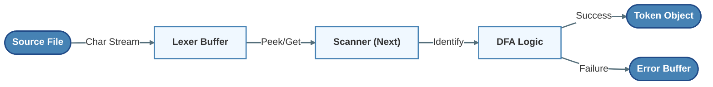
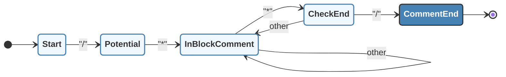

# 词法分析器 (Lexer) 设计文档

## 1. 设计目标

构建基于 **DFA (确定有限自动机)** 模型的词法扫描器，实现将源程序字符流转换为 Token 流。

- **输入**：SysY 源程序（文本流）。
- **输出**：Token 序列（`lexer.txt`）或 错误报告（`error.txt`）。
- **原则**：
  - **完整扫描**：采用错误恢复策略，遇到非法字符记录后跳过，保证完成全文件扫描。
  - **数值常量**：保留原始字面量。
  - **字符串/字符常量**：按 SysY 规范在词法阶段解析唯一转义 `\n` 为换行符，token value 中存解码后的内容（供 printf、数组初值等统一使用）；不包含首尾引号。

## 2. 总体架构

### 2.1 模块职责

| **模块**      | **核心职责**                    | **设计模式/理论支撑**                      |
| ------------- | ------------------------------- | ------------------------------------------ |
| **TokenType** | 符号分类、保留字映射            | 静态哈希表 (Perfect Hashing 思想)          |
| **Token**     | 单词二元组 `(Type, Value)` 封装 | 符号表的基础单元                           |
| **Lexer**     | 状态机驱动、字符流缓冲          | **DFA 状态流转**、**超前搜索 (Lookahead)** |

### 2.2 数据流 (Pipeline)

采用**拉取式 (Pull Model)** 数据流，由 Parser 驱动 Lexer 前进。



## 3. 词法定义与核心结构

### 3.1 正则文法定义 (Regular Grammar)

基于当前代码实现，各 Token 的正则定义如下：

- **Ident** (标识符) $\rightarrow$ `[_a-zA-Z][_a-zA-Z0-9]*`

- **IntConst** (整常数) $\rightarrow$ `[0-9]+`

  > *注：当前实现仅扫描连续数字序列，未在词法层处理十六进制前缀（如 `0x`），该行为与代码 `Lexer::GetIntConst` 逻辑一致。*

- **FormatString** (字符串) $\rightarrow$ `"` ( `[^"]` | `\` `.` ) `*` `"`

### 3.2 字符串与字符常量中的转义 (SysY)

SysY 规定：字符串/字符中仅可能出现一种转义 `\n`，用以标注换行。

- **GetStringConst**：扫描到 `\` 且下一字符为 `n` 时，向 token value 追加一个换行符 `'\n'`，并前进 2 个源字符；其余字符按原样追加。这样 printf 格式串与 `ConstInitVal`/`InitVal` 中的 StringConst 语义一致（长度、内容正确）。
- **GetCharConst**：同样将源码中的 `\n` 解析为一个换行符存入 token value。

### 3.3 核心数据结构

```cpp
struct Token {
    TokenType type;     // 类别码（内部枚举）
    int line;           // 行号（用于报错定位）
    std::string value;  // 词素（Lexeme），即源代码中的原始字符串（含引号）
};
```

## 4. 扫描机制与状态机实现

核心 `Next()` 函数本质上是一个**基于首字符预测的分发器**，内部嵌套了多个子状态机。

### 4.1 符号识别与最长匹配 (Maximal Munch)

对于运算符和界符，严格遵循**最长匹配原则**。

- **实现逻辑**：利用 `Peek()` 超前查看 1 个字符（代码中通过检测 `cur_pos_ + 2` 实现）。
- **案例**：识别 `<` 时，必须探测下一字符：
  - 若为 `=` $\rightarrow$ 状态转移至 `LEQ` (`<=`)，指针步进 2。
  - 否则 $\rightarrow$ 状态转移至 `LSS` (`<`)，指针步进 1。

### 4.2 注释处理的状态机 (DFA)

注释处理是词法分析中典型的 DFA 应用，包含 **Start (初始)**、**Entry (进入)**、**Loop (消耗)**、**End (结束)** 四个阶段。

**块注释 (`/\* ... \*/`) 状态流转图：**



*注：在 `InBlockComment` 状态下，需持续处理换行符以维护行号计数，这是区别于普通字符串处理的关键点。*

### 4.3 标识符与保留字识别

采用 **“先扫描，后查表”** 的策略，避免构建复杂的 DFA 来区分保留字。

1. **正则匹配**：先按 `Ident` 的正则规则读取完整单词（字母/下划线开头）。
2. **哈希映射**：将结果在 `ReservedWords` 表（`std::unordered_map`）中查找。
   - 命中 $\rightarrow$ 返回对应保留字 Token（如 `INTTK`, `RETURNTK`）。
   - 未命中 $\rightarrow$ 返回 `IDENFR`。

## 5. 错误处理与恢复

### 5.1 错误缓冲策略

词法阶段不应直接中断编译（Panic），而是采用**错误收集模式**。

- **机制**：设置 `std::vector<std::pair<int, std::string>> error_log_`。
- **策略**：当 DFA 进入死胡同（例如发现非法字符）且无法匹配任何运算符时：
  1. 记录错误（行号, 错误码 `a`）。
  2. **错误恢复**：指针强制前移 1 位（Skip），重置状态机至 Start 状态，继续扫描。

## 6. 接口设计

```cpp
class Lexer {
public:
    // 支持文件路径构造或直接移动字符串资源
    explicit Lexer(const char* file_path);
    explicit Lexer(std::string&& source);
    
    void Next();                        // 驱动状态机前进一步
    std::optional<Token> GetCurrentToken(); // 获取当前 Token
    bool NotEnd();                      // 判定输入流结束
    
    // 错误接口
    const std::vector<std::pair<int, std::string>>& GetErrorLog() const;
};
```