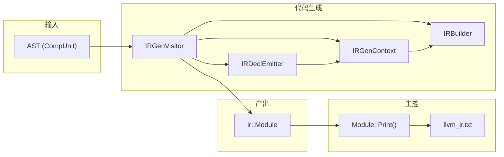
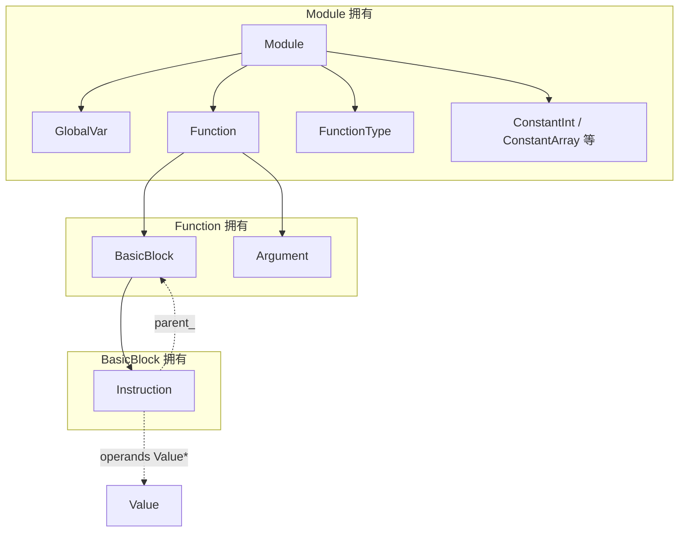
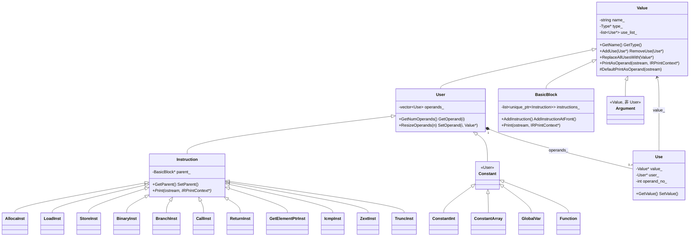
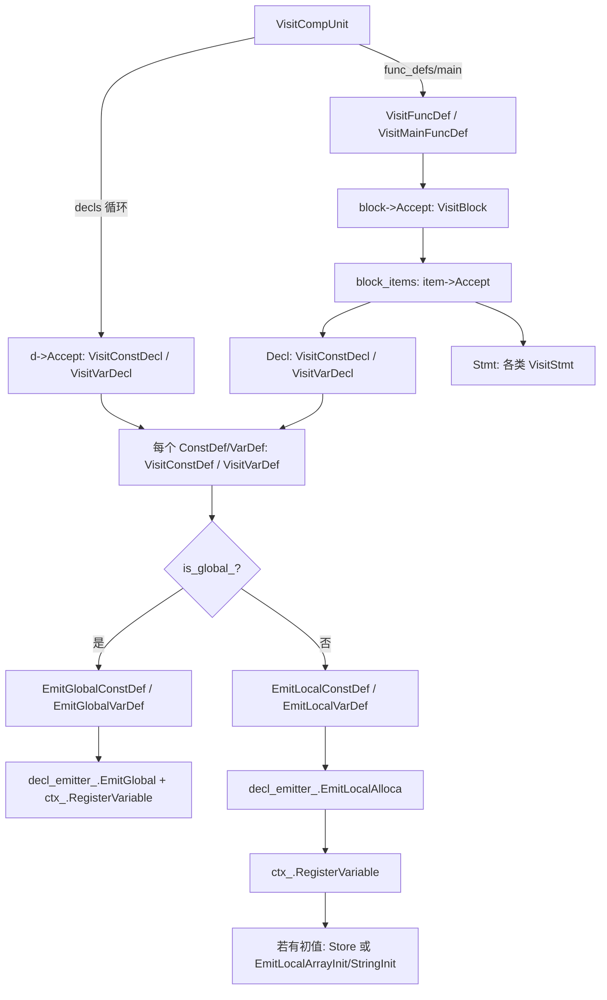
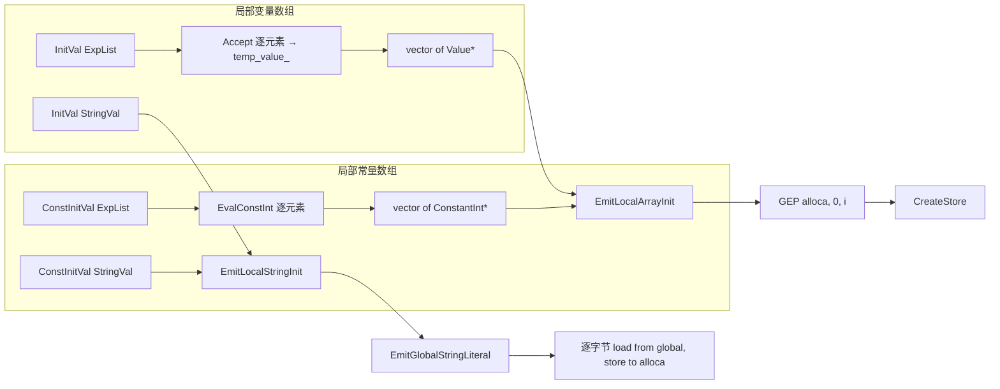
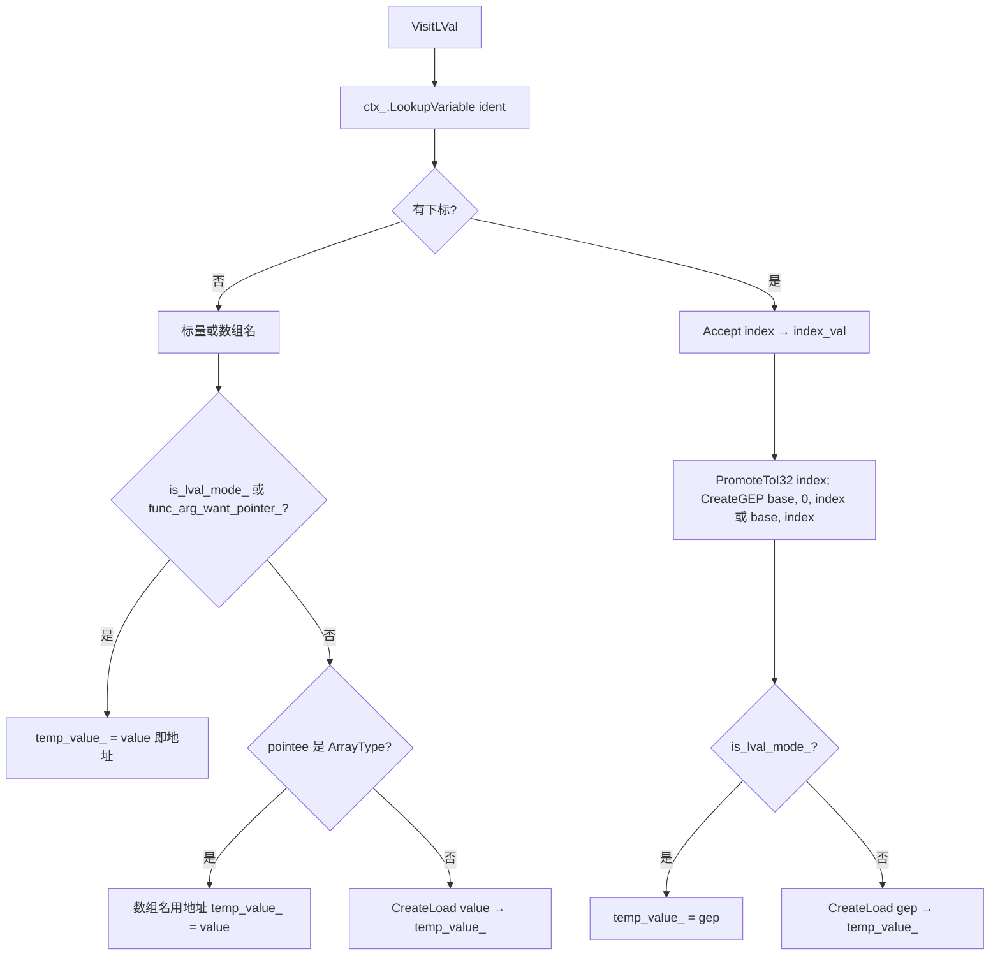
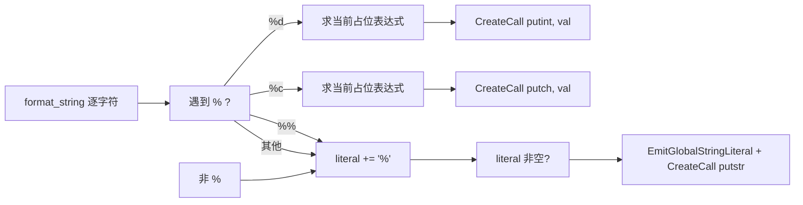

# 代码生成（LLVM IR）设计文档

本文档描述从 **SysY AST** 到 **内存中的 LLVM IR** 的设计与实现要点。IR 以类对象（Module / Function / BasicBlock / Instruction 等）形式在内存中构建，最终通过各节点的 `Print` 输出为 .ll 文本；该结构为后续 MIPS 或其它后端代码生成预留了统一的中间表示。**当前版本仅覆盖 LLVM IR 基础数据结构**（入口与数据流、内存与所有权、Value/User/Use/Instruction 类层次及设计考量）。

---

## 1. 设计目标与策略

### 1.1 模块职责与入口

代码生成阶段在 **语义分析之后的 AST** 上，将 **CompUnit** 翻译为 **内存中的 ir::Module**；主控在**无编译错误**时调用 IR 生成，并将返回的 Module 通过 `Module::Print(ostream)` 写入 llvm_ir.txt。

- **输入**：语义分析后的 **AST 根节点 CompUnit**（符号表已构建，本阶段仅消费 AST）。
- **输出**：**std::unique_ptr\<ir::Module\>**；本阶段内部不负责写文件。

主控侧调用方式如下（无错误且 `comp_unit` 非空时执行）：

```cpp
// Driver.cpp
if (result.comp_unit) {
    IRGenVisitor ir_gen;
    result.module = ir_gen.Translate(*result.comp_unit);
}
// 主控再将 result.module->Print(ostream) 写入 llvm_ir.txt
```

### 1.2 核心策略

- **结构先于字符串**：IR 一律先构建为对象（Instruction、BasicBlock、Function、GlobalVar 等），再通过 `Print` 输出文本；禁止在 Visitor 里直接拼字符串，以便后端（如 MIPS）复用同一套 IR。
- **所有权与引用分离**：拥有关系用 `std::unique_ptr`；使用/引用关系用**裸指针**，避免 `shared_ptr` 循环引用。
- **Visitor + IRBuilder**：AST 由 IRGenVisitor 遍历；指令的创建与插入由 IRBuilder 统一封装（CreateAlloca、CreateLoad、CreateStore、CreateBinary、CreateBr 等），IRBuilder 维护当前插入点（BasicBlock*）与 SSA 名字分配。

---

## 2. 总体架构：入口与数据流

### 2.1 数据流视图




各组件的分工可以这样理解：

| 组件 | 角色 | 说明 |
|------|------|------|
| **IRGenVisitor** | 翻译驱动 | 负责整次 AST→Module 的翻译：**拥有**产出的 `module_` 和写指令用的 `builder_`；遍历时通过 `ctx_` 取当前函数/插入点/变量表，通过 `decl_emitter_` 生成全局与局部变量；遍历状态（当前表达式结果 `temp_value_`、左值模式、break/continue 目标栈等）也由其维护。 |
| **IRBuilder** | 指令工厂 | 只做两件事：在**当前块**（`insert_point_`）尾追加指令、为结果分配**临时** SSA 名。不拥有 Module/Function，插入点由 Context 在进入某函数/某块时设置。 |
| **IRGenContext** | 当前现场 | **不拥有**任何 IR 对象，仅提供当前函数、builder、module 的指针和**“变量名→Value*”的注册/查找**，供 Visitor 与 DeclEmitter 在生成指令或声明时查询“当前在哪、名字对应谁”。 |
| **IRDeclEmitter** | 声明与变量生成 | 被 Visitor 在 VisitConstDef/VisitVarDef 等处调用；创建全局变量/常量、在 entry 块首插 alloca、字符串字面量等，并把名字通过 `ctx_` 注册。 |

Visitor 的构造即把“谁拥有谁、谁用谁”固定下来；后续遍历中只改 Context 里的“当前”指针和变量表，不改这些所有权关系：

```cpp
// IRGenVisitor 构造（节选）
IRGenVisitor::IRGenVisitor()
    : module_(std::make_unique<ir::Module>()),
      builder_(std::make_unique<ir::IRBuilder>()),
      ctx_(module_.get(), builder_.get(), types_),
      decl_emitter_(ctx_) {}
```

### 2.2 入口调用链

1. **RunCompiler** → Lexer → Parser → SemanticAnalyzer；若 `!result.has_errors` 且 `result.comp_unit` 非空，则执行 2。
2. **IRGenVisitor::Translate(CompUnit&)** 内对 `comp_unit.Accept(*this)` 做一次遍历，在各 VisitXxx 中创建 IR 并插入指令。
3. **Translate** 返回 `std::move(module_)`；主控将 `result.module->Print(ostream)` 写入 llvm_ir.txt。

---

## 3. 内存与所有权

### 3.1 设计原则

- **单一所有权**：每个 IR 实体仅被一个所有者持有（`std::unique_ptr`），所有者析构时递归释放。
- **引用不拥有**：指令操作数（Value*）、分支目标（BasicBlock*）、IRBuilder 的插入点等均为裸指针，不参与析构。
- **Use-Def 链**：User 通过 **Use** 引用 Value；Use 由 **User 拥有**（存在 User::operands_），Value 仅维护 **use_list_**（Use* 的列表），用于替换或优化时更新引用。

### 3.2 所有权层次



实现上，Module 的顶层容器即为一组 `unique_ptr`：

```cpp
// Module.h（节选）
class Module {
    // ...
    std::vector<std::unique_ptr<GlobalVar>> global_vars_;
    std::vector<std::unique_ptr<Function>> functions_;
    std::vector<std::unique_ptr<FunctionType>> function_types_;
    std::vector<std::unique_ptr<ConstantInt>> constants_;
    // ...
};
```

Function 拥有 BasicBlock 与 Argument；BasicBlock 使用 **list\<unique_ptr\<Instruction\>>**，便于在块首插入 alloca（如 entry 块集中放 alloca）：

```cpp
// BasicBlock.h
class BasicBlock : public Value {
    // ...
    void AddInstruction(std::unique_ptr<Instruction> inst);
    void AddInstructionAtFront(std::unique_ptr<Instruction> inst);  // 用于 entry 块 alloca
private:
    std::list<std::unique_ptr<Instruction>> instructions_;
};
```

### 3.3 特殊实体的归属

| 实体 | 所有者 | 说明 |
|------|--------|------|
| GlobalVar | Module | initializer 为 Constant* 非拥有（来自常量池）。 |
| Function | Module | FunctionType 由 Module 的 function_types_ 持有。 |
| BasicBlock | Function | blocks_ 中 unique_ptr。 |
| Instruction | BasicBlock | instructions_（list）中；parent_ 为裸指针。 |
| Argument | Function | 仅 Value，非 User。 |
| ConstantInt / ConstantArray | Module | 常量池；多处可共享同一 Constant*。 |
| xxxxxxxxxx class Lexer {public:    // 支持文件路径构造或直接移动字符串资源    explicit Lexer(const char* file_path);    explicit Lexer(std::string&& source);        void Next();                        // 驱动状态机前进一步    std::optional<Token> GetCurrentToken(); // 获取当前 Token    bool NotEnd();                      // 判定输入流结束        // 错误接口    const std::vector<std::pair<int, std::string>>& GetErrorLog() const;};cpp | 无 | 经 Use 引用，可能指向 Constant、Argument、Instruction、GlobalVar、BasicBlock 等。 |

---

## 4. IR 中间表示结构（类层次与设计要点）

### 4.1 总体类图

采用与 LLVM 类似的 **Value 中心** 设计：所有可作为操作数出现（如 `%0`、`@main`、`i32 0`）的实体继承 **Value**；有**操作数**的实体继承 **User**；指令再继承 **Instruction** 并挂在 BasicBlock 下。常量（含全局变量、函数地址）继承 **Constant**（Constant 继承 User）。



> **为何有的只继承 Value，有的继承 User？Constant 如何理解？**——
>
> LLVM IR 的设计里，有两类不同的“值”：一类**只是被引用**（有类型、有名字、能作为操作数出现），另一类**还会引用别的值**（有操作数，参与 def-use 链）。类层次用 **Value** 与 **User** 把这两种职责分开，既保证“所有能当操作数的都是 Value”，又保证“只有需要存操作数的才维护 Use 列表”。
>
> - **Value 作为根**：在 IR 文本里，凡是能出现在“操作数位置”的，都是某种“值”——例如 `%0`（指令结果）、`@main`（函数地址）、`i32 0`（常量）、`label %entry`（基本块）。它们共同点是：有类型、有名字（或字面量）、可被其他指令/常量**使用**。因此 LLVM 把“可被引用的实体”统一成 **Value**：类型、名字、以及“谁在引用我”（use_list_）。这样任意一条指令的操作数、分支目标、返回值等，都可以用 Value* 统一表示。
>
> - **User 为何存在**：一条指令（如 `add i32 %0, %1`）会**使用**多个 Value（%0、%1）；常量数组 `[3 x i32] [i32 1, i32 2, i32 3]` 也**使用**多个 Constant。这些“使用”关系需要被显式存下来，以便做** def-use 分析**（例如 ReplaceAllUsesWith、死代码删除）。LLVM 的做法是：每个“使用点”对应一个 **Use** 对象，且 **Use 由使用者拥有**。因此，“有操作数的实体”被抽象成 **User**：继承 Value（自己也是值，可被引用），并增加 **operands_**（vector\<Use\>），表示“我引用了哪些 Value”。只有“会引用别人”的才需要 User；**Argument**（只是形参，没有操作数）、**BasicBlock**（只是块标签，没有操作数）就只继承 Value，不继承 User。
>
> - **Constant 的渊源**：在 LLVM 中，“常量”指**编译期即可确定的值**——字面量（ConstantInt）、常量数组（ConstantArray）、全局变量地址（GlobalVar）、函数地址（Function）。它们有两个特点：
>   1. 不随控制流变化，不挂在某条指令后，而是挂在 Module 或常量池；
>   2. 仍参与 def-use：既可以作为指令的操作数（如 `add i32 %0, 1` 里的 `1`），也可以自己带操作数（如 ConstantArray 的每个元素）。
>
> - 因此 **Constant 继承 User**：常量可以引用别的常量/值；ConstantInt 的 operands 为空，ConstantArray 的 operands 为各元素。**GlobalVar** 与 **Function** 的“值”是**地址**，该地址在编译期固定，所以也归为 Constant；它们由 Module 拥有，可作为 call 的 callee 或全局引用。
>
> 总结：**Value = 可被引用**；**User = 可被引用且会引用别人**（需要 operands_）；**Instruction** 是“在基本块里、会引用操作数”的 User；**Constant** 是“编译期确定、可能带操作数”的 User；**Argument / BasicBlock** 仅“可被引用”，不存操作数，故只到 Value。
>

### 4.2 Value：类型、名字与 use_list_

Value 是所有 IR 值的基类（指令结果、常量、参数、基本块标签等）。头文件中明确说明：**use_list_ 存的是指向 Use 的指针，这些 Use 实际生活在 User::operands_ 里**；Value 不拥有它们。

```cpp
// Value.h（节选）
/**
 * Ownership: Value does not own its Type* (types are often shared).
 * The use_list_ stores pointers to Use objects that live inside User::operands_.
 */
class Value {
protected:
    std::string name_;
    Type* type_;
    std::list<Use*> use_list_;   // Uses that reference this Value (not owned).
};
```

**ReplaceAllUsesWith** 的实现体现了“遍历 use 列表并逐个把引用改到新 Value”的语义；为避免在遍历中修改 use_list_ 导致迭代器失效，先拷贝再遍历：

```cpp
// Value.cpp
void Value::ReplaceAllUsesWith(Value* new_val) {
    if (!new_val) return;
    auto use_list_copy = use_list_;
    for (Use* use : use_list_copy) {
        RemoveUse(use);
        use->SetValue(new_val);
        new_val->AddUse(use);
    }
}
```

**PrintAsOperand** 在有 IRPrintContext 时优先用上下文中的 SSA 名/块标签，否则走子类重写的 DefaultPrintAsOperand（如 BasicBlock 输出 `label %entry`，默认输出 `%name_`）。

### 4.3 User 与 Use：operands_ 与 use_list_ 的存储差异（设计考量）

**User** 拥有操作数槽位，用 **vector\<Use\>** 存储；**Value** 只维护“谁在引用我”，用 **list\<Use*\>** 存储。这与 LLVM 自身 IR 的缓存与更新语义一致。

- **User::operands_ 为 vector\<Use\>（by value）**
  Use 对象内嵌在 User 内部，由 User 唯一拥有。访问某条指令的操作数时，顺序遍历一块连续内存，**缓存局部性好**；构造指令时先 **ResizeOperands(n)** 再按下标 **SetOperand(i, val)**，避免在未预留空间时 push_back 导致 vector 扩容，进而使 SetOperand 里对 `operands_[i]` 的 Use 引用失效（见下）。

- **Value::use_list_ 为 list\<Use*\>**
  Value 不拥有 Use，只持有指向 Use 的指针。当某个 Use 被移除（例如 SetOperand 把该槽位改为别的 Value，或 User 析构）时，需要从 Value 的 use_list_ 里 **O(1) 删除** 该 Use*；**std::list** 的 erase 是 O(1)，且不涉及其他指针的移动。若用 vector\<Use*\>，删除中间元素需要移动后续元素，且 ReplaceAllUsesWith 等会频繁做 RemoveUse，list 更合适。

头文件中的注释直接点出了这两点：

```cpp
// User.h
/**
 * Ownership: User owns the Use objects in operands_ (stored by value for
 * cache locality). The Value* in each Use are not owned.
 */
// ...
/** @brief Operands stored inline for cache locality. */
std::vector<Use> operands_;

// Use.h
/**
 * Memory layout: stored inline in User::operands_ for cache locality.
 */
```

### 4.4 ResizeOperands(n) 的必要性

多操作数指令（如 StoreInst：value + ptr；BranchInst：cond + if_true + if_false）在构造时，需要先为每个操作数槽位准备好 Use，再把这些 Use 与具体 Value 绑定。若在绑定过程中 **SetOperand(i, val)** 会触发 **val->AddUse(&operands_[i])**，而此时 operands_ 尚未 resize 到最终大小，后续的 resize 或 push_back 可能导致 **vector 重新分配**，则已绑定的 Use 的地址会失效，Value 的 use_list_ 里存的 Use* 就变成悬垂指针。

因此约定：**先 ResizeOperands(n)**，再按下标 **SetOperand(i, val)**。ResizeOperands 一次分配好 n 个 Use，并把每个 Use 的 user_ 和 operand_no_ 设好，之后 SetOperand 只改 Use 的 value_ 并维护两边 Value 的 use_list_，不再改变 operands_ 的容量。

```cpp
// User.cpp
void User::ResizeOperands(size_t n) {
    operands_.resize(n);
    for (size_t i = 0; i < n; ++i) {
        operands_[i].SetUser(this);
        operands_[i].SetOperandNo(static_cast<int>(i));
    }
}

void User::SetOperand(int i, Value* val) {
    if (i >= 0 && static_cast<size_t>(i) < operands_.size()) {
        Use& use = operands_[static_cast<size_t>(i)];
        Value* old_val = use.GetValue();
        if (old_val) old_val->RemoveUse(&use);
        use.SetValue(val);
        if (val) val->AddUse(&use);
    }
}
```

头文件中的 API 注释也明确写了这一点：

```cpp
// User.h
/**
 * @brief Resize operand vector to n slots. New slots are bound to this User.
 * Call this before SetOperand when constructing instructions with a fixed operand count
 * to avoid iteration invalidation (resize once, then set by index).
 */
void ResizeOperands(size_t n);
```

### 4.5 Instruction：父块与插入方式

Instruction 继承 User，并持有 **parent_**（BasicBlock*），表示所属基本块；所有权在 BasicBlock 的 instructions_ 中。指令**不**在构造时自动加入块，而是由 IRBuilder 或 IRDeclEmitter 在创建后插入：

```cpp
// IRBuilder.h（节选）
template <typename InstType, typename... Args>
InstType* Create(Args&&... args) {
    assert(insert_point_ != nullptr);
    auto inst = std::make_unique<InstType>(std::forward<Args>(args)...);
    InstType* inst_ptr = inst.get();
    insert_point_->AddInstruction(std::move(inst));
    return inst_ptr;
}
```

即：先 `make_unique` 构造指令，再交给当前插入点（BasicBlock）的 **AddInstruction**，块尾追加；entry 块中的 alloca 则通过 **AddInstructionAtFront** 插在块首。

### 4.6 指令子类与 LLVM IR 文本对应

| IR 类 | 含义 | 典型 LLVM IR 形式 |
|-------|------|-------------------|
| AllocaInst | 栈上分配 | `%1 = alloca i32, align 4` |
| LoadInst | 从指针加载 | `%2 = load i32, ptr %1, align 4` |
| StoreInst | 写入指针 | `store i32 %2, ptr %1, align 4` |
| BinaryInst | 二元运算 | `%3 = add nsw i32 %0, %1` |
| BranchInst | 分支 | `br label %next` / `br i1 %cond, label %then, label %else` |
| CallInst | 函数调用 | `%4 = call i32 @getint()` / `call void @putint(i32 %x)` |
| ReturnInst | 返回 | `ret i32 %0` / `ret void` |
| GetElementPtrInst | 地址计算 | `%5 = getelementptr inbounds [10 x i32], ptr %arr, i32 0, i32 %idx` |
| IcmpInst | 整数比较 | `%6 = icmp slt i32 %a, %b` |
| ZextInst / TruncInst | 零扩展 / 截断 | `%7 = zext i1 %6 to i32` / `%8 = trunc i32 %7 to i8` |

BinaryInst 使用 **BinaryOp**（ADD, SUB, MUL, DIV, REM）；IcmpInst 使用 **IcmpPred**（SLT, SGT, SLE, SGE, EQ, NE）。BranchInst 通过重载构造区分无条件 br（单 BasicBlock*）与条件 br（Value* cond + 两个 BasicBlock*）。

### 4.7 Constant 分支与 Argument / BasicBlock

- **Constant** 继承 User：ConstantInt、ConstantArray 由 Module 常量池管理；**GlobalVar**、**Function** 继承 Constant（地址为常量），由 Module 拥有。
- **Argument**：仅继承 Value，不继承 User；表示形参（如 `i32 %0`），由 Function::args_ 拥有。
- **BasicBlock**：继承 Value，不继承 User；name_ 为块标签，作为 br 目标时以 Value 身份出现在 BranchInst 的操作数中；拥有 `list<unique_ptr<Instruction>> instructions_`。

---

## 5. 类型与常量

类型与常量是 IR 中“不随控制流变化”的共享基础设施：类型描述值的形状（i32、ptr、[N x i32] 等），常量表示编译期可求值的字面量或全局地址。二者均由**单例或 Module 统一管理**，保证同构复用（同一类型/同一整数常量只存一份），且不归任何 Instruction 或 BasicBlock 拥有。

### 5.1 类型系统：TypeManager 与 Type 层次

类型由 **TypeManager** 单例持有，进程内唯一；所有通过 TypeManager 得到的 Type* 均为非拥有指针，在进程生命周期内有效。

```cpp
// TypeManager.h（节选）
/**
 * TypeManager is a process-wide singleton that owns every Type object in the IR.
 * Primitive types (i1, i8, i32, void, label) are created once at construction;
 * composite types (PointerType, ArrayType) are cached and reused.
 */
class TypeManager {
public:
    static TypeManager& Get();
    IntegerType* GetI32Type() const;
    IntegerType* GetI8Type() const;
    IntegerType* GetI1Type() const;
    VoidType* GetVoidType() const;
    LabelType* GetLabelType() const;
    PointerType* GetPointerType(Type* pointee_type);
    ArrayType* GetArrayType(Type* element_type, unsigned num_elements);
private:
    std::vector<std::unique_ptr<Type>> owned_types_;
    IntegerType* i32_type_;  // 等原始类型指针
    std::unordered_map<Type*, PointerType*> ptr_cache_;
    std::map<std::pair<Type*, unsigned>, ArrayType*> array_cache_;
};
```

- **原始类型**：在 TypeManager 构造时**一次性创建**，存于 `owned_types_`，成员指针（如 `i32_type_`）指向其中元素；GetI32Type() 等直接返回该指针，无重复分配。
- **复合类型**：**按需创建并缓存**。GetPointerType(pointee) 先查 `ptr_cache_`，命中则返回已有 PointerType*，否则 new 一个并放入 owned_types_ 与 cache。GetArrayType(elem, N) 同理，以 (element_type, num_elements) 为 key 缓存。这样同一 [10 x i32] 或同一 ptr 类型在全局只存在一份，符合 **Flyweight** 思想。

Type 层次（Type.h）与 SysY/LLVM 对应关系如下：

| Type 子类 | 含义 | LLVM IR 文本 | 典型用途 |
|-----------|------|--------------|----------|
| IntegerType | 整数位宽 | i1, i8, i32 | 条件、char、int |
| PointerType | 指向某类型 | ptr（不透明指针） | 局部/全局/形参指针 |
| ArrayType | 元素类型 + 长度 | [N x i32] / [N x i8] | 数组 alloca/global 的 pointee |
| FunctionType | 返回类型 + 参数类型列表 | (i32, i32) -> i32 | 函数签名 |
| VoidType / LabelType | 无值 / 块标签 | void, label | 返回类型、br 目标类型 |

Value 的 `type_` 仅保存 Type*，不拥有；创建指令或全局变量时从 TypeManager/Module 取类型，保证所有引用指向 TypeManager 或 Module 持有的对象。

### 5.2 常量池：Module 的整数常量与常量数组

常量由 **Module** 拥有，与具体函数/基本块无关；常用“按值缓存、同值复用”避免重复分配。

**整数常量（ConstantInt）**：GetInt32Constant(value) / GetInt8Constant(value) 先查缓存表，命中则返回已有 ConstantInt*，否则 new 并加入 `constants_` 与 `const_i32_cache_`/`const_i8_cache_`。多处指令引用同一字面量（如 0、1）时共享同一指针。

```cpp
// Module.cpp（节选）
ConstantInt* Module::GetInt32Constant(int64_t value) {
    auto it = const_i32_cache_.find(value);
    if (it != const_i32_cache_.end()) {
        return it->second;
    }
    IntegerType* i32 = TypeManager::Get().GetI32Type();
    auto c = std::make_unique<ConstantInt>("", i32, value);
    ConstantInt* p = c.get();
    constants_.push_back(std::move(c));
    const_i32_cache_[value] = p;
    return p;
}
```

**常量数组（ConstantArray）**：用于全局数组初值（如 `[3 x i32] [i32 1, i32 2, i32 3]`）。Module::CreateConstantArray(type, elements) 创建并放入 `array_constants_`；elements 中的 Constant* 通常来自同一 Module 的 GetInt32Constant/GetInt8Constant，Module 不重复拥有这些元素，只持有指针。GlobalVar 的 SetInitializer 接受的也是 Constant*（来自常量池或 CreateConstantArray 的返回值），不转移所有权。

| 常量种类 | 所有者 | 获取方式 | 说明 |
|----------|--------|----------|------|
| ConstantInt (i32/i8) | Module | GetInt32Constant(v) / GetInt8Constant(v) | 缓存按值复用 |
| ConstantArray | Module | CreateConstantArray(type, elements) | 全局数组初值；elements 非拥有 |
| GlobalVar / Function | Module | CreateGlobalVar / CreateFunction | 地址为常量，作为 Constant 子类 |

---

## 6. 插入点与 IRBuilder、Context 与作用域基础

本节说明“指令插到哪”“SSA 名在生成期的角色”以及“当前函数/变量表/作用域”如何由 **IRBuilder** 与 **IRGenContext** 维护，并在后续 **§7 声明与变量生成**、**§8 表达式翻译**、**§9 控制流** 中反复使用。

### 6.1 插入点与 IRBuilder

所有指令都插入到**当前基本块**的尾部；当前块由 IRBuilder 的 **insert_point_** 保存，Visitor 在进入某函数或某控制流分支时通过 **SetInsertPoint(bb)** 切换，之后该块内所有 `Create*` 调用都会把新指令追加到该块。

```cpp
// IRBuilder.h（节选）
/** @brief Set the basic block where subsequent instructions will be inserted. */
void SetInsertPoint(BasicBlock* bb) {
    insert_point_ = bb;
}
/** @brief Get the current insertion block, or nullptr if none set. */
BasicBlock* GetInsertBlock() const {
    return insert_point_;
}
```

**何时设置插入点**：进入函数定义时，先创建 entry 块并 `SetInsertPoint(entry)`，后续该函数内生成的普通指令（alloca 除外，见 §7 声明与变量生成）都落在 entry 或当前已切换到的块；进入 if/for 等控制流时，会创建 then/else/cond/body/step/end 等块，并在访问对应子语句前 `SetInsertPoint(对应块)`，访问完再切回合并块或后继块。因此“当前插入点”始终表示“接下来生成的指令会出现在哪个块”。

Create* 内部只做两件事：用当前 insert_point_ 调用 `insert_point_->AddInstruction(std::move(inst))`，以及（对产生结果的指令）用 GetNextSSAName() 给指令命名；不持有 Module/Function，由 Context 在外部保证 insert_point_ 已指向正确块。

### 6.2 SSA 名：生成期兼容，输出阶段覆盖

IRBuilder 内嵌 **SSANameAllocator**，在生成阶段为每条“产生结果的”指令分配单调递增的名字（"0", "1", ...），便于调试与内存中引用；形参在 LLVM 惯例中通常占 %0, %1, ...，因此进入函数时会对计数器做一次 **ResetSSACounter**，使形参之后的第一个 alloca/指令从 %形参个数 开始。

```cpp
// IRBuilder.h
void ResetSSACounter(int start = 0) {
    ssa_allocator_.Reset(start);
}
std::string GetNextSSAName() {
    return ssa_allocator_.Next();
}
```

```cpp
// VisitFuncDef：有形参时形参占 %0..%n-1，首条 alloca/指令从 %n 开始
ctx_.builder->SetInsertPoint(entry);
ctx_.builder->ResetSSACounter(static_cast<int>(func_def.func_f_params.size()));

// VisitMainFuncDef：无参，从 %0 开始
ctx_.builder->SetInsertPoint(entry);
ctx_.builder->ResetSSACounter(0);
```

**注意**：这些名字仅在生成期有效，**最终 .ll 文本中的 %0, %1, ... 由 §10 输出阶段的 IRPrintContext 按“布局序”重新分配**。因此生成期 SSA 名仅用于内存中一致性，输出时会被覆盖，无需与打印结果逐字一致。

### 6.3 Context 职责：资源指针与当前函数

**IRGenContext** 集中存放“当前用到的资源”和“当前函数”，不拥有任何 IR 对象，仅提供非拥有指针与类型管理器引用，供 Visitor 与 IRDeclEmitter 使用。

```cpp
// IRGenContext.h（节选）
class IRGenContext {
public:
    IRGenContext(ir::Module* module, ir::IRBuilder* builder, ir::TypeManager& types);

    ir::Module* module;
    ir::IRBuilder* builder;
    ir::TypeManager& types;

    /** Currently generated function. Set by VisitFuncDef / VisitMainFuncDef. */
    ir::Function* current_function = nullptr;

    void PushScope();
    void PopScope();
    void RegisterVariable(const std::string& name, ir::Value* value);
    ir::Value* LookupVariable(const std::string& name) const;
    // ...
};
```

- **module / builder / types**：Visitor 和 DeclEmitter 通过 ctx_ 取 Module（创建全局变量、常量、函数）、Builder（插入指令）、TypeManager（取 i32/i8/ptr 等类型），避免在 Visitor 内散落多处依赖。
- **current_function**：在 VisitFuncDef / VisitMainFuncDef 开头被设为刚创建的 Function*；创建 entry 块、alloca、以及需要“当前函数”的 API（如 CreateBasicBlock 把块加入 current_function）都依赖它。§7 中声明生成会用到 current_function 的 entry 块。

### 6.4 作用域与变量注册：PushScope / PopScope / Register / Lookup

SysY 的块内可声明局部变量，同名在不同层作用域可遮蔽；IR 生成需要“名字 → 对应 Value*（alloca 或全局/形参）”的映射，且按作用域查找（内层遮蔽外层）。Context 用 **栈式作用域** 实现：每层作用域一个 **Scope**（id + map\<string, Value*\>），**PushScope** 压入新层，**PopScope** 弹出，**RegisterVariable** 在当前层（scopes_.back()）登记名字，**LookupVariable** 从当前层向外层查找，先找到先返回。

```cpp
// IRGenContext.cpp
void IRGenContext::PushScope() {
    current_scope_id_ = next_scope_id_++;
    scopes_.push_back(Scope{current_scope_id_, {}});
}

void IRGenContext::PopScope() {
    if (scopes_.empty()) return;
    scopes_.pop_back();
    current_scope_id_ = scopes_.empty() ? 0 : scopes_.back().id;
}

void IRGenContext::RegisterVariable(const std::string& name, ir::Value* value) {
    scopes_.back().map[name] = value;
}

ir::Value* IRGenContext::LookupVariable(const std::string& name) const {
    for (auto it = scopes_.rbegin(); it != scopes_.rend(); ++it) {
        auto i = it->map.find(name);
        if (i != it->map.end()) return i->second;
    }
    return nullptr;
}
```

**进入/退出作用域的时机**：与 AST 的块结构一致。进入**函数**时 PushScope（并设 current_function、SetInsertPoint）；进入**语句块（Block）**时再 PushScope，退出块时 PopScope；退出函数时 PopScope。实现上通过 **IRScopeGuard** 在进入 Block 或 FuncDef 时构造即 PushScope，析构即 PopScope，保证异常或提前 return 也不会漏弹栈。

```cpp
// VisitBlock：每个 Block 对应一层作用域
void IRGenVisitor::VisitBlock(Block& block) {
    IRScopeGuard scope_guard(ctx_);
    for (auto& item : block.block_items) {
        item->Accept(*this);
    }
}

// VisitFuncDef：函数体也占一层作用域
void IRGenVisitor::VisitFuncDef(FuncDef& func_def) {
    // ...
    ctx_.current_function = func;
    IRScopeGuard scope_guard(ctx_);
    // ... SetInsertPoint(entry); 形参/局部注册；func_def.block->Accept(*this);
}
```

### 6.5 在后续章节中的应用

| 后续章节 | 对插入点 / Context 的依赖 |
|----------|---------------------------|
| **§7 声明与变量生成** | 全局/局部通过 EmitGlobal/EmitLocalAlloca + RegisterVariable；LookupVariable 在 §8 表达式里解析 LVal 时使用。 |
| **§8 表达式翻译** | LookupVariable、is_lval_mode_/func_arg_want_pointer_、temp_value_；Create* 依赖当前 SetInsertPoint。 |
| **§9 控制流** | if/for 多块、SetInsertPoint(对应块)；break/continue 目标块。 |

---

## 7. 声明与变量生成

本节说明**全局变量/常量**与**局部变量/常量/形参**如何从 AST 声明生成到 IR，以及“名字 → Value*”如何在 Context 中注册、供 §8 表达式中的 LVal 解析使用。阅读时可按**调用层次**自上而下跟一条路径（例如“一条全局常量”或“函数内一条局部变量”），再对照代码。

### 7.1 全局与局部的唯一分界：is_global_

声明在 AST 中只分两种位置：(1) **CompUnit 顶层**的 `{ Decl }`（文法里 CompUnit → { Decl } { FuncDef } MainFuncDef）；(2) **函数内 Block** 的 BlockItem 中的 Decl（BlockItem → Decl | Stmt）。前者对应**全局**变量/常量（Module 的 global/constant）；后者对应**局部**（entry 块 alloca + Context 作用域内注册）。

实现上用 Visitor 的一个布尔 **is_global_** 区分，且**只在 VisitCompUnit 中改写**：

```cpp
// IRGenVisitor.cpp
void IRGenVisitor::VisitCompUnit(CompUnit& comp_unit) {
    is_global_ = true;
    for (auto& d : comp_unit.decls) {
        d->Accept(*this);   // 每个 d 是 Decl（ConstDecl 或 VarDecl）
    }
    is_global_ = false;
    for (auto& f : comp_unit.func_defs) {
        f->Accept(*this);
    }
    if (comp_unit.main_func_def) {
        comp_unit.main_func_def->Accept(*this);
    }
}
```

因此：**只有在遍历 comp_unit.decls 时 is_global_ 为 true**；一旦进入 FuncDef/MainFuncDef 或再进入 Block，is_global_ 已为 false，之后遇到的任何 Decl（来自 Block 的 block_items）都走**局部**分支。无需在 VisitBlock 或 VisitConstDecl 里再设 is_global_。

### 7.2 调用层次总览：从 CompUnit 到一条定义

下面按“谁调谁”给出从根到叶的完整路径，便于久未读代码时顺着文档找回调用关系。

**路径 A：全局声明（CompUnit 顶层 Decl）**

1. **VisitCompUnit**：`is_global_ = true`；对 `comp_unit.decls` 中每一项 `d` 调用 `d->Accept(*this)`。
2. **Accept** 会按 `d` 的实际类型调用 **VisitConstDecl** 或 **VisitVarDecl**（ConstDecl / VarDecl 均继承 Decl）。
3. **VisitConstDecl**：设置 `current_decl_btype_ = const_decl.btype`（int/char）；对 `const_decl.const_defs` 中每个 `ConstDef` 调用 `def->Accept(*this)`。
   **VisitVarDecl**：设置 `current_decl_btype_ = var_decl.btype`；对 `var_decl.var_defs` 中每个 `VarDef` 调用 `def->Accept(*this)`。
4. **VisitConstDef** / **VisitVarDef**：用 **GetCurDeclType()** 得到当前声明的基础类型（i32 或 i8）；根据 **is_global_** 分支：
   - `is_global_ == true` → 调用 **EmitGlobalConstDef** / **EmitGlobalVarDef**（见 7.3）；
   - `is_global_ == false` → 调用 **EmitLocalConstDef** / **EmitLocalVarDef**（见 7.4、7.5）。

**路径 B：局部声明（函数内 Block 中的 Decl）**

1. **VisitFuncDef**（或 VisitMainFuncDef）：创建 Function、设置 `ctx_.current_function`、**IRScopeGuard**（PushScope）、创建 entry 块并 **SetInsertPoint(entry)**、**ResetSSACounter(形参个数)**；对**形参**循环：数组形参直接 **RegisterVariable(ident, arg_val)**，标量形参调用 **decl_emitter_.EmitLocalAlloca** 得到 alloca，**CreateStore(arg_val, alloca)** 后 **RegisterVariable(ident, alloca)**；最后 **func_def.block->Accept(*this)**。
2. **VisitBlock**：**IRScopeGuard**（再 PushScope，本 Block 一层作用域）；对 `block.block_items` 中每一项 `item->Accept(*this)`。
3. 若该项为 **Decl**（BlockItem → Decl），则同路径 A 的 2–4，进入 VisitConstDecl/VisitVarDecl → VisitConstDef/VisitVarDef；此时 **is_global_ 必为 false**，故走 **EmitLocalConstDef** / **EmitLocalVarDef**。
4. 若该项为 **Stmt**（BlockItem → Stmt），则进入对应 VisitXxxStmt，与声明生成无关。

用流程图概括“单条 ConstDef/VarDef 的归宿”：



### 7.3 全局定义：EmitGlobal 与初值收集

Visitor 侧只做两件事：**判数组、求 size**，以及**从 AST 把初值收成 `std::vector<int> init_vals`**，然后交给 `decl_emitter_.EmitGlobal`。RegisterVariable 在 EmitGlobal 内部做（Context 最外层由 Translate 入口的 IRScopeGuard 已 PushScope）。

**初值从哪来**：ConstInitVal/InitVal 在 AST 里是 variant（SingleExp / ExpList / StringVal）。标量用 `std::get_if<SingleExp>` 取一个 ConstExp，再 `EvalConstInt` 得一个 int；数组用 `ExpList` 则对每个元素 EvalConstInt 压入 init_vals，用 `StringVal` 则逐字符压入并末尾补 0。示意：

```cpp
// Visitor 侧：从 ConstInitVal 收成 init_vals（整数序列），再交给 EmitGlobal
if (kIsArray) {
    if (auto* list = std::get_if<ConstInitVal::ExpList>(&const_def.const_init_val->value)) {
        for (auto& cexp : *list)
            init_vals.push_back(irgen::EvalConstInt(cexp->inner.get()));
    }
    if (auto* str = std::get_if<ConstInitVal::StringVal>(&...)) {
        for (unsigned char c : *str) init_vals.push_back(static_cast<int>(c));
        init_vals.push_back(0);  // 结尾 \0
    }
} else {
    init_vals.push_back(irgen::EvalConstInt((*single)->inner.get()));  // 标量一个 int
}
decl_emitter_.EmitGlobal(const_def.ident, elem_type, size, init_vals, true);
```

DeclEmitter 侧：**EmitGlobal** 按 size 区分标量/数组，按 init_vals 构造 Constant，再 CreateGlobalVar + RegisterVariable：

```cpp
// IRDeclEmitter::EmitGlobal：标量/数组分支，初值不足补零后建 Constant，再 CreateGlobalVar + 注册
bool is_array = (size > 0);
if (is_array) {
    auto* arr_ty = ctx_.types.GetArrayType(elem_type, static_cast<unsigned>(size));
    var_type = arr_ty;
    if (!init_vals.empty()) {
        std::vector<int> padded = init_vals;
        while (static_cast<int>(padded.size()) < size) padded.push_back(0);  // 不足补 0
        init = BuildConstArrayInit(arr_ty, elem_type, padded);
    }
} else {
    var_type = elem_type;
    if (!init_vals.empty()) init = MakeConstInt(elem_type, init_vals[0]);
}
ir::GlobalVar* gv = ctx_.module->CreateGlobalVar(name, ctx_.types.GetPointerType(var_type), init, is_const);
ctx_.RegisterVariable(name, gv);   // 名字→全局变量，供 §8 LVal LookupVariable
```

### 7.4 局部定义与 entry 块 alloca

局部声明统一先 **EmitLocalAlloca** 得到 alloca 指针，再 **ctx_.RegisterVariable(ident, alloca_ptr)**。alloca 不插在当前插入点，而是**始终插在 current_function 的 entry 块首**：

```cpp
// IRDeclEmitter.cpp：alloca 插在 entry 块最前面，保证局部变量在函数入口就分配
ir::Instruction* IRDeclEmitter::CreateEntryBlockAlloca(ir::Type* type) {
    assert(ctx_.current_function && type && ctx_.builder);
    ir::BasicBlock* entry = ctx_.current_function->GetBlocks().front().get();
    ir::Type* ptr_type = ctx_.types.GetPointerType(type);
    std::string name = ctx_.builder->GetNextSSAName();
    auto inst = std::make_unique<ir::AllocaInst>(name, ptr_type, entry);
    ir::Instruction* result = inst.get();
    entry->AddInstructionAtFront(std::move(inst));   // 插到块首，后插入的在前
    return result;
}

// 标量 size<=0 用 elem_type；数组 size>0 用 GetArrayType(elem_type, size)
ir::Value* IRDeclEmitter::EmitLocalAlloca(const std::string&, ir::Type* elem_type, int size) {
    ir::Type* alloca_type = (size > 0) ? ctx_.types.GetArrayType(elem_type, size) : elem_type;
    return CreateEntryBlockAlloca(alloca_type);
}
```

因此 entry 块内 alloca 顺序为：**后插入的在前**。VisitFuncDef 里先对形参循环做 alloca（标量）+ store + Register，再 `block->Accept`；Block 内每遇 Decl 再 EmitLocalAlloca，所以块内**先声明的变量在 entry 里反而更靠后**。

形参分支在 VisitFuncDef 里直接可见：数组形参只 RegisterVariable(ident, arg_val)；标量形参 alloca + store 实参再注册：

```cpp
// IRGenVisitor.cpp（VisitFuncDef 形参循环）
for (size_t i = 0; i < func_def.func_f_params.size(); ++i) {
    const auto& p = func_def.func_f_params[i];
    ir::Value* arg_val = func->GetArgument(i);   // 当前形参对应的 LLVM Argument
    if (p->is_array) {
        // 数组形参：传的是指针，直接注册即可，后续 LVal 用地址
        ctx_.RegisterVariable(p->ident, arg_val);
    } else {
        // 标量形参：在 entry 块 alloca 一格，把实参 store 进去，名字绑定到 alloca
        ir::Value* alloca_inst = decl_emitter_.EmitLocalAlloca("", irgen::BTypeToAllocaType(p->btype), 0);
        if (alloca_inst && ctx_.builder->GetInsertBlock()) {
            ctx_.builder->CreateStore(arg_val, alloca_inst);
            ctx_.RegisterVariable(p->ident, alloca_inst);
        }
    }
}
```

### 7.5 局部初值：标量 vs 数组

标量：常量用 **EvalConstInt** → **BuildConstScalarInit** → **CreateStore(init, alloca_ptr)**；变量用 **Accept** → **temp_value_** → **ConvertToTargetType** → **CreateStore**。

数组初值分支多，容易搞混，按“谁提供初值、谁写内存”拆开：



两函数逻辑见下两段代码；Visitor 侧谁提供初值、谁调谁（常量列表/字符串、变量列表）见上图 Mermaid 及 7.3/7.4。

```cpp
// IRDeclEmitter::EmitLocalArrayInit（核心：两段循环）
ir::Type* ptr_type = ctx_.types.GetPointerType(elem_type);
ir::Value* zero = ctx_.module->GetInt32Constant(0);
// 1) 有初值的元素：按下标 GEP(alloca, 0, i) → CreateStore(init_vals[i], gep)
for (size_t i = 0; i < init_vals.size() && static_cast<int>(i) < size; ++i) {
    ir::Value* idx = ctx_.module->GetInt32Constant(static_cast<int64_t>(i));
    ir::Instruction* gep = ctx_.builder->CreateGEP(ptr_type, alloca_ptr, zero, idx);
    ctx_.builder->CreateStore(init_vals[i], gep);
}
// 2) 零填充：从 init_vals.size() 到 size 的每个下标 GEP + Store(0)
for (size_t i = init_vals.size(); i < static_cast<size_t>(size); ++i) {
    ir::Value* idx = ctx_.module->GetInt32Constant(static_cast<int64_t>(i));
    ir::Instruction* gep = ctx_.builder->CreateGEP(ptr_type, alloca_ptr, zero, idx);
    ctx_.builder->CreateStore(MakeConstInt(elem_type, 0), gep);
}
```

```cpp
// IRDeclEmitter::EmitLocalStringInit（全局串 → 局部 alloca 逐字节拷贝）
ir::Value* global_str = EmitGlobalStringLiteral(str);   // 先得到全局常量串
size_t copy_len = std::min(size, static_cast<int>(str.size()) + 1);  // 含 \0
for (size_t i = 0; i < copy_len; ++i) {
    ir::Value* idx = ctx_.module->GetInt32Constant(static_cast<int64_t>(i));
    ir::Instruction* src_gep = ctx_.builder->CreateGEP(i8_ptr, global_str, zero, idx);
    ir::Instruction* load = ctx_.builder->CreateLoad(src_gep);
    ir::Instruction* dst_gep = ctx_.builder->CreateGEP(elem_ptr, alloca_ptr, zero, idx);
    ctx_.builder->CreateStore(load, dst_gep);
}
// 若 size > copy_len，剩余下标同样 GEP + Store(0) 零填充
```

### 7.6 小结：谁创建、谁注册、初值谁求

| 类别 | 创建方式 | 注册 | 初值 |
|------|----------|------|------|
| **全局常量/变量** | decl_emitter_.EmitGlobal → CreateGlobalVar | EmitGlobal 内 ctx_.RegisterVariable | 编译期 init_vals |
| **形参（数组）** | 用 GetArgument(i) | VisitFuncDef 内 RegisterVariable(ident, arg_val) | 无 |
| **形参（标量）** | EmitLocalAlloca + CreateStore(arg_val, alloca) | VisitFuncDef 内 RegisterVariable(ident, alloca_inst) | 入口 store 实参 |
| **局部常量/变量** | EmitLocalAlloca → CreateEntryBlockAlloca | Visitor 内 RegisterVariable(ident, alloca_ptr) | 常量 EvalConstInt+Store；变量 Accept+Store；数组 EmitLocalArrayInit/StringInit |

类型与长度：**GetCurDeclType()** 依 current_decl_btype_ 返回 i8/i32；**EvalArraySizeFromConstExp** 用 EvalConstInt 求长度，≤0 按 1。

---

## 8. 表达式翻译

表达式在 IR 中的结果通过 **temp_value_** 从子节点传回父节点：子表达式 Accept 返回后，父节点从 `temp_value_` 取该表达式的 Value*，再参与运算或写回内存。本节按 **LVal（含左值/右值/数组元素）**、**二元/单目**、**函数调用**、**printf** 与 **类型提升** 分块说明，LVal 和 printf 细节较多，用流程图与代码对照。

### 8.1 temp_value_ 约定与入口

所有“产生一个值”的表达式在对应 Visit 结束时把结果写入 **temp_value_**；上层通过“先 Accept 子节点，再读 temp_value_”得到子表达式结果。例如二元运算：

```cpp
binary_exp.lhs->Accept(*this);
ir::Value* lhs = temp_value_;
binary_exp.rhs->Accept(*this);
ir::Value* rhs = temp_value_;
// 再用 lhs/rhs 生成 add/sub/icmp 等
```

Number/Character 直接设 `temp_value_ = GetInt32Constant(...)` 或 `GetInt8Constant(...)`；ConstExp 若有折叠值则设常量，否则对 inner 再 Accept。

### 8.2 LVal：左值/右值、标量/数组、GEP

LVal 在两种语义下被使用：**当左值**（赋值目标、取地址）和**当右值**（取值、或数组名当实参传指针）。实现上用 **is_lval_mode_** 和 **func_arg_want_pointer_** 区分；**LookupVariable(ident)** 得到该名字对应的 Value*（alloca 或 GlobalVar 或 Argument）。



**无下标**（标量或数组名）：需要地址则 `temp_value_ = value`；否则标量 **CreateLoad(value)**，数组名用地址 `temp_value_ = value`。对应代码：

```cpp
// 无下标：需要地址则直接返回 value，否则标量 load、数组名用地址
if (!lval.index.has_value() || !*lval.index) {
    if (is_lval_mode_ || func_arg_want_pointer_) {
        temp_value_ = value;
    } else {
        if (pointee && dynamic_cast<ir::ArrayType*>(pointee))
            temp_value_ = value;   // 数组名即首地址
        else
            temp_value_ = ctx_.builder->CreateLoad(value);  // 标量取值
    }
    return;
}
```

**有下标**（数组元素）：先关掉 is_lval_mode_ 求下标（避免下标表达式里再触发左值逻辑），再按 base 的 pointee 选 GEP 形式，最后按 is_lval_mode_ 返回地址或 load。对应代码：

```cpp
// 有下标：先求下标值，再 GEP，再按左值/右值返回地址或元素值
bool is_lval_mode_backup = is_lval_mode_;
is_lval_mode_ = false;
(*lval.index)->Accept(*this);           // 下标表达式只关心“值”
is_lval_mode_ = is_lval_mode_backup;
ir::Value* index_val = PromoteToI32(temp_value_);

auto* ptr_ty = dynamic_cast<ir::PointerType*>(value->GetType());
ir::Type* pointee = ptr_ty->GetPointeeType();
ir::Instruction* gep = nullptr;
ir::Type* elem_ty = nullptr;
if (auto* arr_ty = dynamic_cast<ir::ArrayType*>(pointee)) {
    elem_ty = arr_ty->GetElementType();
    gep = ctx_.builder->CreateGEP(ctx_.types.GetPointerType(elem_ty), value,
                                  ctx_.module->GetInt32Constant(0), index_val);  // [N x T]* 用 (base, 0, idx)
} else {
    elem_ty = pointee;
    gep = ctx_.builder->CreateGEP(ctx_.types.GetPointerType(elem_ty), value, index_val);  // 形参 T* 用 (base, idx)
}
temp_value_ = is_lval_mode_ ? gep : ctx_.builder->CreateLoad(gep);
```

### 8.3 二元运算与单目

**二元**：lhs/rhs 各 Accept 取 temp_value_，再按 OpType 分支：算术 → **PromoteToI32** + **CreateBinary**；比较 → **CreateIcmp** + **CreateZext(..., i32)** 得 0/1。**短路 &&/||** 走 **EmitShortCircuitAND** / **EmitShortCircuitOR**（多块 + CondBr），详见 §9。

```cpp
// VisitBinaryExp（非短路）：算术与比较分支
binary_exp.lhs->Accept(*this);
ir::Value* lhs = temp_value_;
binary_exp.rhs->Accept(*this);
ir::Value* rhs = temp_value_;
lhs = PromoteToI32(lhs);
rhs = PromoteToI32(rhs);
if (bop)  temp_value_ = ctx_.builder->CreateBinary(*bop, lhs, rhs);
if (pred) temp_value_ = ctx_.builder->CreateZext(
    ctx_.builder->CreateIcmp(ctx_.types.GetI1Type(), *pred, lhs, rhs), ctx_.types.GetI32Type());
```

**单目**：`-` → `CreateBinary(SUB, GetInt32Constant(0), PromoteToI32(operand))`；`!` → `CreateIcmp(EQ, operand, 0)` 再 zext 到 i32；`+` 直接 operand。

### 8.4 函数调用

用 **ctx_.module->GetFunction(ident)** 取 callee 与 param_types；清空 **call_args_**，对每个实参：若形参是指针则置 **func_arg_want_pointer_ = true**，再 **exp->Accept(*this)** 并把 **temp_value_** 推入 call_args_（LVal 会直接返回数组名/元素地址）；最后 **ConvertToTargetType** 对齐类型后 **CreateCall**。核心循环示意：

```cpp
// VisitFuncCall 实参收集：按形参类型决定是否要“地址”，再 Accept 得到 temp_value_ 入 call_args_
call_args_.clear();
for (size_t i = 0; i < param_types.size(); ++i) {
    func_arg_want_pointer_ = IsPointerType(param_types[i]);
    func_def.exp_list[i]->Accept(*this);
    call_args_.push_back(temp_value_);
}
// 类型转换后 CreateCall(ret_type, callee, converted_args)；若非 void 则 temp_value_ = call
```

### 8.5 printf：格式串扫描与 putint/putch/putstr

printf 在 IR 层降级为**按格式串逐段**生成 **putint** / **putch** / **putstr** 的 call。逻辑是：顺序扫描格式串，**遇到 % 且下一字符为 d/c/% 时**做对应动作，否则把字符攒进一段 **literal**，凑成一段就 **EmitGlobalStringLiteral(literal)** 再 **CreateCall(putstr, {str_ptr})**。



实现上顺序扫描格式串，遇 `%` 先 flush 当前 literal（若有则 EmitGlobalStringLiteral + putstr），再根据下一字符分支：

```cpp
// 核心循环（示意）：遇 % 先 flush 已攒的 literal，再按 %d/%c/%% 分支
for (size_t i = 0; i < fmt.size(); ++i) {
    if (fmt[i] == '%' && i + 1 < fmt.size()) {
        if (!literal.empty()) {
            ir::Value* str_ptr = decl_emitter_.EmitGlobalStringLiteral(literal);
            ctx_.builder->CreateCall(void_ty, putstr_fn, {str_ptr});
            literal.clear();
        }
        if (fmt[i+1] == 'd') {
            printf_stmt.exp_list[exp_idx]->Accept(*this);
            ctx_.builder->CreateCall(void_ty, putint_fn, {PromoteToI32(temp_value_)});
            ++exp_idx; ++i;   // 消费掉 %d 两个字符
        } else if (fmt[i+1] == 'c') { /* putch(exp_list[exp_idx++]); ++i; */ }
        else if (fmt[i+1] == '%') { literal.push_back('%'); ++i; }
    } else {
        literal.push_back(fmt[i]);   // 非 % 或 % 后无有效符，进 literal
    }
}
// 循环结束后若 literal 非空，再 EmitGlobalStringLiteral + putstr 一次
```

### 8.6 类型提升与转换

- **PromoteToI32**：若值为 i8，插 **CreateZext(v, i32)**；已是 i32/i1 则直接返回。用于算术、比较、printf 实参等。
- **ConvertToTargetType(v, target_ty)**：若 target 为 i8 且 v 为 i32，插 **CreateTrunc**；若 target 为 i32 且 v 为 i8，插 **CreateZext**；否则返回 v。用于赋值、实参、局部数组初值元素。

---

## 9. 控制流

控制流在 IR 中本质上是构建**控制流图 (CFG)**，由一系列的基本块 (`BasicBlock`) 与块之间的跳转指令 (`br`/`ret`) 组成。在设计上，我们需要遵循以下几个核心准则：
1.  **合并块约束**：当控制流发生分支时，必须预留一个合并块，让多条执行路径最终汇聚于此，以保证后续代码的顺序生成。
2.  **终止检查**：通过 `IsBlockTerminated()` 判断当前基本块是否已经以返回或跳转指令结束。如果在块内（如 `if` 语句体内）发生了 `return`，则无需（也不能）在末尾补上跳往合并块的指令。
3.  **游标切换**：通过 `ctx_.builder->SetInsertPoint(bb)` 不断在各个分支块和循环块之间切换“当前插入点”，确保生成的指令落在预期的基本块中。

下面我们将分别从 `if/else` 条件分支、`for` 循环与跳转，以及逻辑运算符的短路求值三个方面，阐述控制流的设计思路与实现细节。

### 9.1 if/else 语句翻译

`if (cond) then_stmt else else_stmt` 需要将控制流拆分为多个基本块。我们在 IR 中通过条件跳转指令 (`br i1`) 来实现分支。

**基本块划分与跳转逻辑**
1.  **条件计算与分支 (Entry)**：在当前块中计算条件表达式的值，并将其强制转换为 `i1` 类型（布尔值）。随后生成一条 `CondBr` 指令，如果为真则跳转到 `then` 块，为假则跳转到 `else` 块。
2.  **真分支 (if.then)**：创建一个新的基本块用于存放 `then_stmt` 的指令。执行完毕后，如果没有在此块内发生提前返回或跳转（即块尚未终止），则生成一条无条件跳转指令 (`Br`)，跳往合并块。
3.  **假分支 (if.else)**：如果有 `else_stmt`，同样创建一个新块执行之，并在末尾跳转到合并块。如果没有 `else_stmt`，那么条件为假时可以直接跳往合并块，从而省去创建一个空的 `if.else` 块。
4.  **合并块 (if.next)**：两条分支最终汇合的地方，后续语句将在此块中继续生成。

在代码实现中，这体现在对块的预先创建以及 `SetInsertPoint` 的频繁切换：

```cpp
ir::BasicBlock* true_block = CreateBasicBlock("if.then");
ir::BasicBlock* next_block = CreateBasicBlock("if.next");
// 如果没有 else 语句，假分支直接指向合并块 next_block
ir::BasicBlock* false_block = (if_stmt.else_stmt.has_value() && if_stmt.else_stmt->get())
                                  ? CreateBasicBlock("if.else") : next_block;

// 在当前块计算条件并生成分支指令
if_stmt.cond->Accept(*this);
ctx_.builder->CreateCondBr(CoerceToI1(temp_value_), true_block, false_block);
```

随后，我们分别切入不同的块生成对应语句。注意通过 `IsBlockTerminated()` 判断是否需要补上跳转，因为如果 `then_stmt` 中包含 `return`，则不应再生成跳往 `next_block` 的指令：

```cpp
// 进入 then 块生成指令
ctx_.builder->SetInsertPoint(true_block);
if_stmt.then_stmt->Accept(*this);
if (!IsBlockTerminated()) {
    ctx_.builder->CreateBr(next_block);
}

// ... 同样处理 else 块 ...

// 离开 if 语句，将插入点设置在合并块，使得后续代码追加到 if 之后
ctx_.builder->SetInsertPoint(next_block);
```

### 9.2 for 循环与 break/continue 的上下文管理

`for (init; cond; step) body` 构成了更复杂的控制流图。为了支持循环并处理循环内部可能出现的 `break` 和 `continue`，我们需要四个基本块：条件判断 (`for.cond`)、循环体 (`for.body`)、步进 (`for.step`) 和循环后继 (`for.after`)。

**循环基本块的构造流**
*   **初始化**：`init` 语句在进入循环前的当前块中执行，随后无条件跳转至 `for.cond`。
*   **条件判断**：在 `for.cond` 块中对 `cond` 求值，若为真则进入 `for.body`，否则跳出循环至 `for.after`。如果省略了条件（如 `for(;;)`），则视为条件永远为真。
*   **循环体与步进**：`for.body` 执行结束后跳转至 `for.step` 块进行步进更新，完成后再跳回 `for.cond`，从而形成完整的循环闭环。

**维护 break 与 continue 的跳转目标**
由于 `break` 需要跳出当前循环（即跳往 `for.after`），而 `continue` 需要提前结束本次循环体（跳往 `for.step`），当存在嵌套循环时，它们必须准确地跳往**最内层**循环对应的块。我们在 Visitor 中引入了两个栈 `break_targets_` 和 `continue_targets_` 来维护这一状态。

在开始解析循环体之前，我们将当前循环的 `after` 和 `step` 块压入栈中：

```cpp
// 记录当前这一层 for 循环的 break/continue 目标
break_targets_.push_back(after_block);
continue_targets_.push_back(step_block);

ctx_.builder->SetInsertPoint(body_block);
for_stmt.body->Accept(*this);
// 循环体正常的结束应该前往步进块
if (!IsBlockTerminated()) {
    ctx_.builder->CreateBr(step_block);
}
```

而在离开循环处理函数前，我们将其弹出。这样，当在循环体内部遇到 `break` 或 `continue` 语句时，只需要读取栈顶元素并生成无条件跳转即可，无需再创建新的块。这也是为什么代码实现中 `VisitBreakStmt` 会非常简洁的原因：

```cpp
void IRGenVisitor::VisitBreakStmt(BreakStmt&) {
    if (!break_targets_.empty()) {
        ctx_.builder->CreateBr(break_targets_.back());
    }
}
```

### 9.3 逻辑与 / 或 的短路求值

SysY 的逻辑表达式 `&&` 和 `||` 具有短路求值特性。例如 `a && b`，如果 `a` 计算为假，则不应再对 `b` 求值。这意味着逻辑运算不仅是计算指令，实质上隐含了控制流分支。

**利用内存槽（Memory Slot）统一结果**
为了保持与表达式求值 `temp_value_` 范式的一致性，我们在当前函数入口利用 `alloca` 分配一个临时的局部栈空间（`result_slot`）来存储逻辑表达式的计算结果。分支的不同路径只需向该槽位写入 `1` 或 `0`，最后在合并块中统一通过 `load` 读取即可。

以短路与 (`&&`) 为例，我们将其拆分为当前块、求值右操作数的 `and.then` 块、快速失败的 `and.false` 块，以及最终统一读取结果的 `and.merge` 块。

首先分配结果槽，并对左操作数进行求值。如果左操作数为真，跳转去求值右操作数；如果为假，则短路失败：

```cpp
// 分配临时槽位存放短路求值的结果
ir::Value* result_slot = decl_emitter_.EmitLocalAlloca("", ctx_.types.GetI32Type(), 0);
ir::BasicBlock* true_block = CreateBasicBlock("and.then");
ir::BasicBlock* false_block = CreateBasicBlock("and.false");
ir::BasicBlock* merge_block = CreateBasicBlock("and.merge");

// 对左侧表达式求值并判断
lhs->Accept(*this);
ctx_.builder->CreateCondBr(CoerceToI1(temp_value_), true_block, false_block);
```

对于短路失败的假分支，直接向结果槽中写入 `0`，并立即跳往合并块：

```cpp
ctx_.builder->SetInsertPoint(false_block);
ctx_.builder->CreateStore(ctx_.module->GetInt32Constant(0), result_slot);
ctx_.builder->CreateBr(merge_block);
```

若左侧为真，则进入 `true_block` 对右操作数进行求值。将其结果转换为 `i32` 并写入槽位后，跳往合并块：

```cpp
ctx_.builder->SetInsertPoint(true_block);
rhs->Accept(*this);
if (!IsBlockTerminated()) {
    ctx_.builder->CreateStore(PromoteToI32(temp_value_), result_slot);
    ctx_.builder->CreateBr(merge_block);
}
```

最后，在合并块中通过 `load` 指令读取槽位中的值，作为整个逻辑表达式的最终结果赋值给 `temp_value_`，供外层 AST 节点使用：

```cpp
ctx_.builder->SetInsertPoint(merge_block);
temp_value_ = ctx_.builder->CreateLoad(result_slot);
```

短路或 (`||`) 的处理逻辑与此完全对称：当左操作数为真时，发生短路，直接向结果槽写入 `1` 并跳转；仅在左侧为假时，才去求值右侧表达式。这种基于内存分配的实现方式自然地将控制流跳转逻辑映射回了表达式统一的值返回模型中。

---

## 10. 输出

IR 输出阶段将内存中的 Module 打印为符合课程要求的 .ll 文本。**不在此阶段做优化或改写**，只做单遍遍历：Module → 全局变量 → 函数（declare/define）→ 函数内 BasicBlock → 每条 Instruction，各层通过 `Print(ostream)` 委托子节点，并在函数定义内使用 **IRPrintContext** 做打印时的 SSA 名与块标签重编号。

### 10.1 调用入口与整体流程

主控在得到 `result.module` 后，将内容写入文件时调用：

```cpp
// 主控侧（示意）
result.module->Print(ostream);
```

Module::Print 按顺序输出：(1) 所有全局变量/常量（GlobalVar::Print）；(2) 所有函数（Function::Print）。不单独输出“声明块”：库函数（getint、putint 等）若仅被声明未定义，在 Function::Print 中通过 `blocks_.empty()` 判断，输出为 `declare ...`，否则输出为 `define ...`。

```cpp
// Module.cpp：先全部全局变量/常量，再全部函数（declare/define 由 Function::Print 内判断）
void Module::Print(std::ostream& os) const {
    for (const auto& g : global_vars_) {
        if (g) g->Print(os);
    }
    for (const auto& f : functions_) {
        if (f) f->Print(os);   // blocks_.empty() → declare，否则 define
    }
}
```

### 10.2 函数与基本块：IRPrintContext 与布局序重编号

对**有定义**的函数，需要在打印时为每个 SSA 值和每个基本块分配**单调递增、稳定的**打印名（%0, %1, ... 与 entry, for.cond.1, ...），以便 .ll 可读且符合常见 LLVM 输出习惯。生成阶段使用的 SSA 名可能带后缀或与块内顺序不完全一致，因此**打印时按“布局顺序”重新编号**：先参数、再各块内指令（且只给“产生结果的”指令编号），块顺序与函数内 blocks_ 一致。

**IRPrintContext** 负责保存“Value* / BasicBlock* → 打印用名字”的映射，在打印**单个函数**前构建一次，供该函数内所有 Value::PrintAsOperand 与 Instruction::Print 使用。

```cpp
// IRPrintContext.h
/**
 * Built once per function before printing. Maps each SSA Value and each
 * BasicBlock to a print name so that output has monotonically increasing
 * %N and stable block labels (e.g. for.cond.1, if.then.2).
 */
class IRPrintContext {
public:
    void Build(const Function* func);
    bool GetSSAName(const Value* val, std::string& out) const;
    bool GetBlockLabel(const BasicBlock* bb, std::string& out) const;
private:
    std::unordered_map<const Value*, std::string> value_to_name_;
    std::unordered_map<const BasicBlock*, std::string> block_to_label_;
};
```

Build 的遍历顺序即**布局序**：先所有形参（args），再按 blocks_ 顺序遍历每个块，块内先登记块标签（entry 或 基名.块序号），再对该块内每条“产生 SSA 结果的”指令分配下一个 %N。不产生结果的指令（StoreInst、BranchInst、ReturnInst、void CallInst）不占 SSA 编号。

```cpp
// IRPrintContext.cpp（节选）：按布局序分配 %0,%1,... 与 entry/for.cond.1/...
void IRPrintContext::Build(const Function* func) {
    value_to_name_.clear();
    block_to_label_.clear();
    const auto& args = func->GetArguments();
    const auto& blocks = func->GetBlocks();
    int next_ssa = 0;
    int block_index = 0;
    for (const auto& arg : args) {
        if (arg) value_to_name_[arg.get()] = std::to_string(next_ssa++);  // 形参先占 %0, %1, ...
    }
    for (const auto& block : blocks) {
        if (!block) continue;
        BasicBlock* bb = block.get();
        block_to_label_[bb] = (block_index == 0) ? "entry" : (GetBlockBaseName(bb) + "." + std::to_string(block_index));
        block_index++;
        for (const auto& inst : bb->GetInstructions()) {
            if (inst && InstructionProducesValue(inst.get()))   // Store/Br/Ret/void Call 不编号
                value_to_name_[inst.get()] = std::to_string(next_ssa++);
        }
    }
}
```

Function::Print 在有定义时先 `IRPrintContext ctx; ctx.Build(this);`，再输出 `define dso_local ...` 与形参列表，然后对每个 BasicBlock 调用 `block->Print(os, &ctx)`，块与指令的打印均带上 `&ctx`，这样 Value::PrintAsOperand 和 Instruction::Print 可通过 context 查到统一编号后的名字。

### 10.3 指令与操作数的打印

BasicBlock::Print 对块内每条指令调用 `inst->Print(os, context)` 并补换行。每条指令的 Print 负责一行文本：先（若产生结果）输出 `  %<name> = <opcode> ...`，再输出类型与操作数；操作数通过 `ptr->PrintAsOperand(os, context)` 输出，若 context 非空则用 context 中的 SSA 名或块标签，否则用 Value 的 DefaultPrintAsOperand（如 %0、@main）。

```cpp
// BasicBlock.cpp：先打块标签（context 提供布局序名 entry/for.cond.1），再逐条指令
void BasicBlock::Print(std::ostream& os, const IRPrintContext* context) const {
    std::string label;
    if (context && context->GetBlockLabel(this, label)) {
        os << label << ":\n";
    } else {
        os << (GetName().empty() ? "0" : GetName()) << ":\n";
    }
    for (const auto& inst : instructions_) {
        if (inst) {
            inst->Print(os, context);   // 指令内操作数通过 context 解析 %N / 块名
            os << "\n";
        }
    }
}
```

```cpp
// Instruction.cpp 中 LoadInst::Print 示例：结果用 context 的 %N，操作数用 PrintAsOperand(context)
void LoadInst::Print(std::ostream& os, const IRPrintContext* context) const {
    os << "  %" << InstPrintName(this, context) << " = load ";   // context 非空则取 GetSSAName(this)
    if (type_) type_->Print(os);
    os << ", ptr ";
    if (Value* ptr = GetPointerOperand()) {
        ptr->PrintAsOperand(os, context);   // 输出 %M 或 @glob 等
    }
    os << ", align 4";
}
```

InstPrintName(this, context) 在 context 非空时取 context->GetSSAName(this)，否则用 instruction 的 GetName()，保证在 define 内输出与 Build 时一致的 %N。

---

## 11. 总结与回顾

本次重构通过引入纯面向对象的 **IR 基础设施**，将语法分析生成的 AST 成功桥接到抽象的 LLVM IR 指令流。我们实现了：

1. **基于内存的 IR 结构**：`Module` 掌管全局，`Function` 管理基本块，`BasicBlock` 维护指令链，形成了严谨的 `Value`-`User`-`Use` 数据流骨架。
2. **规范的所有权模型**：通过 `std::unique_ptr` 管理宿主生命周期，`裸指针` 处理操作数与分支块的引用，彻底避免了悬垂引用和内存泄漏风险。
3. **职责分离的生成模式**：Visitor 专心处理 AST 结点的遍历语境与符号映射（通过 `IRGenContext`），`IRBuilder` 则专注封装指令的创建与插入细节。

这套厚重的基础设施支持直接输出标准 `.ll` 文本通过 `lli` 验证，同时为下一步的 **MIPS 目标代码生成**与各类**寄存器分配/机器无关优化**奠定了极其稳固的设计基础。

---

## 12. 接口设计

### 12.1 IR 生成访问器 (IRGenVisitor)

负责调度和遍历 AST，将整个 AST 结构转化为一个包含了全局变量与函数定义的完整 IR Module。

| 接口 | 说明 |
|------|------|
| `std::unique_ptr<ir::Module> Translate(CompUnit& comp_unit)` | 入口接口：输入 AST 根节点，输出构建完毕的内存 LLVM IR Module 实例，同时清空构建过程中的各种上下文环境。 |
| `void VisitXXX(XXXNode& node) override` | AST 各个节点的 Accept 遍历处理。如 `VisitFuncDef`、`VisitBinaryExp`。这些方法通过在内部维护并读写 `temp_value_` 以实现在子树返回后提取生成的 IR `Value*`。 |

### 12.2 IR 构建器 (IRBuilder)

负责在特定的 `BasicBlock` 末尾创建、管理以及插入 `Instruction` 对象，通过封装使得指令创建过程更为自然流畅。

| 接口 | 说明 |
|------|------|
| `void SetInsertPoint(BasicBlock* block)` | 将插入点设为指定基本块的末尾，使得后续创建的 Instruction 能够正确 append 进去。 |
| `BasicBlock* GetInsertBlock() const` | 获取当前指令将要插入的基本块。 |
| `Value* CreateAdd(Value* lhs, Value* rhs)` | 辅助函数簇示例：自动检测类型（是否为指针/整数），自动创建 `AddInst`，并默认使用 i32 类型，并将其插入当前块中，然后返回这个操作数（或者表达式常量结果）。 |
| `Value* CreateCondBr(Value* cond, BasicBlock* true_block, BasicBlock* false_block)` | 辅助函数簇示例：创建并插入一个条件跳转指令，它负责正确地绑定两个目标块作为后继节点（操作数）。 |

### 12.3 IR 顶层结构 (Module 与 Function)

封装底层数据模型，并暴露简单的文本导出能力。

| 接口 | 说明 |
|------|------|
| `void Module::Print(std::ostream& os) const` | 对外唯一的持久化入口，按照 LLVM IR 的规范对自身所有包含的全局变量和函数进行序列化输出。 |
| `Function* Module::CreateFunction(const std::string& name, FunctionType* type)` | Module 层面的工厂方法，新建函数并纳入所有权管理生命周期。 |
| `void Function::Print(std::ostream& os) const` | 函数级输出，内部将触发 `IRPrintContext` 实现局部 SSA 值自动递增编号，并依次对各个基本块实施 Print。 |

## 附录：与课程要求的对应

- **函数库映射**：内置 `putint` / `getint` / `putch` / `getch` 等运行时声明，在 IR 层被正确地对应为 `@putint` 等 `dso_local` 函数的外部声明，`Type` 模型会自动装配其参数。
- **输出格式一致性**：输出 `llvm_ir.txt` 全面遵循课程实验要求的子集 LLVM IR 标准格式（去除复杂 metadata/attribute），包括基本块的自动重新编号（SSA form）。生成的文本必须能直接送入 LLVM 本地工具链 `lli` 进行黑盒运行测试并返回相同的运行时退出状态。

