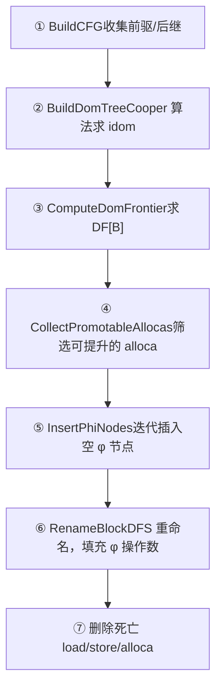

# Mem2Reg 优化 Pass 设计文档

本文档描述 **Mem2Reg**（Memory-to-Register）优化 Pass 的设计思路与实现细节。该 Pass 在 LLVM IR 生成之后、MIPS 后端代码生成之前运行，将"伪 SSA"形式的内存操作提升为真正的 SSA φ 节点，是进入后端之前的关键预处理步骤。

---

## 1. 为什么需要 Mem2Reg？

### 1.1 现状：伪 SSA 风格

IRGenVisitor 生成的 IR 以 `alloca` 代替 φ 节点，每个局部变量对应一个栈上槽：

```llvm
; SysY: int a = 0; if (cond) { a = 1; } return a;
entry:
  %a_ptr = alloca i32        ; ← 为变量 a 分配栈空间
  store i32 0, ptr %a_ptr    ; ← 初始化
  br i1 %cond, label %if.then, label %if.merge
if.then:
  store i32 1, ptr %a_ptr    ; ← 赋值
  br label %if.merge
if.merge:
  %val = load i32, ptr %a_ptr  ; ← 读取（哪条路径来的？）
  ret i32 %val
```

这种风格正确但低效：每次读写变量都经过内存，而 `%val` 实际上只需要是一个 SSA φ 节点。

### 1.2 目标：真正的 SSA 形式

Mem2Reg 变换后，`alloca/load/store` 三元组被完全消除：

```llvm
entry:
  br i1 %cond, label %if.then, label %if.merge
if.then:
  br label %if.merge
if.merge:
  %val = phi i32 [ 0, %entry ], [ 1, %if.then ]  ; ← 由控制流决定值
  ret i32 %val
```

这有两方面意义：
- **正确性**：φ 节点是 SSA 形式的语义要求，MIPS 寄存器分配基于 SSA 假设。
- **效率**：消除大量冗余 load/store，后续优化（常量传播、死代码消除）的效果更好。

> **课程知识点**：SSA（Static Single Assignment）是现代编译器中间表示的标准形式，LLVM、GCC、JVM 均采用。其核心约束是"每个变量恰好被赋值一次"，配合 φ 节点在控制流汇合处选值。Mem2Reg 是从"内存模型"（任意读写）到 SSA 形式的标准变换算法，由 Cytron 等人在 1991 年论文中提出。

---

## 2. 总体架构与数据流

Pass 基础设施采用经典的 **FunctionPass** 接口：

```cpp
// include/pass/Pass.h
class FunctionPass {
public:
    virtual bool Run(ir::Function& func) = 0;  // 返回 true 表示 IR 被修改
    virtual std::string_view GetName() const = 0;
};
```

`Mem2RegPass` 继承 `FunctionPass`，对每个函数独立执行，互不干扰。主控在 `main.cpp` 中接入：

```cpp
// main.cpp（节选）
const bool kEnableMem2Reg = true;   // 开关：false 可关闭优化对比前后 IR
if (kEnableMem2Reg) {
    pass::Mem2RegPass mem2reg;
    for (auto& func : result.module->GetFunctions()) {
        if (!func->GetBlocks().empty())   // 跳过外部声明（无基本块）
            mem2reg.Run(*func);
    }
}
```

每次 `Run` 的完整流水线：



---

## 3. CFG 构建（步骤①）

### 3.1 数据结构

```cpp
// include/pass/CFGBuilder.h
class CFGInfo {
    std::unordered_map<ir::BasicBlock*, BlockList> succs_;  // 后继
    std::unordered_map<ir::BasicBlock*, BlockList> preds_;  // 前驱
public:
    const BlockList& GetSuccs(ir::BasicBlock* bb) const;
    const BlockList& GetPreds(ir::BasicBlock* bb) const;
};
```

**设计决策**：CFGInfo 作为 Pass 运行时的局部变量（不写入 `BasicBlock`）。原因是 Mem2Reg 会修改 IR（删除指令、插入 φ），修改后 CFG 即失效；临时计算避免了"忘记更新"的隐患。

### 3.2 后继：从终止指令读取

每个基本块的最后一条指令必然是 `BranchInst` 或 `ReturnInst`。后继从 `BranchInst` 的操作数直接读出：

```cpp
static CFGInfo::BlockList GetTerminatorSuccs(ir::Instruction* inst) {
    if (auto* br = dynamic_cast<ir::BranchInst*>(inst)) {
        if (br->IsConditional())
            return {br->GetIfTrue(), br->GetIfFalse()};  // 两个后继
        else
            return {br->GetDest()};                      // 一个后继
    }
    assert(dynamic_cast<ir::ReturnInst*>(inst));
    return {};   // ReturnInst：无后继
}
```

### 3.3 前驱：def-use 链已"免费"提供

**这是一个设计亮点**：`BasicBlock` 继承自 `Value`；`BranchInst` 把目标块作为 operand 通过 `SetOperand` 挂入，目标块的 `use_list_` 因此天然记录了所有跳转到它的 `BranchInst`。

不过 `BuildCFG` 选择了更直白的方式——在计算后继时顺带填充前驱（`preds_[succ].push_back(B)`），避免了一次额外的 `dynamic_cast` 遍历。

---

## 4. 支配树（步骤②）

### 4.1 支配的定义

- 块 A **支配** 块 B（记作 A dom B）：从函数入口到 B 的**每一条路径**都经过 A。

- 特别地：每个块支配自己（自反性）；A **严格支配** B 指 A dom B 且 A ≠ B。

- **直接支配者（idom）**：离 B 最近的严格支配者，是支配树中 B 的父节点。

### 4.2 RPO 编号

Cooper 算法要求按**逆后序（Reverse Post-Order，RPO）** 遍历块。RPO 保证：对于 CFG 中的前向边 `A → B`（非回边），A 的 RPO 编号 < B 的 RPO 编号。这样处理 B 时，B 的大多数前驱 A 的 idom 已经确定，算法通常一两次迭代即收敛。

RPO 通过迭代 DFS 计算（避免深层 CFG 上的栈溢出）：

```cpp
// 后序收集，然后逆转 → RPO
std::vector<ir::BasicBlock*> rpo(post_order.rbegin(), post_order.rend());
for (int i = 0; i < (int)rpo.size(); ++i)
    rpo_index[rpo[i]] = i;
```

### 4.3 Cooper 算法核心：Intersect

算法的关键操作是在"部分已建成的 idom 树"上求两个块的**最近公共祖先（LCA）**：

```cpp
// 用 RPO 编号"让更深的先往上爬"，直到相遇
static ir::BasicBlock* Intersect(
        ir::BasicBlock* b1, ir::BasicBlock* b2,
        const idom_map& idom, const rpo_index_map& rpo_index) {
    while (b1 != b2) {
        while (rpo_index.at(b1) > rpo_index.at(b2)) b1 = idom.at(b1);
        while (rpo_index.at(b2) > rpo_index.at(b1)) b2 = idom.at(b2);
    }
    return b1;
}
```

完整算法：

```cpp
// 初始化：entry 的 idom 指向自身
idom[entry] = entry;
bool changed = true;
while (changed) {
    changed = false;
    for (每个非 entry 的块 B，按 RPO 顺序) {
        ir::BasicBlock* new_idom = B 的"第一个已处理前驱";
        for (B 的其余已处理前驱 P) {
            new_idom = Intersect(new_idom, P, idom, rpo_index);
        }
        if (idom[B] != new_idom) { idom[B] = new_idom; changed = true; }
    }
}
```

> **工业渊源**：Keith Cooper 的论文 *"A Simple, Fast Dominance Algorithm"*（2001）。该算法虽非渐近最优（Lengauer-Tarjan 为近似线性），但实现简单、实践中通常 1-2 次收敛，被多个工业编译器（包括早期 LLVM）采用作为首选。

### 4.4 支配边界（Dominance Frontier）

**支配边界** DF[B] 是"B 的支配范围刚好终止的地方"：

> DF[B] = { Y | ∃X ∈ pred(Y)，使得 B dom X，但 B **不**严格 dom Y }

计算方法：对每个**汇合块**（前驱数 ≥ 2 的块）Y，对 Y 的每个前驱 X 执行 `runner` 爬树：

```cpp
for (每个 Y，|pred(Y)| >= 2) {
    for (每个前驱 X of Y) {
        runner = X;
        while (runner != idom[Y]) {   // 爬到 idom(Y) 前停止
            df[runner].add(Y);        // Y 在 runner 的支配边界里
            runner = idom[runner];
        }
    }
}
```

`while (runner != idom[Y])` 的停止条件：`idom[Y]` 是 Y 的直接支配者，它的支配范围包含 Y，所以 Y **不在**它的 DF 里。

---

## 5. PhiInst 指令类

### 5.1 设计决策：独立存储 incoming

φ 节点的操作数（`incoming` 对）需要动态增长（逐个 `AddIncoming`）。若使用 `User::operands_`（`vector<Use>`），`vector` 扩容时会重分配内存，使已注册进 value `use_list_` 的 `Use*` 指针**悬空**，造成内存安全漏洞。

因此 `PhiInst` 用独立 `vector<IncomingPair>` 存储，不走 `User::operands_` 体系：

```cpp
class PhiInst : public Instruction {
    struct IncomingPair { Value* val; BasicBlock* pred; };
    std::vector<IncomingPair> incoming_;   // ← 独立存储，不触发 Use* 失效
public:
    void AddIncoming(Value* val, BasicBlock* pred);
    Value*      GetIncomingValue(int i) const;
    BasicBlock* GetIncomingBlock(int i) const;
    int         GetNumIncoming() const;
};
```

### 5.2 后续影响：φ 操作数不在 def-use 链中

**这是一个重要的设计局限**，需要明确说明：

| 功能 | 状态 |
|------|------|
| 通过 `GetIncomingValue(i)` 查询 φ 操作数 | ✅ 可用 |
| RAUW（`val->ReplaceAllUsesWith`）更新 φ 操作数 | ❌ 不会更新 |
| 通过 `val->GetUseList()` 找到"谁的 φ 用了我" | ❌ 找不到 |

**实际影响**：
- **Mem2Reg 本身**：不受影响。重命名阶段直接调用 `AddIncoming(current_val, pred_bb)`，所赋的值就是最终 SSA 值，无需后续 RAUW。
- **MIPS 后端**：通过 `phi->GetIncomingValue(i)` 和 `phi->GetIncomingBlock(i)` 直接访问，不依赖 def-use 链，也不受影响。
- **后续 DCE/SCCP 等优化 Pass**：若需要通过 RAUW 更新 φ 操作数，则需要升级 `PhiInst` 使其 incoming 进入 `User::operands_`（解决方案：在构造时预先 `ResizeOperands(2 * num_preds)`，一次性分配好空间，之后只 `SetOperand` 不再 `resize`）。**本阶段不实现此升级**，以保持简洁性。

### 5.3 打印格式

```llvm
  %5 = phi i32 [ %3, %if.then.2 ], [ %4, %if.else.3 ]
```

前驱块只打印标签名（`%label`），不带 `label` 关键字（与 `BranchInst` 操作数不同）：

```cpp
// 从 IRPrintContext 取块标签，拼 %label 格式
std::string label;
if (context && context->GetBlockLabel(pred, label))
    os << "%" << label;
```

---

## 6. φ 节点插入算法（步骤⑤）

### 6.1 核心思想

φ 节点要插在**变量定义汇合处**，即各 `store` 所在块的**支配边界**。关键在于：φ 节点本身也是一次"赋值"，它所在的块也要加入工作列表，可能触发新一轮插入——这就是"**迭代**"的含义。

### 6.2 算法（以变量 `a` 为例）

```pseudocode
has_phi    = {}     ← 已插入 φ 的块集合（防重复）
on_worklist = def_blocks(a)  ← 含 store 的块
worklist   = def_blocks(a)

while worklist 非空:
    B = worklist.pop()
    for Y in DF[B]:
        if Y ∉ has_phi:
            在 Y 的开头插入空 φ(a)   ← 操作数留空，重命名阶段填充
            has_phi.add(Y)
            if Y ∉ on_worklist:
                worklist.add(Y)      ← φ 是新的"定义"，Y 也要入队
                on_worklist.add(Y)
```

### 6.3 具体案例手推

以 `while` 循环中的变量 `a` 为例（最能体现迭代必要性）：

```pseudocode
CFG:  entry → for.cond ⇄ for.body（回边！）
              for.cond → for.after
```

支配树中 `idom[for.cond] = entry`，回边 `for.body → for.cond` 导致 **DF[for.body] = {for.cond}** 且 **DF[for.cond] = {for.cond}**（for.cond 在自己的支配边界里，这是**循环头**的典型特征）。

| 迭代轮次 | 弹出块 | DF[块] | 操作 |
|---------|--------|--------|------|
| Round 1 | entry | {} | 无操作 |
| Round 1 | for.body | {for.cond} | 在 for.cond 插入 φ；for.cond 入队 |
| Round 2 | for.cond | {for.cond} | for.cond ∈ has_phi，跳过 |

结果：φ 节点仅插在 `for.cond`，操作数暂为空。

---

## 7. SSA 重命名算法（步骤⑥）

这是整个 Mem2Reg 中最精妙的部分，也是最容易出错的地方。

### 7.1 核心数据结构

```cpp
struct RenameContext {
    // current_val[alloca] = "当前值"栈；back() 是当前作用域最新的定义
    std::unordered_map<ir::AllocaInst*, std::vector<ir::Value*>>& current_val;
    // phi_map[alloca][bb] = 在 bb 为 alloca 插入的 PhiInst*
    const phi_map_t& phi_map;
    // 逆映射：某个 PhiInst 是为哪个 alloca 插入的？
    const std::unordered_map<ir::PhiInst*, ir::AllocaInst*>& phi_to_alloca;
    std::vector<ir::Instruction*>& to_erase;  // 延迟删除列表
    // CFG/支配树
    const CFGInfo& cfg;
    const DomTreeInfo& dom;
};
```

`current_val[alloca]` 是一个**值栈**，栈顶是当前 DFS 路径下变量的最新 SSA 值。

### 7.2 DFS 过程（每个块执行四步）

对每个块 `bb`，按顺序执行：

#### 步骤 A：处理块内指令

| 遇到的指令 | 操作 | 值栈变化 |
|-----------|------|---------|
| `PhiInst`（Mem2Reg 插入的） | φ 本身就是新的 SSA 值 | **压栈**：`stack.push(phi)` |
| `LoadInst`（从可提升 alloca 读） | RAUW：所有使用者改用 `stack.back()` | 不变；load 加入 to_erase |
| `StoreInst`（向可提升 alloca 写） | 存储的值成为新 SSA 值 | **压栈**：`stack.push(stored_val)` |

#### 步骤 B：填充后继块的 φ 节点

```cpp
for (ir::BasicBlock* succ : cfg.GetSuccs(bb)) {
    for (ir::AllocaInst* alloca : allocas) {
        // 如果 succ 里有为 alloca 插入的 φ
        if (phi_map[alloca].count(succ)) {
            ir::Value* cur = current_val[alloca].back();
            phi_map[alloca][succ]->AddIncoming(cur, bb);
            //                                 ↑       ↑
            //                           当前路径的值  来自哪条边
        }
    }
}
```

这一步是"填空"：φ 节点在步骤⑤创建时为空，现在从 DFS 当前位置（知道"来自哪个块"和"当前值是什么"）填入一对 `(val, pred_bb)`。

#### 步骤 C：递归到支配树子节点

```cpp
for (ir::BasicBlock* child : dom.children[bb]) {
    RenameBlock(child, ctx);   // 子节点继承父节点的值栈状态
}
```

注意是**支配树**的子节点，不是 CFG 的后继。支配树的 DFS 保证了"处理 child 时，parent 的所有定义都已压栈"。

#### 步骤 D：弹栈（恢复父节点状态）

```cpp
for (auto& [alloca, count] : push_count) {
    for (int i = 0; i < count; ++i)
        current_val[alloca].pop_back();   // 精确弹出本块压入的条目
}
```

"不可变栈"语义：本块压入的值只在本块的 DFS 子树中有效，退出时必须精确还原。

### 7.3 完整示例：`while` 循环变量 `a`

延续第 6.3 节的例子，φ 已插在 `for.cond`，现在执行重命名：

```
DFS 访问顺序（支配树顺序）：entry → for.cond → for.body，for.after
```

**访问 entry**：
- 遇到 `store i32 0, ptr %a_ptr` → 压栈：`stack = [0]`，store 加入 to_erase
- 填充后继 `for.cond` 的 φ：`phi.AddIncoming(0, entry)`
- 递归到 for.cond

**访问 for.cond**：
- 遇到 `phi`（为 a 插入的）→ phi 是新 SSA 值，压栈：`stack = [0, phi]`
- （栈顶是 phi，因为 phi 自身的值在执行时由操作数选出，是比 0 更新的定义）
- 填充 for.body 的后继（for.cond 没有为 a 插入 φ，for.body 里无 φ）
- 递归到 for.body，for.after

**访问 for.body**：
- 遇到 `load i32, ptr %a_ptr` → RAUW 为 phi，load 入 to_erase
- 遇到 `add i32 %load, 1` → 注意 load 已被 RAUW 替换为 phi，add 的操作数正确
- 遇到 `store i32 %1, ptr %a_ptr` → 压栈：`stack = [0, phi, %1]`，store 入 to_erase
- 填充 for.cond 的 φ（回边）：`phi.AddIncoming(%1, for.body)`
- 弹出 `%1`，回到 `stack = [0, phi]`，退出 for.body

**访问 for.after**：
- 遇到 `load i32, ptr %a_ptr` → RAUW 为 `stack.back() = phi`，入 to_erase
- 无后继，退出

**弹出 for.cond 压入的 phi**，回到 `stack = [0]`；
**弹出 entry 压入的 0**，回到 `stack = []`。

**最终结果**：

```llvm
for.cond:
  %a.phi = phi i32 [ 0, %entry ], [ %1, %for.body ]
for.body:
  %1 = add nsw i32 %a.phi, 1
for.after:
  ret i32 %a.phi
```

所有 `alloca/load/store` 已消除，IR 进入完全 SSA 形式。

---

## 8. 可提升性判断（IsPromotable）

只有**标量** alloca 且所有 use 为直接 `load`/`store` 时才可提升：

```cpp
bool IsPromotable(ir::AllocaInst* alloca) {
    // 规则1：数组 alloca 不可提升
    if (elem_ty->GetTypeId() == ir::TypeID::ARRAY_TY_ID) return false;

    for (ir::Use* use : alloca->GetUseList()) {
        if (auto* load = dynamic_cast<ir::LoadInst*>(use->GetUser())) {
            if (load->GetPointerOperand() != alloca) return false; // 地址被取走
        } else if (auto* store = dynamic_cast<ir::StoreInst*>(use->GetUser())) {
            // StoreInst op(1)=ptr；若 alloca 出现在 op(0) 位置，说明地址被存走
            if (store->GetPointerOperand() != alloca) return false;
        } else {
            return false;  // GEP、call 参数等 → 不可提升
        }
    }
    return true;
}
```

**不可提升的情形**：
- `alloca [10 x i32]`（数组）
- 通过 GEP 计算下标地址
- 将 alloca 的地址传给函数调用（取地址）

> `store->GetPointerOperand() != alloca` 这一判断的微妙之处：`StoreInst` 有两个操作数，`op(0) = value`，`op(1) = ptr`。若某条 store 是把 alloca 的地址存走（`store ptr %alloca, ptr %other_ptr`），则 alloca 出现在 op(0)，`GetPointerOperand()`（即 op(1)）返回 `%other_ptr`，不等于 alloca，正确拒绝。

---

## 9. 指令删除（EraseFromParent）

Mem2Reg 修改 IR 的最后一步是删除所有 dead alloca/load/store：

```cpp
static void EraseFromParent(ir::Instruction* inst) {
    // ① 先解绑所有操作数：从各 Value 的 use_list_ 中移除对应 Use*
    for (int i = 0; i < (int)inst->GetNumOperands(); ++i)
        inst->SetOperand(i, nullptr);   // SetOperand 会调用 RemoveUse

    // ② 从父块的指令列表中删除（list 迭代器稳定，O(n) 遍历定位）
    auto& insts = inst->GetParent()->GetInstructions();
    insts.erase(std::find_if(insts.begin(), insts.end(),
                             [inst](const auto& up){ return up.get() == inst; }));
}
```

**为什么必须先解绑操作数**：`User` 的析构函数不会自动清理 `Use`——`Use::~Use()` 为默认析构，不调用 `value_->RemoveUse(this)`。若不手动解绑，`Value::use_list_` 里会留下指向已释放内存的悬垂指针，后续遍历 use_list 会导致未定义行为。

**延迟删除的必要性**：重命名 DFS 期间正在遍历每个块的指令列表，不能在遍历中删除元素（迭代器失效）。因此所有待删除指令先收集进 `to_erase` 向量，DFS 全部完成后统一删除。

---

## 10. 文件结构

```plaintext
include/pass/
  Pass.h          ← FunctionPass 基类
  CFGBuilder.h    ← CFGInfo 数据结构 + BuildCFG 声明
  DomTree.h       ← DomTreeInfo / DomFrontierInfo + 算法声明
  Mem2Reg.h       ← Mem2RegPass 声明

src/pass/
  CFGBuilder.cpp  ← BuildCFG 实现
  DomTree.cpp     ← Cooper 算法 + DF 计算
  Mem2Reg.cpp     ← IsPromotable / InsertPhiNodes / RenameBlock / Run
```

这三个 `.cpp` 文件的职责完全分离，`DomTree.cpp` 和 `CFGBuilder.cpp` 是可复用的分析工具，未来 MIPS 后端做活跃变量分析、寄存器分配时可以直接复用 `CFGBuilder`，并在此基础上扩展后支配树（Post-Dominator Tree）。

---

## 11. 验证方法

| 验证场景 | 操作 | 预期结果 |
|---------|------|---------|
| 直线代码 `int a = 1; return a;` | 关闭/开启 Mem2Reg | 开启后 `alloca/load/store` 全消失，`ret i32 1` |
| if-else 分支 | 开启 Mem2Reg | `if.merge` 处出现 `phi i32 [ ..., %if.then ], [ ..., %if.else ]` |
| while 循环 | 开启 Mem2Reg | 循环头出现 `phi`，含 `%entry` 和 `%for.body` 两个 incoming |
| 数组变量 | 开启 Mem2Reg | 数组的 `alloca [N x i32]` **保留**（不可提升），仅标量被消除 |
| 用 `lli` 执行 | `lli llvm_ir.txt` | 返回值与预期相同 |
