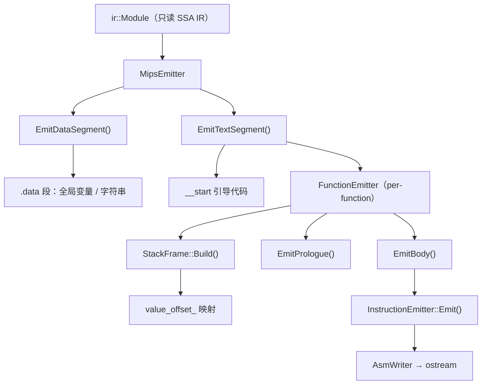
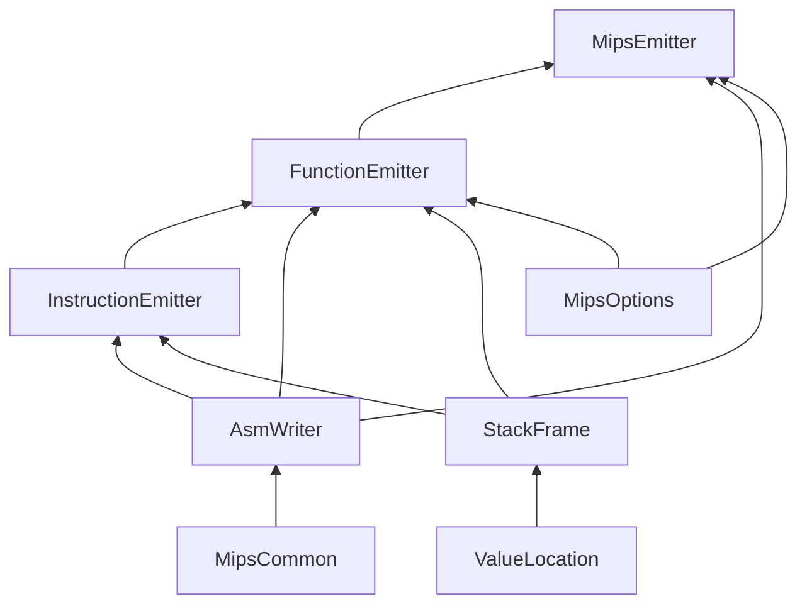

# MIPS 目标代码生成 设计文档

本文档描述 **MIPS 后端**（LLVM IR → MIPS Assembly）的设计思路与实现细节。该模块在 Mem2Reg Pass 之后运行，将完全 SSA 形式的 `ir::Module` 翻译为可在 MARS 4.5 上正确执行的 MIPS 汇编，写入 `mips.txt`。

作为编译器的最终阶段，MIPS 后端负责弥合**抽象 IR**与**具体硬件**之间的语义鸿沟——这恰是编译原理课程中"代码生成"一章的核心命题：如何将平台无关的中间表示，通过**指令选择**、**栈帧布局**和**调用约定**，落地为目标机器可执行的指令序列。

---

## 1. 实现思路与演进

### 1.1 初版：先做对，再做好

遵循 [先导设计文档](../ai_collab_notes/mips/mips_backend_preliminary_guide_20260305.md) 的路线图，初版以**正确性优先**为唯一目标：

- **全栈分配（All Values on Stack）**：每个 SSA Value 都住在栈上，不做寄存器分配；运算时临时借用 `$t0`–`$t3` 搬运，算完立即写回。这是最保守也最不容易出错的策略。
- **两文件结构**：仅 `MipsEmitter`（顶层驱动）+ `FunctionEmitter`（每函数发射），后者一个类承担栈帧计算、指令选择、调用约定、Phi 下降等全部职责——典型的 God Class。
- **增量里程碑**：从 M0（骨架）到 M8（char/trunc），每步只新增一种 IR 指令的翻译，逐步扩展 `emitInstruction` 的 `if-else` 链，每步用 MARS 验证。

这种"先一锅粥"的方式让我们在两天内跑通了全部测试用例，但也积累了重复代码、职责不清、接口暴露过多等技术债。

### 1.2 重构：AI 协作的模块化拆分

初版通过全部测试后，基于 [模块化重构方案](../ai_collab_notes/mips/mips_backend_modular_refactor_plan_20260310.md) 进行了 **语义不变** 的重构：

- 将 FunctionEmitter 的 5 项职责拆分为独立模块（StackFrame、InstructionEmitter、AsmWriter 等）
- 提取共享工具到 MipsCommon，消除代码重复
- 引入 MipsOptions / ValueLocation 为后续优化预留接口
- 每步 diff 验证输出完全一致，确保重构零引入 bug

重构的核心原则是 **"让每个文件的职责可以用一句话说清"**：StackFrame 只算偏移，AsmWriter 只管输出格式，InstructionEmitter 只做指令选择，FunctionEmitter 只是编排者。

---

## 2. 总体架构

### 2.1 模块职责

| 模块 | 文件 | 一句话职责 |
|------|------|-----------|
| **MipsEmitter** | `MipsEmitter.h/cpp` | 顶层驱动：遍历 Module，发射 `.data` 和 `.text` 段 |
| **FunctionEmitter** | `FunctionEmitter.h/cpp` | 每函数编排者：Build → Prologue → Body |
| **StackFrame** | `StackFrame.h/cpp` | 栈帧布局：扫描 IR 指令，为每个 Value 分配 `$sp` 偏移 |
| **InstructionEmitter** | `InstructionEmitter.h/cpp` | 指令选择：每种 IR 指令 → 对应 MIPS 序列 |
| **AsmWriter** | `AsmWriter.h/cpp` | 汇编输出：所有 MIPS 文本经此单一出口，统一缩进与格式 |
| **MipsCommon** | `MipsCommon.h/cpp` | 共享工具：标签生成、库函数判断 |
| **MipsOptions** | `MipsOptions.h` | 编译选项：优化开关（当前全部关闭） |
| **ValueLocation** | `ValueLocation.h` | Value 位置抽象：栈偏移 / 寄存器（为寄存器分配预留） |

### 2.2 数据流



后端**只读**遍历 IR，不修改任何 `ir::` 对象。通过 `dynamic_cast` 识别每种指令类型，将结构化的 IR 决策翻译为 MIPS 文本——这与 IR 阶段 `Print()` 方法的识别机制一脉相承。

### 2.3 主控接入

```cpp
// main.cpp（节选）
if (kEmitMIPSOutput && result.module) {
    std::ofstream mips_out("mips.txt");
    mips::MipsOptions mips_opts;
    mips::MipsEmitter emitter(mips_out, *result.module, mips_opts);
    emitter.Emit();
}
```

`MipsOptions` 的所有优化开关默认关闭，因此当前行为等价于初版的全栈分配。后续启用寄存器分配只需设 `mips_opts.enable_reg_alloc = true`。

---

## 3. 关键数据结构

### 3.1 StackFrame：栈帧布局

StackFrame 是整个后端的**地基**——如果一个 Value 找不到自己的"家"（栈偏移），后续一切指令选择都无从谈起。

```cpp
class StackFrame {
public:
    explicit StackFrame(const ir::Function& func);
    void Build();
    int GetFrameSize() const;
    int GetOffset(const ir::Value* val) const;
    bool HasSlot(const ir::Value* val) const;
    ValueLocation GetLocation(const ir::Value* val) const;
private:
    const ir::Function& func_;
    int frame_size_ = 0;
    std::unordered_map<const ir::Value*, int> value_offset_;

    void AllocateAllocas();
    void AllocateInstructionSlots();
    void AllocateArgumentSlots();
    static bool ProducesValue(const ir::Instruction* inst);
};
```

`value_offset_` 是核心映射：给定任意 `ir::Value*`，返回其相对 `$sp` 的字节偏移。`Build()` 一趟扫描完成全部分配，之后只读查询。

**栈帧布局（由低地址到高地址）**：

```
低地址（$sp 指向这里）
┌─────────────────────────────────────┐  offset = 0
│  $ra 保存槽 (4 bytes)                │
├─────────────────────────────────────┤  offset = 4
│  AllocaInst 空间                     │  标量 4B / 数组 N×elem_size
│  ...                                │
├─────────────────────────────────────┤
│  各指令结果槽 (每个 4 bytes)          │  BinaryInst / LoadInst / PhiInst ...
│  ...                                │
├─────────────────────────────────────┤
│  参数 0–3 的溢出槽 (各 4 bytes)       │  从 $a0–$a3 spill 进来
├─────────────────────────────────────┤  offset = frame_size_
│  参数 4+ 区域（属于调用者栈帧！）      │  callee 只读，不占 callee frame
└─────────────────────────────────────┘
高地址
```

### 3.2 ValueLocation：为寄存器分配预留的桥梁

```cpp
struct ValueLocation {
    enum Kind { STACK, REGISTER };
    Kind kind;
    int stack_offset;     // kind == STACK
    std::string reg_name; // kind == REGISTER
    static ValueLocation OnStack(int offset);
    static ValueLocation InRegister(const std::string& reg);
};
```

当前 `GetLocation()` 始终返回 `OnStack(offset)`。当寄存器分配器上线后，部分 Value 将返回 `InRegister("$s0")` 等，`LoadValueToReg` 的通用分支会自动从 `lw` 切换为 `move`：

```cpp
ValueLocation loc = frame_.GetLocation(val);
if (loc.kind == ValueLocation::REGISTER) {
    if (loc.reg_name != reg)
        writer_.EmitMove(reg, loc.reg_name);  // 寄存器分配后的路径
} else {
    writer_.EmitLwSp(reg, loc.stack_offset);   // 当前全栈路径
}
```

### 3.3 AsmWriter：汇编输出的单一出口

```cpp
class AsmWriter {
public:
    explicit AsmWriter(std::ostream& os);
    void EmitLabel(const std::string& label);
    void EmitDirective(const std::string& directive);
    void EmitInsn(const std::string& text);     // 带 4 格缩进
    void EmitLi(const std::string& reg, int64_t imm);
    void EmitLa(const std::string& reg, const std::string& label);
    void EmitSwSp(const std::string& reg, int offset);
    void EmitLwSp(const std::string& reg, int offset);
    void EmitAddiu(const std::string& dst, const std::string& src, int imm);
    void EmitSyscall();
    // ... .data helpers: EmitWord, EmitAsciiz, EmitSpace
};
```

**设计决策**：所有 MIPS 文本输出都经过 `AsmWriter`，杜绝散落的 `os_ <<`。这不仅保证了格式统一（缩进、助记符对齐），更为后续窥孔优化提供了可能——只需在 `AsmWriter` 内部增加缓冲层，先收集指令再优化后输出。

---

## 4. 核心算法与实现

### 4.1 Value 加载：LoadValueToReg

`LoadValueToReg` 是出现频率最高的辅助方法——几乎每条指令翻译都要先把操作数"搬"到临时寄存器。它根据 Value 的**运行时类型**决定加载方式：

```cpp
void InstructionEmitter::LoadValueToReg(const ir::Value* val, const std::string& reg) {
    if (val == nullptr) {
        writer_.EmitLi(reg, 0);           // undef → 0
    } else if (auto* ci = dynamic_cast<const ir::ConstantInt*>(val)) {
        writer_.EmitLi(reg, ci->GetValue()); // 常量 → li
    } else if (auto* gv = dynamic_cast<const ir::GlobalVar*>(val)) {
        writer_.EmitLa(reg, GlobalLabel(gv->GetName())); // 全局 → la（地址）
    } else if (auto* alloca = dynamic_cast<const ir::AllocaInst*>(val)) {
        writer_.EmitAddiu(reg, "$sp", frame_.GetOffset(alloca)); // 栈地址 → addiu
    } else {
        // 通用路径：查 ValueLocation（当前全是 STACK → lw）
        ValueLocation loc = frame_.GetLocation(val);
        // ... REGISTER / STACK 分支
    }
}
```

| Value 类型 | 加载方式 | 语义 |
|-----------|---------|------|
| `ConstantInt` | `li $t, imm` | 立即数 |
| `GlobalVar` | `la $t, label` | 全局变量**地址** |
| `AllocaInst` | `addiu $t, $sp, offset` | 栈上空间**地址** |
| 其他 SSA Value | `lw $t, offset($sp)` | 栈槽中的**值** |

注意 `GlobalVar` 和 `AllocaInst` 加载的是**地址**，而非值本身——因为 IR 中它们的类型是 `ptr`，后续 `LoadInst` / `StoreInst` 会通过这个地址再做一次间接访问。

### 4.2 指令选择

`InstructionEmitter::Emit()` 是一条 `if-else if` 的 `dynamic_cast` 链，每种 IR 指令类型对应一个专用的 `EmitXxxInst` 方法。这与 IR 的 `Print()` 采用完全一致的识别模式——通过运行时类型分派实现指令选择。

> **编译原理知识点**：指令选择（Instruction Selection）是后端代码生成的核心步骤之一。工业编译器（如 LLVM）使用 TableGen + DAG Matching 实现自动化的模式匹配；而本项目采用手写 `dynamic_cast` 链，虽然不如自动化方案可扩展，但在 SysY 有限的指令种类下足够简洁明了。

以二元运算为例：

```cpp
void InstructionEmitter::EmitBinaryInst(const ir::BinaryInst* inst) {
    LoadValueToReg(inst->GetLhs(), "$t0");
    LoadValueToReg(inst->GetRhs(), "$t1");
    switch (inst->GetOp()) {
        case ir::BinaryOp::ADD: writer_.EmitInsn("addu  $t2, $t0, $t1"); break;
        case ir::BinaryOp::SUB: writer_.EmitInsn("subu  $t2, $t0, $t1"); break;
        case ir::BinaryOp::MUL: writer_.EmitInsn("mul   $t2, $t0, $t1"); break;
        case ir::BinaryOp::DIV:
            writer_.EmitInsn("div   $t0, $t1");
            writer_.EmitInsn("mflo  $t2");
            break;
        case ir::BinaryOp::REM:
            writer_.EmitInsn("div   $t0, $t1");
            writer_.EmitInsn("mfhi  $t2");
            break;
    }
    writer_.EmitSwSp("$t2", frame_.GetOffset(inst));
}
```

**模式统一**：load 操作数到 `$t0`/`$t1` → 运算到 `$t2` → store 结果回栈。全栈分配下每条 IR 指令都遵循这个三段式，简单到不可能出错。

`DIV`/`REM` 值得注意：MARS 的 `div $s, $t` 是真正的 R 型指令（结果写入 HI:LO 特殊寄存器），必须用 `mflo`（商）/ `mfhi`（余数）取出。初版曾误用三操作数伪指令 `div $d, $s, $t`，在 MARS 4.5 上不兼容。

**完整的指令选择映射**：

| IR 指令 | MIPS 序列 | 要点 |
|---------|----------|------|
| `BinaryInst(ADD/SUB)` | `addu/subu $t2, $t0, $t1` | 用无符号版本避免溢出异常 |
| `BinaryInst(MUL)` | `mul $t2, $t0, $t1` | MARS 伪指令 |
| `BinaryInst(DIV/REM)` | `div $t0, $t1` + `mflo/mfhi` | 真正的 R 型 |
| `IcmpInst` | `slt/sgt/sle/sge/seq/sne` | 全部是 MARS 伪指令 |
| `LoadInst` | `lw/lbu $t0, 0($t0)` | i8 用 `lbu` 零扩展 |
| `StoreInst` | `sw/sb $t0, 0($t1)` | i8 用 `sb` 只写低字节 |
| `BranchInst`（无条件） | `j label` | — |
| `BranchInst`（条件） | `bnez $t0, true` + `j false` | 两条指令保证覆盖 |
| `ReturnInst` | `move $v0, ..` + epilogue | 内联 epilogue |
| `ZextInst` | 直接 copy（栈上 i1 已占 4B） | No-op 语义 |
| `TruncInst` | `andi $t0, $t0, 0xFF` | i32→i8 截低 8 位 |
| `GetElementPtrInst` | `sll` + `addu` | 见 §4.3 |
| `CallInst` | 参数设置 + `jal` | 见 §4.4 |
| `PhiInst` | 不在自己块生成代码 | 见 §4.5 |
| `AllocaInst` | 不生成运行时代码 | 空间在 prologue 统一分配 |

### 4.3 GEP 与数组地址计算

`GetElementPtrInst` 只做**地址算术**，不访问内存。IR 中有两种形式：

```llvm
; 两索引：base 是指向数组的指针（局部 alloca 或全局数组）
%addr = getelementptr [5 x i32], ptr %arr, i32 0, i32 %idx
; 单索引：base 已经是元素指针（如函数参数传入的数组指针）
%addr = getelementptr i32, ptr %base, i32 %idx
```

翻译逻辑根据第二个索引是否存在来区分，最终都归结为 `base + index * elem_size`：

```cpp
const ir::Value* elem_index =
    inst->GetIndex(1) != nullptr ? inst->GetIndex(1) : inst->GetIndex(0);
LoadValueToReg(elem_index, "$t1");
int elem_size = GepElementSizeBytes(inst);
if (elem_size == 4) {
    writer_.EmitInsn("sll   $t2, $t1, 2");   // index * 4
    writer_.EmitInsn("addu  $t2, $t0, $t2");  // base + offset
} else {
    writer_.EmitInsn("addu  $t2, $t0, $t1");  // i8: index * 1
}
```

`sll $t1, 2` 即左移 2 位，等价于乘以 4——对于 i32 数组，每个元素占 4 字节。i8 数组（char 类型）每元素 1 字节，直接加。

### 4.4 函数调用与栈帧协议

#### 调用约定

| 规则 | 说明 |
|------|------|
| 参数 0–3 | 通过 `$a0`–`$a3` 传递 |
| 参数 4+ | 由**调用者**在自己栈帧底部分配空间并 `sw` |
| 返回值 | `$v0` |
| `$ra` 保存 | **被调函数**在 prologue 中 `sw`，epilogue 中 `lw` |
| 临时寄存器 | `$t0`–`$t3` caller-saved，不跨指令存活 |
| callee-saved | 初版不使用 `$s0`–`$s7`，无需保存 |

#### 调用者视角：EmitCallInst

```cpp
void InstructionEmitter::EmitCallInst(const ir::CallInst* inst) {
    // 1 逐个 load 参数 5+ 到 $t0，立即写到 $sp 下方的目标位置
    //    （负偏移，$sp 调整后刚好成为正确的栈槽）
    if (kExtraSize > 0) {
        for (size_t i = 4; i < kNumArgs; ++i) {
            LoadValueToReg(inst->GetArg(i), "$t0");
            writer_.EmitSwSp("$t0", -kExtraSize + (i-4)*4);
        }
    }
    // 2 load 参数 0–3 到 $a0–$a3
    for (size_t i = 0; i < 4 && i < kNumArgs; ++i)
        LoadValueToReg(inst->GetArg(i), "$a" + ...);
    // 3 下移 $sp 覆盖已写入的参数区
    if (kExtraSize > 0)
        writer_.EmitAddiu("$sp", "$sp", -kExtraSize);
    writer_.EmitInsn("jal   " + name);
    // 4 调用返回后恢复 $sp
    if (kExtraSize > 0)
        writer_.EmitAddiu("$sp", "$sp", kExtraSize);
    // 5 保存返回值到栈槽
    if (非 void) writer_.EmitSwSp("$v0", frame_.GetOffset(inst));
}
```

**关键顺序问题**：步骤 1 和 2 必须在 3（调整 `$sp`）之前完成。因为 `LoadValueToReg` 可能从 `$sp + offset` 加载操作数，如果先移动了 `$sp`，offset 就错位了。步骤 1 采用"逐个处理"策略——每个额外参数用 `$t0` 加载后立即写到 `$sp` 下方的目标位置（负偏移），而非同时持有在多个 `$t` 寄存器中。这避免了当额外参数超过 10 个时溢出 `$t0`–`$t9` 的问题。写入区域（`$sp` 下方）与源值区域（`$sp` 上方的栈槽）不重叠，操作安全。

#### 被调函数视角：Prologue

```cpp
void FunctionEmitter::EmitPrologue() {
    writer_.EmitLabel(func_.GetName());
    writer_.EmitAddiu("$sp", "$sp", -frame_.GetFrameSize());
    writer_.EmitInsn("sw    $ra, 0($sp)");  // $ra 在 offset 0
    // 将 $a0–$a3 spill 到栈上各自的槽
    for (size_t i = 0; i < kNumArgs && i < 4u; ++i)
        writer_.EmitSwSp("$a" + ..., frame_.GetOffset(func_.GetArgument(i)));
}
```

#### 为什么参数 5+ 不增加 frame\_size\_？

这是 `StackFrame::AllocateArgumentSlots()` 中一个关键的设计细节：

```cpp
void StackFrame::AllocateArgumentSlots() {
    // 参数 0–3：分配本地栈槽
    for (size_t i = 0; i < kNumArgs && i < 4u; ++i) {
        value_offset_[func_.GetArgument(i)] = frame_size_;
        frame_size_ += 4;  // ← 占用 callee 自己的栈帧空间
    }
    // 参数 4+：映射到调用者栈帧
    for (size_t i = 4; i < kNumArgs; ++i) {
        value_offset_[func_.GetArgument(i)] = frame_size_ + static_cast<int>((i - 4) * 4);
        // ← 注意：没有 frame_size_ += 4!
    }
}
```

参数 0–3 通过 `$a0`–`$a3` 传入，被调函数需要在**自己的栈帧内**分配槽位来保存它们（prologue 中 `sw $a0, offset($sp)`），所以 `frame_size_ += 4`。

参数 4+ 则完全不同——它们由==**调用者**==在自己的栈帧底部分配空间并写入。从被调函数的角度看，这些参数位于 `$sp + frame_size` 的上方，即**调用者的领地**。被调函数只是通过计算好的偏移去读它们，不需要为它们分配自己的栈空间。用一张图来说明：

```
            调用者栈帧
       ┌───────────────────┐
       │  arg[5] (调用者写) │  callee 的 $sp + frame_size + 4
       │  arg[4] (调用者写) │  callee 的 $sp + frame_size + 0
       ├───────────────────┤  ← callee 入口时的 $sp
       │                   │
       │  callee 的栈帧     │  frame_size 字节
       │  (包含 $ra、alloca、│
       │   结果槽、arg0-3)  │
       │                   │
       └───────────────────┘  ← callee prologue 后的 $sp
```

因此 `value_offset_[arg_5] = frame_size_ + 0`、`value_offset_[arg_6] = frame_size_ + 4`——偏移**跨越**了 callee 自己的 frame，直接指向上方的调用者区域。如果错误地做了 `frame_size_ += 4`，这些偏移就会指错位置。

### 4.5 Phi 节点下降与拓扑排序

#### 问题的本质

SSA 形式中的 φ 节点是**并行赋值**的语义：`%a = phi [ %x, %pred1 ], [ %y, %pred2 ]` 意味着"从 pred1 来取 %x，从 pred2 来取 %y"。但 MIPS 没有 φ 指令，我们必须在前驱块的**跳转之前**插入 move 操作来模拟。

这对应编译原理中 **SSA 解构（SSA Destruction）** 的经典问题：将 φ 节点"下降"为具体的 move 指令。

#### 天真方案的陷阱

以 `fib_iter` 的 for 循环为例，Mem2Reg 后循环头 `for.cond` 有三个 φ：

| φ 变量 | 从 entry | 从 for.step |
|--------|----------|-------------|
| %a | 0 | **%b**（上一轮的 b） |
| %b | 1 | %tmp |
| %i | 2 | %i1 |

在 `for.step → for.cond` 这条边上，需要发射三条 move：

- 写 %a 的槽 := %b（读 b 的槽）
- 写 %b 的槽 := %tmp
- 写 %i 的槽 := %i1

如果**先**执行"写 %b 的槽 := %tmp"，**再**执行"写 %a 的槽 := %b"，那么 %a 读到的已是被覆盖后的新 %b（即 %tmp），而非上一轮的旧 %b——这就是初版中 case_008 输出 256 而非 55 的根本原因。

#### 拓扑排序：接收者先写，生产者后写

我们需要对同一条边上的所有 phi move 做**拓扑排序**，遵循一条规则：

> **如果移动 P 会覆写槽 S，而另一移动 Q 要从槽 S 读取，则 Q 必须排在 P 之前。**

换言之：**接收者**（读别人的槽）先发射，**生产者**（写入该槽的新值）后发射。

```cpp
while (sorted.size() < edge_phis.size()) {
    bool added = false;
    for (const auto& p : edge_phis) {
        if (已在 sorted 中) continue;
        // "写 p.first 的槽"的移动能否加入？
        // 仅当所有"从 p.first 的槽读取"的移动都已在 sorted 中
        bool receivers_ready = true;
        for (const auto& q : edge_phis) {
            if (q.second != p.first) continue; // q 不读 p.first 的槽
            if (q.first 不在 sorted 中) { receivers_ready = false; break; }
        }
        if (!receivers_ready) continue;
        sorted.push_back(p);
        added = true;
    }
    assert(added && "Phi cycle detected");
}
```

`p = (phi_dst, value_src)`：写 `phi_dst` 的槽 := `value_src`。
`q.second == p.first`：q 要读的值恰好是 `phi_dst` 的当前槽内容。

对上面的 fib\_iter 例子：
- `(phi_b, %tmp)` 要写 %b 的槽。但 `(phi_a, %b)` 需要读 %b 的槽（`q.second == phi_b`）。
- 只有 `phi_a` 已入 sorted，`phi_b` 才被允许入 sorted。
- 结果：先写 %a := %b，后写 %b := %tmp。%a 读到旧 %b，正确。

> **理论映射**：这本质上是一个**有向无环图的拓扑排序**。节点是 φ 移动，边表示"写-读"依赖。由于 Mem2Reg 不产生同一条边上的 φ 循环依赖（如 `a := b`, `b := a` 同时出现），DAG 假设成立，拓扑序必然存在。如果未来遇到真正的循环（如手写 IR 的 swap），则需引入额外的临时槽来打破环。

#### 发射顺序确定后的 move 生成

```cpp
for (const auto& [phi, incoming] : sorted) {
    LoadValueToReg(incoming, "$t0");            // 读源值到 $t0
    writer_.EmitSwSp("$t0", frame_.GetOffset(phi)); // 写入 phi 的栈槽
}
```

由于全栈分配下 `LoadValueToReg` 的 `lw` 操作不会修改源槽（读不破坏源），只要发射顺序正确，每条 move 都能读到正确的值。

### 4.6 MARS 的 getint / getchar 混合输入问题

#### 现象

当 SysY 程序混用 `getint` 和 `getchar` 时（如 `x = getint(); c = getchar(); z = getint();`），MARS 在第三次 `getint` 处报 "invalid integer input" 错误。

#### 根因：MARS syscall 的行为差异

| 操作 | C 标准 `scanf` 行为 | MARS syscall 行为 |
|------|-------------------|------------------|
| **getint** (syscall 5) | 跳过空白，读整数，**不消耗**尾 `\n` | **整行读取**（含尾 `\n`），解析为整数 |
| **getchar** (syscall 12) | 读一个字符 | 读一个字符，**不消耗**尾 `\n` |

问题序列（输入 `1\n2\nA\n3\n`）：

| 操作 | 消耗 | 缓冲区剩余 |
|------|------|-----------|
| getint → x | `1\n` | `2\nA\n3\n` |
| getint → y | `2\n` | `A\n3\n` |
| getchar → c | `A` | `\n3\n` |
| getint → z | 读到 `\n`（空行） | 报错！ |

MARS 的 getint 尝试读一整行，拿到空行 `\n`，无法解析为整数。

#### 解决方案

在每个 `getchar` 的 syscall 之后，**额外执行一次 syscall 12 消耗掉尾随的 `\n`**：

```cpp
} else if (name == "getchar") {
    writer_.EmitLi("$v0", 12);
    writer_.EmitSyscall();
    writer_.EmitSwSp("$v0", frame_.GetOffset(inst));
    // 消耗尾随 '\n'，否则下一个 getint 会读到空行
    writer_.EmitLi("$v0", 12);
    writer_.EmitSyscall();
}
```

修复后 getchar 消耗 `A` 和 `\n` 两个字符，缓冲区干净地留下 `3\n`，后续 getint 正常读取。

**使用约束**：当前方案假设课程测试数据中每个 `getchar` 的字符独占一行（即字符后一定跟 `\n`）。这是 BUAA 课程测试数据的标准格式。如果输入格式为多字符同行（如 `AB\n`），额外的 syscall 12 会误吞下一个有效字符。

> `getint` **无需**额外处理——MARS syscall 5 自身会消耗整行（含 `\n`），行为自洽。

### 4.7 .data 段：全局变量与字符串

`MipsEmitter::EmitDataSegment()` 遍历 `module.GetGlobalVars()`，按类型输出：

| 全局类型 | 输出指令 | 示例 |
|---------|---------|------|
| 标量 `int a = 5;` | `.word 5` | `global_a: .word 5` |
| 标量未初始化 | `.word 0` | `global_b: .word 0` |
| i32 数组 | `.word v0, v1, ...` | `global_arr: .word 1, 2, 0, 0, 0` |
| i8 数组（字符串字面量） | `.asciiz "..."` | `global__str_0: .asciiz "Hello\n"` |
| i8 数组未初始化 | `.space N` | `global_s: .space 100` |

i8 数组的 `.asciiz` 输出需要处理转义字符（`\n` → `\\n`、`"` → `\\"`、`\` → `\\\\`），并在遇到第一个零值时截断——因为 `.asciiz` 自带 null terminator。

### 4.8 标签命名与 MARS 兼容

MARS 4.5 的标签不支持 `.` 字符，而 IR 的基本块名称常包含 `.`（如 `if.then.2`、`for.cond`）。`MipsCommon` 提供统一的转换：

```cpp
std::string BlockLabel(const std::string& func_name, const std::string& block_name) {
    std::string label = block_name;
    std::replace(label.begin(), label.end(), '.', '_');
    return func_name + "_" + label;
}
```

`if.then.2` in function `foo` → `foo_if_then_2`。`函数名_块名` 的格式保证全局唯一。

---

## 5. .text 段结构

### 5.1 引导代码

```mips
.text
__start:
    jal   main
    li    $v0, 10
    syscall          ; exit
```

程序入口跳转到 `main`，`main` 返回后执行 10 号 syscall（程序退出）。

### 5.2 函数体

每个有 body 的函数按照 **prologue → 逐块遍历 → (epilogue 内联在 ret 处)** 生成：

```mips
main:
    addiu $sp, $sp, -24       ; prologue: 开辟栈帧
    sw    $ra, 0($sp)         ; 保存返回地址
    sw    $a0, 20($sp)        ; spill 参数 0 到栈（如有）
main_entry:
    ; ... 指令序列 ...
main_if_then:
    ; ... 指令序列 ...
main_if_merge:
    lw    $v0, 12($sp)        ; ret: 加载返回值到 $v0
    lw    $ra, 0($sp)         ; epilogue: 恢复 $ra
    addiu $sp, $sp, 24        ;           恢复 $sp
    jr    $ra                 ;           返回
```

epilogue 不是单独的函数，而是在每条 `ReturnInst` 翻译时**内联**发射——因为一个函数可能有多个 return 语句（多个出口块），每个都需要独立的 epilogue。

---

## 6. 文件结构

```plaintext
include/mips/
    MipsEmitter.h          ← 顶层驱动
    FunctionEmitter.h      ← 每函数编排
    InstructionEmitter.h   ← 指令选择
    StackFrame.h           ← 栈帧布局
    AsmWriter.h            ← 汇编输出
    MipsCommon.h           ← 标签 / 工具
    MipsOptions.h          ← 优化开关
    ValueLocation.h        ← Value 位置抽象

src/mips/
    MipsEmitter.cpp        ~130 行
    FunctionEmitter.cpp    ~50  行
    InstructionEmitter.cpp ~380 行（指令选择核心）
    StackFrame.cpp         ~105 行
    AsmWriter.cpp          ~85  行
    MipsCommon.cpp         ~25  行
```

模块依赖关系清晰无环：



---

## 7. 优化预留

当前后端采用全栈分配，正确但低效。架构已为后续优化留好接口：

| 优化 | 接入点 | 方式 |
|------|-------|------|
| **寄存器分配** | `StackFrame` → `ValueLocation` | 分配到寄存器的 Value 返回 `REGISTER`，`LoadValueToReg` 自动走 `move` 分支 |
| **窥孔优化** | `AsmWriter` 内部缓冲 | 缓冲指令后做模式匹配（如删除 `sw` 紧接 `lw` 同地址的冗余对） |
| **乘除优化** | `EmitBinaryInst` | 检查 `MipsOptions::enable_mul_div_opt`，对 2 的幂用 `sll` 替代 `mul` |
| **IR 层优化** | `main.cpp` 中 Mem2Reg 之后 | 新增 `FunctionPass`（常量折叠、死代码消除等） |

所有优化通过 `MipsOptions` 的 bool 开关控制，风格与 `kEnableMem2Reg` 一致。

---

## 8. 验证方法

| 验证场景 | 操作 | 预期 |
|---------|------|------|
| 纯算术 `return 1+2` | MARS Run | 返回值 3 |
| 全局变量读写 | MARS 执行 | 正确 IO |
| 递归 fib(10) | MARS 执行 | 输出 55 |
| getint + getchar 混用 | MARS 执行 + 输入文件 | 无 "invalid integer" 错误 |
| 多参数函数（>4 参数） | MARS 执行 | 各参数值正确 |
| char 数组 + putstr | MARS 执行 | 字符串正确输出 |
| 重构前后 diff | `diff mips_before.txt mips.txt` | 输出完全一致 |
| SysY_Test_2024 全量测试 | 批量脚本对比 | 全部通过 |
