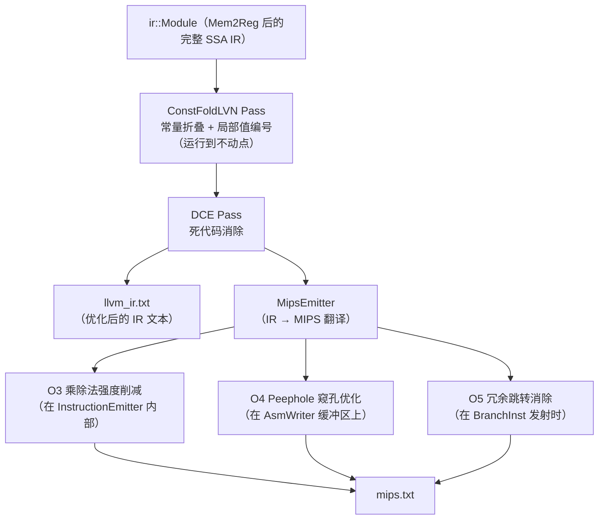
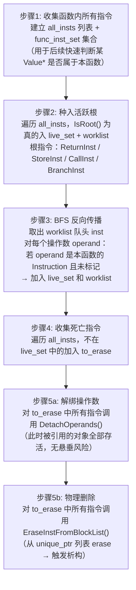
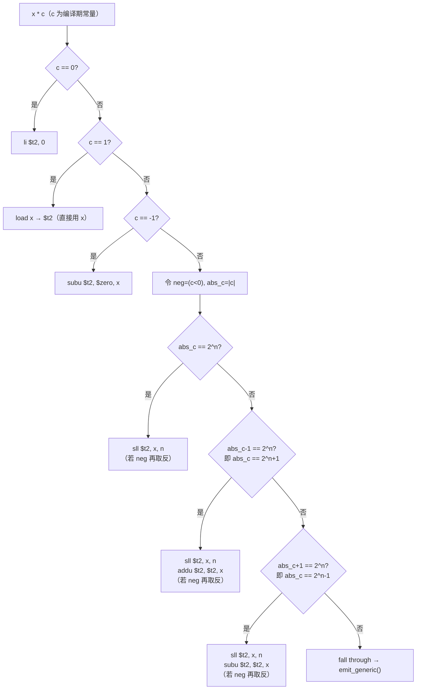

# 编译器优化 (Optimization) 设计文档

本文档描述编译器**优化阶段**的设计思路与实现细节。优化分为两层：**IR 级优化**（在 Mem2Reg 之后、MIPS 后端之前作用于 SSA IR）和 **MIPS 后端优化**（在汇编发射阶段作用于指令序列）。

当前已实现五项优化：

| 编号 | 名称 | 层次 | 开关 (`main.cpp`) |
|------|------|------|------|
| — | **ConstFoldLVN** | IR | `kEnableConstFoldLVN` |
| — | **DCE** | IR | `kEnableDCE` |
| O3 | 乘除法强度削减 | MIPS | `kEnableMulDivOpt` |
| O4 | Peephole 窥孔优化 | MIPS | `kEnablePeephole` |
| O5 | 冗余跳转消除 | MIPS | `kEnableBlockMerge` |

---

## 1. 全局视图：优化在编译管线中的位置

理解各项优化前，先确定它们在整条管线中的位置。`main.cpp` 是唯一的主控，Mem2Reg 完成后依次触发 IR 优化，再进入 MIPS 后端（后端内部还有三项汇编级优化）：



所有优化均通过 `main.cpp` 中的 `const bool k...` 开关控制，关闭任意一项都不影响其他项的正确性，便于逐一对比效果。

---

## 2. Pass 基础设施

### 2.1 接口与文件

**`include/pass/Pass.h`** 定义了 IR 优化的统一接口：

```cpp
class FunctionPass {
public:
    virtual bool Run(ir::Function& func) = 0;  // 返回 true 表示 IR 被修改
    virtual std::string_view GetName() const = 0;
};
```

设计为 **FunctionPass**（而非 ModulePass）的原因是：SSA 的 def-use 链、基本块列表、支配关系均以函数为单位构建，函数之间没有共享的 IR 结构。对每个函数独立运行 Pass，既符合数据边界，又让 Pass 的调试更简单——出错时可以直接定位到某个函数。

### 2.2 Pass 顺序与驱动循环

`main.cpp` 中的接入代码如下，三个 Pass 的顺序是精心安排的：

```cpp
// ① ConstFoldLVN：折叠常量，消除冗余计算
//    外层 while 循环持续运行直到没有任何指令被替换——不动点迭代
if (kEnableConstFoldLVN) {
    bool changed = true;
    while (changed) {
        changed = false;
        pass::ConstFoldLVNPass const_fold_lvn(*result.module);
        for (auto& func : result.module->GetFunctions()) {
            if (!func->GetBlocks().empty())
                changed |= const_fold_lvn.Run(*func);  // 返回 true 表示本轮有替换
        }
    }
}

// ② DCE：清理 ConstFoldLVN 替换后无人使用的死亡指令
if (kEnableDCE) {
    pass::DCEPass dce;
    for (auto& func : result.module->GetFunctions()) {
        if (!func->GetBlocks().empty())
            dce.Run(*func);
    }
}
```

**为什么 ConstFoldLVN 需要不动点迭代，而 DCE 不需要？**

ConstFoldLVN 的一次替换（RAUW）可能让原先的非常量操作数变成常量，从而暴露新的折叠机会。例如：

```llvm
%a = mul i32 2, 3    ; 折叠为 6
%b = add i32 %a, 4   ; 第二轮：%a 已是常量 6，折叠为 10
%c = mul i32 %b, 2   ; 第三轮：%b 已是常量 10，折叠为 20
```

单次遍历只能折叠一层，需要多次才能把链式计算全部折叠完。DCE 则不同——只要 ConstFoldLVN 已达不动点，一次 BFS 就能标记所有死亡指令，无需重复。

**`skip_empty_func` 的防御**：外部库函数（如 `getint`、`putch`）在 IR 中以无基本块的 `Function` 对象表示（只有声明，无定义）。对空函数运行 Pass 会在遍历基本块时触发越界，`!func->GetBlocks().empty()` 判断将其过滤。

---

## 3. ConstFoldLVN：常量折叠 + 局部值编号

### 3.1 代码导读

阅读本优化，推荐按以下顺序：

```
include/pass/ConstFoldLVN.h     — 类声明，了解对外接口（只有 Run）
src/pass/ConstFoldLVN.cpp       — 全部实现，按以下顺序阅读：
  ├─ IsConstInt()               — 辅助：判断一个 Value* 是否为 ConstantInt 并取值
  ├─ GetConstForType()          — 辅助：根据类型宽度从 Module 拿常量对象
  ├─ IsCommutative()            — 辅助：判断操作符是否可交换
  ├─ MakeCanonicalBinaryKey()   — 核心：构造 LVN 哈希键（处理交换律）
  ├─ TryFoldBinary()            — 核心：尝试常量折叠 + 代数化简
  ├─ RunOnBlock()               — 核心：驱动每个块的遍历，串联折叠与 LVN
  └─ ConstFoldLVNPass::Run()    — 入口：遍历函数的所有块，汇总 changed
```

### 3.2 为什么需要它？

Mem2Reg 之后 IR 已是 SSA，但仍可能包含三类低效：

**① 常量表达式未求值**（IRGen 故意不在生成阶段折叠，以保持代码简单）：
```llvm
%1 = mul i32 3, 4     ; 运行期不需要乘法器，编译期就知道结果是 12
%2 = add i32 %1, 0    ; 加 0 永远无意义
```

**② 同块内相同表达式重复计算**：
```llvm
%3 = add i32 %x, %y   ; 第一次计算
; ... 一些不修改 %x, %y 的指令 ...
%4 = add i32 %x, %y   ; 完全相同，%4 == %3，%4 应直接用 %3 替代
```

**③ 死代码**：折叠/替换后，旧的 `BinaryInst` 无人使用——由 DCE 清理。

ConstFoldLVN 变换后，上例变为：
```llvm
; %1 替换为常量 12，%2 替换为 %x，%4 替换为 %3
; 死亡的 %1、%2、%4 指令留给 DCE 删除
```

### 3.3 入口：`Run()` 与 `RunOnBlock()`

`ConstFoldLVNPass::Run()` 的实现极为简洁——它只是按序遍历函数的所有基本块，把真正的工作委托给 `RunOnBlock()`：

```cpp
// src/pass/ConstFoldLVN.cpp
bool ConstFoldLVNPass::Run(ir::Function& func) {
    bool changed = false;
    for (auto& bb_uptr : func.GetBlocks()) {
        changed |= RunOnBlock(*bb_uptr, module_);
    }
    return changed;
}
```

`RunOnBlock()` 是核心：它对块内**每一条 `BinaryInst`** 依次尝试折叠与 LVN，对其他类型的指令直接跳过：

```cpp
bool RunOnBlock(ir::BasicBlock& bb, ir::Module& module) {
    bool changed = false;
    std::unordered_map<BinaryKey, ir::Value*, BinaryKeyHash> lvn_table;
    //                  ↑ 局部表：仅在本块内有效，块结束后丢弃

    for (auto& inst_uptr : bb.GetInstructions()) {
        auto* bin = dynamic_cast<ir::BinaryInst*>(inst_uptr.get());
        if (!bin) continue;    // 非二元指令（load/store/branch…）直接跳过

        // 步骤一：尝试折叠
        if (ir::Value* replacement = TryFoldBinary(bin, module)) {
            bool had_uses = !bin->GetUseList().empty();
            bin->ReplaceAllUsesWith(replacement);  // RAUW：所有使用者改指向 replacement
            changed |= had_uses;                   // 只有真正替换了使用者才算"有变化"
            continue;   // 已折叠，不再做 LVN
        }

        // 步骤二：LVN——在表中查找或注册
        BinaryKey key = MakeCanonicalBinaryKey(bin);
        auto it = lvn_table.find(key);
        if (it != lvn_table.end()) {
            bool had_uses = !bin->GetUseList().empty();
            bin->ReplaceAllUsesWith(it->second);   // 用已有的等价 Value 替换
            changed |= had_uses;
        } else {
            lvn_table.emplace(key, bin);  // 首次见到，注册进表
        }
    }
    return changed;
}
```

注意 `lvn_table` 是**块局部的**：它在 `RunOnBlock` 栈上创建、在函数返回时销毁。跨块的公共子表达式消除（全局 CSE）需要支配关系的支持，当前 Pass 不实现，保持简单。

### 3.4 `TryFoldBinary()`：两类化简

`TryFoldBinary()` 返回一个 `ir::Value*`——若折叠成功则返回替换值，否则返回 `nullptr`。它内部有两个独立的 `if` 分支：

**分支一：双侧均为常量→直接计算**

```cpp
if (is_lhs_const && is_rhs_const) {
    switch (op) {
        case ADD: return GetConstForType(module, result_ty, lval + rval);
        case SUB: return GetConstForType(module, result_ty, lval - rval);
        case MUL: return GetConstForType(module, result_ty, lval * rval);
        case DIV: if (rval != 0) return GetConstForType(module, result_ty, lval / rval);
                  return nullptr;  // 除零：保留原指令，运行时行为不变
        case REM: if (rval != 0) return GetConstForType(module, result_ty, lval % rval);
                  return nullptr;
        default:  return nullptr;
    }
}
```

`GetConstForType()` 的存在是为了类型正确性：`i8` 类型的结果要取 `Int8Constant`，`i32` 取 `Int32Constant`，两者是不同对象。常量对象由 `ir::Module` 统一管理（interning），同一个值的同一个类型只有一个对象实例。

**分支二：单侧为常量→代数恒等式**

```cpp
if (is_rhs_const) {
    if ((op == ADD || op == SUB) && rval == 0) return lhs;  // x±0 = x
    if (op == MUL) {
        if (rval == 0) return GetConstForType(module, result_ty, 0);  // x*0 = 0
        if (rval == 1) return lhs;                                    // x*1 = x
    }
    if (op == DIV && rval == 1) return lhs;    // x/1 = x
    if (op == REM && rval == 1) return GetConstForType(module, result_ty, 0); // x%1 = 0
}
if (is_lhs_const) {
    if (op == ADD  && lval == 0) return rhs;   // 0+x = x
    if (op == MUL  && lval == 0) return GetConstForType(module, result_ty, 0); // 0*x = 0
    if (op == MUL  && lval == 1) return rhs;   // 1*x = x
}
if (lhs == rhs && op == SUB) return GetConstForType(module, result_ty, 0); // x-x = 0
```

### 3.5 `MakeCanonicalBinaryKey()`：LVN 哈希键的规范化

LVN 的关键是：怎样判断两条 `BinaryInst` "等价"？用操作符 + 操作数指针构成一个三元组作为 key：

```cpp
struct BinaryKey {
    ir::BinaryOp op;
    ir::Value*   lhs;
    ir::Value*   rhs;
    // ...
};
```

但这里有一个微妙之处：对于可交换的运算（`ADD`、`MUL`），`a+b` 和 `b+a` 语义相同，但两个 `BinaryKey` 的 `lhs`/`rhs` 顺序不同，哈希值不同，无法命中。解决方法是**规范化**——按指针地址排序，保证较小的指针总在 `lhs`：

```cpp
BinaryKey MakeCanonicalBinaryKey(ir::BinaryInst* bin) {
    ir::Value* lhs = bin->GetLhs();
    ir::Value* rhs = bin->GetRhs();
    ir::BinaryOp op = bin->GetOp();
    if (IsCommutative(op) && rhs < lhs) std::swap(lhs, rhs);  // 规范化！
    return BinaryKey{op, lhs, rhs};
}
```

`rhs < lhs` 比较的是指针地址（即对象在内存中的位置），并无数值意义，只是一种稳定的全序关系，保证相同的操作数对总能产生相同的 key。

`BinaryKeyHash` 使用经典的 Boost 风格哈希组合：

```cpp
size_t h = std::hash<int>{}(static_cast<int>(key.op));
h ^= std::hash<void*>{}(key.lhs) + 0x9e3779b9 + (h << 6) + (h >> 2);
h ^= std::hash<void*>{}(key.rhs) + 0x9e3779b9 + (h << 6) + (h >> 2);
```

### 3.6 "只替换，不删除"的设计约定

ConstFoldLVN 只调用 `ReplaceAllUsesWith`（RAUW），**从不**从基本块删除任何指令。被替换后"无人使用"的 `BinaryInst` 成为死指令，留给后续的 DCE Pass 统一清理。

这样做有两个好处：第一，在 `for (auto& inst_uptr : bb.GetInstructions())` 的遍历过程中删除元素会使迭代器失效；第二，DCE 是全函数视角的，能更高效地一次性清干净所有死代码，而不是在折叠的同时零散地删。

---

## 4. DCE：死代码消除

### 4.1 代码导读

```
include/pass/DCE.h          — 类声明，接口只有 Run()
src/pass/DCE.cpp            — 全部实现，按以下顺序阅读：
  ├─ DetachOperands()        — 辅助：解绑一条指令的所有操作数（use-list 清理）
  ├─ EraseInstFromBlockList()— 辅助：从父块指令列表中物理移除（触发析构）
  ├─ IsRoot()                — 辅助：判断指令是否为活跃性根（有副作用）
  └─ DCEPass::Run()          — 入口：收集→标记根→BFS→两阶段删除
```

### 4.2 算法：反向标记扫描（Mark-and-Sweep on def-use chains）

**核心思想**：在 SSA 中，每条指令都是一个"定义"；若这个定义从未被任何"必须执行"的操作使用（直接或间接），则它是死代码，可以删除。

反向标记从"必须执行的指令"（根）出发，沿 def-use 链逆向传播——"若指令 A 活跃，则 A 的每个 Instruction 类型的操作数也活跃（因为 A 需要它们的计算结果）"。没有被标记到的指令就是死代码。



### 4.3 `IsRoot()`：有副作用的指令无条件保留

```cpp
static bool IsRoot(ir::Instruction* inst) {
    return dynamic_cast<ir::ReturnInst*>(inst)   // 函数返回：return value 对调用者可见
        || dynamic_cast<ir::StoreInst*>(inst)    // 写内存：可被后续 load 或调用者观察
        || dynamic_cast<ir::CallInst*>(inst)     // 调用：可能有 I/O、全局状态等副作用
        || dynamic_cast<ir::BranchInst*>(inst);  // 控制流：决定执行路径，不可删
}
```

以 `BranchInst` 为例说明根的必要性：假设条件分支 `br i1 %cond, label %a, label %b` 的条件 `%cond` 由 `icmp slt %x, %y` 计算而来，而 `%x` 又来自某次 `BinaryInst`。如果不把 `BranchInst` 标为根，`icmp` 和 `BinaryInst` 都会被认为是死代码——但显然它们影响程序的执行路径。把 `BranchInst` 标为根后，`%cond`（即 `icmp` 的结果）会在 BFS 中被传递标记为活跃，进而 `BinaryInst` 也被标记。

### 4.4 BFS 的边界过滤：`func_inst_set`

```cpp
while (!worklist.empty()) {
    ir::Instruction* inst = worklist.front(); worklist.pop();
    for (size_t i = 0; i < inst->GetNumOperands(); ++i) {
        ir::Value* operand = inst->GetOperand(i);
        auto* def = dynamic_cast<ir::Instruction*>(operand);
        if (!def) continue;                        // 常量、参数、全局变量：非 Instruction，跳过
        if (!func_inst_set.count(def)) continue;   // 不属于本函数：跳过
        if (live_set.insert(def).second)
            worklist.push(def);
    }
}
```

`func_inst_set` 的作用容易被忽视：`CallInst` 的 callee 是一个 `ir::Function*`，它继承自 `ir::Value*`，`dynamic_cast<ir::Instruction*>` 会返回 `nullptr`（因为 `Function` 不是 `Instruction`），但对于其他类型则不一定。用集合过滤比逐一枚举类型更安全，也更易于扩展。

### 4.5 两阶段删除：为什么必须先解绑再析构

这是 DCE 实现中最容易出错的地方，也是从 Mem2Reg 的早期 bug 中总结出的规范。

**问题根源**：`Use` 对象（操作数引用）的析构函数**不会**自动从 `Value::use_list_` 中取消注册。这是一种"手动 use-list 管理"的设计——主动调用 `SetOperand(i, nullptr)` 时才会触发 `value_->RemoveUse(this)`。

考虑两条都是死指令的情形：

```
死亡指令: D    （一个加法，其他地方已无人使用它的结果）
死亡指令: E    （一个减法，其中一个操作数是 D 的结果）
```

若按某顺序先析构 D（从 `unique_ptr` 列表 erase），D 所在的内存被释放。随后处理 E 时，`DetachOperands(E)` 调用 `E->SetOperand(i, nullptr)`，内部执行 `D->RemoveUse(&use_in_E)`——此时 D 已不存在，产生**悬垂指针访问，未定义行为**。

**解法：两阶段完全分离**

```cpp
// 阶段 5a：所有死亡指令先解绑操作数（此时每条指令都还健在）
for (ir::Instruction* inst : to_erase) {
    DetachOperands(inst);  // 调用 inst->SetOperand(i, nullptr)，D 此时仍在内存中
}
// 阶段 5b：所有操作数已解绑，现在可以安全析构
for (ir::Instruction* inst : to_erase) {
    EraseInstFromBlockList(inst);  // 从 unique_ptr 列表 erase → 调用析构函数
}
```

两次遍历完全分离，保证"解绑"发生在所有被引用对象的析构之前，彻底消除顺序依赖。

---

## 5. MIPS 后端优化：架构概览

### 5.1 代码导读

MIPS 后端优化分散在以下文件中：

```
include/mips/MipsInst.h             — MipsInst 结构体 + MipsOpcode 枚举（指令的结构化表示）
include/mips/MipsOptions.h          — 优化开关定义（所有优化的统一入口）
src/mips/FunctionEmitter.cpp        — O4 Peephole 的缓冲区生命周期管理
src/mips/InstructionEmitter.cpp     — O3 乘除法强度削减 + O5 冗余跳转消除
  └─ EmitBinaryInst()               — O3 的具体实现（约 150 行）
  └─ EmitBranchInst()               — O5 的具体实现（约 30 行）
src/mips/AsmWriter.cpp              — O4 Peephole 的结构化匹配 + 序列化输出
  └─ Route() / Serialize()          — 指令路由与文本序列化
  └─ BeginBuffer() / FlushBuffer()  — O4 缓冲区的开闭
  └─ RunPeephole()                  — O4 的两条规则实现（结构化字段匹配）
```

### 5.2 开关的流动路径

所有 MIPS 优化开关在 `main.cpp` 中设置，通过 `MipsOptions` 结构体向下传递：

```
main.cpp
  └─ MipsOptions mips_opts（设置 enable_mul_div_opt / enable_peephole / enable_block_merge）
       └─ MipsEmitter(mips_out, *module, mips_opts)
            └─ FunctionEmitter(writer, func, mips_opts)
                 └─ InstructionEmitter(writer, frame, func, mips_opts)
```

`MipsOptions` 是一个纯数据结构体，按值传递：

```cpp
// include/mips/MipsOptions.h
struct MipsOptions {
    bool enable_mul_div_opt = false;  // O3
    bool enable_peephole    = false;  // O4
    bool enable_block_merge = false;  // O5
    bool enable_reg_alloc   = false;  // 图染色寄存器分配（TODO）
};
```

默认值全为 `false`，确保在 `main.cpp` 中不显式开启的情况下，行为与初版全栈分配（baseline）完全一致。

---

## 6. O3：乘除法强度削减

### 6.1 为什么是"强度削减"？

MIPS 的 `mul` 指令和 `div` 指令延迟明显高于移位指令（`sll`/`sra`/`srl`）。当一个操作数在编译期已知（常量）时，乘除法可以用若干条移位+加减指令替代——指令数量增加，但总执行周期减少。这就是"强度削减（Strength Reduction）"的含义：用多条弱指令替换少量强指令。

### 6.2 入口与分派

优化发生在 `InstructionEmitter::EmitBinaryInst()` 内部。函数先定义一个 `emit_generic` lambda 封装原始路径，然后根据 `options_.enable_mul_div_opt` 决定是否尝试优化：

```cpp
void InstructionEmitter::EmitBinaryInst(const ir::BinaryInst* inst) {
    // 通用路径（baseline 行为）：两操作数均从栈加载到 $t0/$t1，运算后写回 $t2
    auto emit_generic = [&]() {
        LoadValueToReg(inst->GetLhs(), "$t0");
        LoadValueToReg(inst->GetRhs(), "$t1");
        switch (inst->GetOp()) {
            case ADD: writer_.EmitAddu("$t2", "$t0", "$t1"); break;
            case SUB: writer_.EmitSubu("$t2", "$t0", "$t1"); break;
            case MUL: writer_.EmitMul("$t2", "$t0", "$t1");  break;
            case DIV: writer_.EmitDiv("$t0", "$t1");
                      writer_.EmitMflo("$t2");                break;
            case REM: writer_.EmitDiv("$t0", "$t1");
                      writer_.EmitMfhi("$t2");                break;
        }
    };

    if (!options_.enable_mul_div_opt) {
        emit_generic();                          // 未开启 O3：走通用路径
        writer_.EmitSwSp("$t2", frame_.GetOffset(inst));
        return;
    }
    // 以下：O3 优化路径，对 MUL 和 DIV 分别处理
    // ...
}
```

### 6.3 乘法优化：四种移位模式

乘法优化只在**一侧为常量**时触发（两侧都是常量已经被 ConstFoldLVN 折叠掉了）。记常量侧为 `c`，变量侧为 `x`：



这四种模式覆盖了实践中最常见的常量乘数，代码中的关键辅助函数是 `IsPositivePowerOfTwo(abs_c, sh)`，它在确认 `abs_c` 是 2 的幂的同时，把移位量写入 `sh`：

```cpp
bool IsPositivePowerOfTwo(uint64_t x, int& out_shift) {
    if (x == 0 || (x & (x - 1)) != 0) return false;  // 位技巧：非 2 的幂时 x&(x-1) != 0
    int shift = 0;
    while (x > 1) { x >>= 1; ++shift; }
    out_shift = shift;
    return true;
}
```

### 6.4 除法优化：有符号截断向零的修正

C 语言对负数整除的语义是"截断向零"（而非向下取整）。对 `x / 2^n`，直接 `sra x, n` **不正确**——当 `x < 0` 时，`sra` 做的是向下取整（向负无穷），比截断向零多减 1。

修正公式（源自 GCC/LLVM 经典实现）：

```
x / 2^n = (x + ((x >> 31) >>> (32 - n))) >> n（算术）
```

其中 `>>` 是算术右移，`>>>` 是逻辑右移。逐步拆解：

- `x >> 31`：若 `x ≥ 0` 得 `0x00000000`，若 `x < 0` 得 `0xFFFFFFFF`（符号掩码）
- `掩码 >>> (32 - n)`：若 `x ≥ 0` 得 `0`；若 `x < 0` 得 `2^n - 1`（修正量）
- `x + 修正量`：正数加 0 不变；负数加 `2^n - 1` 使截断方向正确
- `结果 >> n`（算术）：最终商

```cpp
// x / 2^n（有符号，截断向零）的 MIPS 实现（sh = n）
writer_.EmitSra("$t2", "$t0", 31);           // 符号掩码
writer_.EmitSrl("$t2", "$t2", 32 - sh);      // 修正量
writer_.EmitAddu("$t2", "$t0", "$t2");        // x + 修正量
writer_.EmitSra("$t2", "$t2", sh);            // 右移 n 位得商
if (neg) writer_.EmitSubu("$t2", "$zero", "$t2");  // 负除数：取反
```

> **保守策略**：对非 2 的幂的常数除数，"魔数乘法"方案（用 32×32→64 位乘法近似倒数）在 MARS 上验证较为繁琐，当前不实现，落入 `emit_generic()` 通用路径。

---

## 7. O4：Peephole 窥孔优化

### 7.1 全栈分配的结构性冗余

全栈分配策略下，每个 SSA 值的完整生命周期是：**运算完毕立即写栈（`sw`），用到时从栈读（`lw`）**。因此几乎每对"写结果 + 读结果"在汇编中都表现为：

```mips
sw    $t2, 8($sp)   ; BinaryInst 的结果写入栈偏移 8
lw    $t0, 8($sp)   ; 紧接着下一条指令从偏移 8 读出
```

`$t2` 刚被写入，值还在寄存器里，随即从相同地址读出又装入另一个寄存器——这对 `sw/lw` 是纯粹的冗余，可以替换为 `move $t0, $t2`，省掉一次内存访问。

### 7.2 缓冲区的生命周期（在 `FunctionEmitter` 中）

Peephole 在 `AsmWriter` 的**结构化指令缓冲区**（`std::vector<MipsInst>`）上工作，而非文本或 IR 对象。`AsmWriter` 提供 `BeginBuffer()`/`FlushBuffer()` 接口，`FunctionEmitter::Emit()` 在每个函数的发射前后调用它们：

```cpp
// src/mips/FunctionEmitter.cpp
void FunctionEmitter::Emit() {
    frame_.Build();
    if (options_.enable_peephole) writer_.BeginBuffer();  // 开始缓冲：所有 MipsInst 进入 buf_
    EmitPrologue();   // 函数序言（addiu $sp、sw $ra、spill 参数寄存器）
    EmitBody();       // 函数体（逐块逐指令翻译）
    if (options_.enable_peephole) writer_.FlushBuffer();  // 触发 RunPeephole() → Serialize → os_
}
```

`BeginBuffer()` 调用后，所有 `writer_.EmitAddu(...)` / `writer_.EmitSwSp(...)` 等调用内部通过 `Route()` 将构造的 `MipsInst` 追加到 `buf_`（而非序列化后直接写文件）。`FlushBuffer()` 先运行 `RunPeephole()` 在 `buf_` 上做结构化模式匹配，再逐条 `Serialize()` 输出文本。

> 关于 MipsInst 结构化缓冲区的详细设计，见本文档第 9 节。

### 7.3 两条规则与收敛循环（在 `AsmWriter::RunPeephole()` 中）

两条规则在同一个收敛循环中迭代应用，直到 `buf_` 不再变化：

**规则 P2：sw/lw 对消除**

匹配相邻两条指令，中间无 label 或空行（屏障），且两条 `$sp` 偏移相同：

```
[i  ]:  sw    $R,  X($sp)    →    不变（值需要留在栈上，后续可能还有 lw）
[i+1]:  lw    $R', X($sp)    →    move  $R', $R   （$R 还持有刚写入的值）
```

由于缓冲区现在是结构化的 `MipsInst`，匹配不再需要字符串解析——直接检查 `op`、`src1`（base 寄存器）、`imm`（偏移量）字段：

```cpp
for (size_t i = 0; i + 1 < buf_.size(); ++i) {
    if (!buf_[i].IsInsn() || !buf_[i + 1].IsInsn()) continue;      // label/空行屏障
    if (buf_[i].op != MipsOpcode::SW || buf_[i].src1 != "$sp") continue;
    if (buf_[i + 1].op != MipsOpcode::LW || buf_[i + 1].src1 != "$sp") continue;
    if (buf_[i].imm != buf_[i + 1].imm) continue;                  // 偏移不同，跳过
    buf_[i + 1] = {MipsOpcode::MOVE, buf_[i + 1].dst, buf_[i].dst}; // 替换为 move！
    changed = true;
}
```

对比旧的字符串实现（需要 `ParseSwSp()` / `ParseLwSp()` 逐字符匹配），结构化版本更简洁、更不易出错。

**规则 P3：自移动消除**

P2 可能产生 `move $t2, $t2`（当 `sw` 和 `lw` 使用了同一个寄存器）。P3 将其直接删除：

```cpp
for (size_t i = 0; i < buf_.size(); /* 手动推进 */) {
    if (buf_[i].op == MipsOpcode::MOVE && buf_[i].dst == buf_[i].src1) {
        buf_.erase(buf_.begin() + static_cast<ptrdiff_t>(i));  // 删除
        changed = true;
    } else { ++i; }
}
```

**`IsInsn()` 的 label 屏障机制**：`MipsInst::IsInsn()` 通过检查 `op` 是否为 `LABEL`/`DIRECTIVE`/`BLANK`/`RAW` 来区分"真正的指令"与"标记行"。只有两条相邻元素都是 `IsInsn() == true` 时才做 P2 匹配，确保规则不会跨越基本块边界：

```
[SW, $t0, $sp, 4]    ← IsInsn() = true
[LABEL, "if.merge.3"]← IsInsn() = false → P2 在此停止，不匹配跨块对
[LW, $t0, $sp, 4]    ← 下一个块开头的 lw
```

---

## 8. O5：冗余跳转消除

### 8.1 全栈分配与基本块线性排布

MIPS 后端按 `func.GetBlocks()` 的存储顺序（即 IR 中基本块被创建的顺序，通常是源码的前序）线性输出。对于以下 CFG：

```
entry → if.then.2 → if.merge.3
      ↘_____________↗
```

输出顺序通常是 `entry → if.then.2 → if.merge.3`。在 `if.then.2` 的末尾，IR 会有一条 `br label %if.merge.3`，翻译为：

```mips
j     func_if.merge.3    ; if.merge.3 恰好是下一块，这条跳转是纯冗余的
func_if.merge.3:
    ...
```

O5 检测到"跳转目标就是紧接着的块"时，直接省略 `j` 指令，让 CPU 自然顺序执行（fall-through）。

### 8.2 实现：`next_block` 参数的传递链

`next_block` 是"当前块在发射顺序上的下一块"，它由 `FunctionEmitter::EmitBody()` 计算并逐层向下传递：

```cpp
// src/mips/FunctionEmitter.cpp
void FunctionEmitter::EmitBody() {
    const auto& blocks = func_.GetBlocks();
    for (size_t idx = 0; idx < blocks.size(); ++idx) {
        const ir::BasicBlock* cur_block  = blocks[idx].get();
        const ir::BasicBlock* next_block =
            (idx + 1 < blocks.size()) ? blocks[idx + 1].get() : nullptr; // 最后一块为 nullptr
        writer_.EmitLabel(BlockLabel(func_.GetName(), cur_block->GetName()));
        for (const auto& inst : cur_block->GetInstructions()) {
            inst_emitter_.Emit(inst.get(), cur_block, next_block); // 传给 InstructionEmitter
        }
    }
}
```

`InstructionEmitter::Emit()` 只在处理 `BranchInst` 时使用 `next_block`，其他指令不需要：

```cpp
} else if (auto* branch = dynamic_cast<const ir::BranchInst*>(inst)) {
    EmitPhiMovesForEdge(block, branch);  // 先发射 phi 解析的 move
    EmitBranchInst(branch, next_block);  // 再发射跳转，next_block 用于 fall-through 判断
}
```

### 8.3 `EmitBranchInst()` 的三种情况

```cpp
void InstructionEmitter::EmitBranchInst(const ir::BranchInst* inst,
                                        const ir::BasicBlock* next_block) {
    if (!inst->IsConditional()) {
        // 无条件跳转：目标就是下一块则完全省略
        if (options_.enable_block_merge && inst->GetDest() == next_block) return;
        writer_.EmitJ(BlockLabel(func_.GetName(), inst->GetDest()->GetName()));
        return;
    }
    // 条件跳转
    const ir::BasicBlock* true_bb  = inst->GetIfTrue();
    const ir::BasicBlock* false_bb = inst->GetIfFalse();
    LoadValueToReg(inst->GetCond(), "$t0");

    if (options_.enable_block_merge && false_bb == next_block) {
        // false 分支是下一块（fall-through）：只发射"条件成立时的跳转"
        writer_.EmitBnez("$t0", BlockLabel(func_.GetName(), true_bb->GetName()));
    } else if (options_.enable_block_merge && true_bb == next_block) {
        // true 分支是下一块：反转条件，发射"条件不成立时的跳转"
        writer_.EmitBeqz("$t0", BlockLabel(func_.GetName(), false_bb->GetName()));
    } else {
        // 两个目标都不是下一块：发射完整的两条跳转指令
        writer_.EmitBnez("$t0", BlockLabel(func_.GetName(), true_bb->GetName()));
        writer_.EmitJ(BlockLabel(func_.GetName(), false_bb->GetName()));
    }
}
```

下面是三种 fall-through 场景在 MIPS 汇编中的对比（以 `if-else` 为例）：

```
            ┌─ O5 关闭 ────────────────────┐  ┌─ O5 开启（false 分支 fall-through）──┐
entry:                                        entry:
  bnez  $t0, if.then.2                          bnez  $t0, if.then.2
  j     if.else.3               →               # j if.else.3 被省略（fall-through）
if.else.3:                                    if.else.3:
  ...                                           ...
  j     if.merge.4              →               # j if.merge.4 被省略（fall-through）
if.merge.4:                                   if.merge.4:
  ...                                           ...
```

一个典型的 `if-else` 结构可以省去 2 条跳转指令。

---

## 9. MipsInst 结构化：寄存器分配的前置基础设施

### 9.1 为什么要结构化？

在实现图染色寄存器分配之前，需要先解决一个基础性问题：**寄存器分配器需要对每条 MIPS 指令做精确的 def/use 分析**（哪些寄存器被定义、哪些被使用），但此前 `AsmWriter` 的缓冲区是 `std::vector<std::string>`——每条指令只是一个格式化好的文本字符串（如 `"    addu  $t2, $t0, $t1"`），从中提取寄存器信息需要反复做字符串解析，既脆弱又低效。

MipsInst 结构化将缓冲区从 `vector<string>` 改为 `vector<MipsInst>`，让每条指令的操作码、寄存器、立即数等字段在**构造时就被分门别类地存储**，而非事后从文本中逆向解析。这为后续寄存器分配的活跃变量分析、干涉图构建等奠定了基础。

### 9.2 代码导读

```
include/mips/MipsInst.h       — 核心数据结构，阅读本节的起点
  ├─ enum MipsOpcode           — 覆盖后端发射的所有 MIPS 指令的操作码枚举
  └─ struct MipsInst           — 统一的结构化表示（op + dst/src1/src2/imm/label/raw）

include/mips/AsmWriter.h      — 接口变更（新增 GetBuffer()、所有 EmitXxx 改为构造 MipsInst）
src/mips/AsmWriter.cpp         — 实现变更
  ├─ Route()                   — 替代旧 RawLine()，将 MipsInst 路由到 buf_ 或直接序列化
  ├─ Serialize()               — MipsInst → 文本，所有格式化集中在此一处
  ├─ EmitXxx() 系列            — 每个方法构造一条类型化 MipsInst 并调用 Route()
  └─ RunPeephole()             — 匹配逻辑从字符串解析改为结构化字段比较

src/mips/InstructionEmitter.cpp — 调用方变更：EmitInsn("addu ...") → EmitAddu("$t2", "$t0", "$t1")
```

### 9.3 `MipsInst`：统一的指令表示

整个结构化方案的核心是 `MipsInst` 结构体和 `MipsOpcode` 枚举（定义在 `include/mips/MipsInst.h`）。

`MipsOpcode` 枚举覆盖后端可能发射的全部 MIPS 指令，按类别组织：

```cpp
enum class MipsOpcode {
    // R-type: dst = src1 op src2
    ADDU, SUBU, MUL, AND, OR, SLT, SGT, SLE, SGE, SEQ, SNE,
    // Shift: dst = src1 op imm
    SLL, SRL, SRA,
    // Division: HI:LO = src1 / src2
    DIV, MFLO, MFHI,
    // I-type: dst = src1 op imm
    ADDIU, ANDI,
    // Memory: dst/src, offset(base)
    LW, SW, LBU, SB,
    // Pseudo-load
    LI, LA,
    // Control flow
    J, JAL, JR, BNEZ, BEQZ,
    // Register copy
    MOVE,
    // System
    SYSCALL,
    // Non-instruction markers
    LABEL, DIRECTIVE, BLANK, RAW,
};
```

`MipsInst` 结构体使用**平铺字段**（而非继承层次或 variant），所有指令共享同一组字段，不同操作码使用不同的字段子集：

```cpp
struct MipsInst {
    MipsOpcode  op   = MipsOpcode::RAW;
    std::string dst;    // 目标寄存器（或 SW/SB 中的值寄存器）
    std::string src1;   // 第一源寄存器 / 基址寄存器
    std::string src2;   // 第二源寄存器
    int64_t     imm  = 0;  // 立即数 / 偏移量 / 移位量
    std::string label;  // 标签名（分支目标 / LA 目标 / LABEL 定义）
    std::string raw;    // 预格式化文本（DIRECTIVE / RAW 专用）

    bool IsInsn() const {
        return op != MipsOpcode::LABEL && op != MipsOpcode::DIRECTIVE
            && op != MipsOpcode::BLANK  && op != MipsOpcode::RAW;
    }
};
```

**字段约定**因操作码类别而异，在头文件的文档注释中列出了完整的对照表：

| 操作码类别 | `dst` | `src1` | `src2` | `imm` | `label` |
|-----------|-------|--------|--------|-------|---------|
| R-type (ADDU 等) | rd | rs | rt | — | — |
| Shift (SLL 等) | rd | rt | — | shamt | — |
| DIV | — | rs | rt | — | — |
| MFLO / MFHI | rd | — | — | — | — |
| I-arith (ADDIU 等) | rt | rs | — | imm | — |
| LW / LBU | rt（目标） | base | — | offset | — |
| SW / SB | rt（值） | base | — | offset | — |
| LI | rd | — | — | imm | — |
| LA | rd | — | — | — | target |
| MOVE | rd | rs | — | — | — |
| J / JAL | — | — | — | — | target |
| JR | — | rs | — | — | — |
| BNEZ / BEQZ | — | rs | — | — | target |
| LABEL | — | — | — | — | name |

**为什么选择平铺而非继承/variant？** 因为 MIPS 指令格式非常统一——几乎都是 ≤3 个寄存器 + 1 个立即数 + 1 个标签的组合。平铺结构的好处是：结构体可以用聚合初始化直接构造（无需工厂函数），peephole 的字段访问无需类型转换，序列化也只需一个 `switch`。未使用的字段保持默认空值，开销可以忽略。

### 9.4 `Route()` 与 `Serialize()`：路由与序列化的分离

旧设计中 `RawLine(std::string)` 同时承担了"路由到缓冲区或输出流"和"文本本身就是最终格式"两个职责。结构化后，两个职责被明确分离：

**`Route(MipsInst)`**：决定一条指令去哪——缓冲区还是输出流：

```cpp
void AsmWriter::Route(MipsInst inst) {
    if (buffering_) {
        buf_.push_back(std::move(inst));  // 缓冲模式：存入 vector<MipsInst>
    } else {
        os_ << Serialize(inst) << "\n";   // 直连模式：立即序列化并输出
    }
}
```

**`Serialize(const MipsInst&)`**：将结构化指令转换为 MARS 兼容的汇编文本。所有格式化逻辑集中在此一处（一个大 `switch`），确保任何格式调整只需修改一个函数：

```cpp
std::string AsmWriter::Serialize(const MipsInst& inst) {
    auto pad = [](const char* name) -> std::string {   // 操作码补齐到 6 字符
        std::string s(name); s.resize(6, ' '); return s;
    };
    const std::string kInd(kIndent);
    switch (inst.op) {
        case MipsOpcode::ADDU:
            return kInd + pad("addu") + inst.dst + ", " + inst.src1 + ", " + inst.src2;
        case MipsOpcode::SW:
            return kInd + pad("sw") + inst.dst + ", " + std::to_string(inst.imm)
                   + "(" + inst.src1 + ")";
        case MipsOpcode::LABEL:
            return inst.label + ":";
        // ... 其余操作码格式类似
    }
}
```

### 9.5 类型化的 `EmitXxx()` 方法

旧接口通过一个泛型的 `EmitInsn(const std::string&)` 发射所有指令（调用方手动拼接格式化字符串）。结构化后，每条指令都有对应的类型化方法，调用方无需关心格式：

```cpp
// 旧接口（字符串拼接，容易出格式错误）：
writer_.EmitInsn("addu  $t2, $t0, $t1");
writer_.EmitInsn("sw    $t2, " + std::to_string(offset) + "($sp)");

// 新接口（类型化，字段在构造时分类存储）：
writer_.EmitAddu("$t2", "$t0", "$t1");
writer_.EmitSwSp("$t2", offset);  // 内部调用 EmitSw("$t2", offset, "$sp")
```

每个 `EmitXxx()` 方法的实现都极为简洁——构造一条 `MipsInst` 并交给 `Route()`：

```cpp
void AsmWriter::EmitAddu(const std::string& dst, const std::string& src1,
                         const std::string& src2) {
    Route({MipsOpcode::ADDU, dst, src1, src2});
}

void AsmWriter::EmitSw(const std::string& src, int offset, const std::string& base) {
    Route({MipsOpcode::SW, src, base, {}, offset});
}

void AsmWriter::EmitSwSp(const std::string& reg, int offset) {
    EmitSw(reg, offset, "$sp");  // 便利封装：base 固定为 $sp
}
```

`EmitInsn(const std::string&)` 仍然保留（构造 `MipsOpcode::RAW` 类型的 `MipsInst`），用于边缘场景。

### 9.6 Peephole 的结构化改造

Peephole 是结构化带来最直观收益的地方。旧的 `RunPeephole()` 需要三个字符串解析函数（`ParseSwSp`、`ParseLwSp`、`ParseMove`）来从文本行中提取寄存器和偏移量，任何格式微调（例如改变操作码的列宽）都可能导致解析失败。结构化后，匹配变成了直接的字段比较：

```cpp
// 旧（字符串解析）：
if (!IsInsnLine(buf_[i]) || !IsInsnLine(buf_[i + 1])) continue;
std::string sw_reg; int sw_off;
if (!ParseSwSp(buf_[i], sw_reg, sw_off)) continue;       // 可能因格式微调而失效
std::string lw_reg; int lw_off;
if (!ParseLwSp(buf_[i + 1], lw_reg, lw_off)) continue;
if (sw_off != lw_off) continue;
buf_[i + 1] = "    move  " + lw_reg + ", " + sw_reg;

// 新（结构化字段）：
if (!buf_[i].IsInsn() || !buf_[i + 1].IsInsn()) continue;
if (buf_[i].op != MipsOpcode::SW || buf_[i].src1 != "$sp") continue;
if (buf_[i + 1].op != MipsOpcode::LW || buf_[i + 1].src1 != "$sp") continue;
if (buf_[i].imm != buf_[i + 1].imm) continue;
buf_[i + 1] = {MipsOpcode::MOVE, buf_[i + 1].dst, buf_[i].dst};   // 构造新 MipsInst
```

三个 `ParseXxx` 函数和 `IsInsnLine` 因此被完全移除，代码减少约 80 行。

### 9.7 `GetBuffer()`：为寄存器分配暴露缓冲区

`AsmWriter` 新增了两个访问器，允许外部 pass（即将实现的寄存器分配器）直接读写 `buf_`：

```cpp
// include/mips/AsmWriter.h
const std::vector<MipsInst>& GetBuffer() const { return buf_; }  // 只读：活跃分析、干涉图构建
std::vector<MipsInst>&       GetBuffer()       { return buf_; }  // 可写：寄存器重写
```

寄存器分配器的工作流是：`BeginBuffer()` → 正常发射全栈代码 → 在 `FlushBuffer()` 之前，通过 `GetBuffer()` 遍历所有 `MipsInst`，分析 def/use 集合、构建活跃区间和干涉图、执行图染色、**原地重写** `MipsInst` 中的寄存器字段 → `FlushBuffer()` 运行 peephole 并序列化输出。

这个接口使得寄存器分配器不需要关心序列化逻辑，只需操作结构化字段即可。

---

## 10. Pass 间协同

### 10.1 顺序依赖与原因


| 顺序约束 | 原因 |
|---------|------|
| Mem2Reg 最先 | ConstFoldLVN/DCE 面向 SSA 设计：它们处理 `BinaryInst`，不处理 `alloca/load/store` 三元组 |
| ConstFoldLVN 在 DCE 之前 | 折叠后产生大量死指令，一次 DCE 统一清干净；反过来先 DCE 再折叠没有意义 |
| DCE 在 MIPS 之前 | 死代码不进入后端，避免为死指令分配栈槽、浪费帧空间 |
| O3 在 MIPS 翻译中内联 | 强度削减在指令选择阶段按需替换，不需要单独 pass |
| O4/O5 在所有指令发射后 | O4 需要看到完整的函数指令流才能做模式匹配；O5 需要知道下一块是什么 |

### 10.2 IR 优化与 MIPS 优化的互补关系

两层优化针对不同层次的低效，叠加后效果显著：

| 层次 | 消除的低效 | 典型例子 |
|------|-----------|---------|
| ConstFoldLVN | 算术层面的冗余（常量表达式、相同子表达式） | `2*3+1` → 直接常量 `7`；`a+b` 重复计算 |
| DCE | 无用的计算（无人使用其结果） | 不被 `return` 或 `store` 传递使用的运算 |
| O3 | 高延迟指令（`mul`/`div` 换成移位序列） | `n*8` → `sll n, 3` |
| O4 | 全栈分配引入的内存往返（`sw` 后立即 `lw`） | `sw $t2, X($sp); lw $t0, X($sp)` → `move $t0, $t2` |
| O5 | 线性排列产生的冗余跳转 | `j` 到紧随其后的标签 |

---

## 11. 文件结构速查

```
include/pass/
  Pass.h              ← FunctionPass 基类（接口定义）
  ConstFoldLVN.h      ← ConstFoldLVNPass 声明
  DCE.h               ← DCEPass 声明（含算法注释）

src/pass/
  ConstFoldLVN.cpp    ← BinaryKey / TryFoldBinary / RunOnBlock / Run（全部实现）
  DCE.cpp             ← IsRoot / DetachOperands / EraseInstFromBlockList / Run（全部实现）

include/mips/
  MipsInst.h          ← MipsOpcode 枚举 + MipsInst 结构体（结构化指令表示）
  MipsOptions.h       ← O3/O4/O5/寄存器分配开关（结构体定义）
  InstructionEmitter.h← Emit() / EmitBranchInst() 声明
  AsmWriter.h         ← Route / Serialize / BeginBuffer / FlushBuffer / GetBuffer 声明

src/mips/
  InstructionEmitter.cpp  ← EmitBinaryInst()（O3）/ EmitBranchInst()（O5）
  AsmWriter.cpp           ← Route() / Serialize() / RunPeephole()（结构化匹配）
  FunctionEmitter.cpp     ← Emit() 中的 BeginBuffer/FlushBuffer 驱动（O4 触发点）
```

---

## 12. 验证方法

| 优化 | 验证场景 | 预期效果（可直接观察） |
|------|---------|---------|
| ConstFoldLVN | `int a = 2 * 3 + 1; return a;` | `llvm_ir.txt` 中直接 `ret i32 7`，无任何 `mul`/`add` |
| ConstFoldLVN | `return x + 0;` | `llvm_ir.txt` 中 `add` 消失，`ret i32 %x` |
| ConstFoldLVN | `int t = a+b; int u = a+b;` | `llvm_ir.txt` 中只有一条 `add`，第二条被替换为第一条 |
| DCE | 声明但从未用到的中间计算 | 对应 `add`/`mul` 等指令在 `llvm_ir.txt` 中消失 |
| O3 | `return n * 8;` | `mips.txt` 出现 `sll $t2, $t0, 3` 而非 `mul` |
| O3 | `return n / 4;`（负数情形） | `mips.txt` 出现 `sra/srl/addu/sra` 修正序列 |
| O4 | 任意函数 | `mips.txt` 中相邻 `sw X; lw Y, X` → `sw X; move Y, $reg`；或 `sw X; move X, X` 整行消失 |
| O5 | `if (cond) { ... } return;` | `if.merge` 块前的 `j if.merge` 行在 `mips.txt` 中不存在 |
| 整体 | `lli llvm_ir.txt` / MARS 运行 | 所有优化开启后返回值与未开启时一致（语义不变） |
