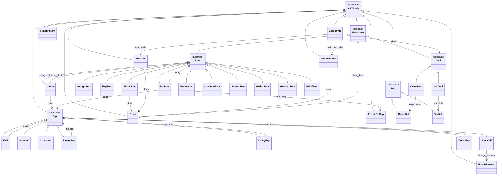

# 语法分析器 (Parser) 设计文档

## 1. 设计目标与策略

### 1.1 分析算法

采用 **递归下降分析法 (Recursive Descent Parsing)**，为 SysY 文法的每个非终结符实现一个解析子程序；每个子程序按当前 Production Rule 的候选式进行分支或循环，**无回溯 (No Backtracking)**。

- **输入**：由 Lexer 提供的 Token 流（拉取式：Parser 通过 `Next`/`Peek` 驱动）。
- **输出**：抽象语法树 (AST) 根节点 `CompUnit`，以及语法错误列表 `(line, error_code)`。

### 1.2 文法特性与 Lookahead

- 文法为 **EBNF** 形式，含 `{ }`、`[ ]`，在递归下降中对应「循环」与「可选」。
- 绝大多数产生式可根据 **当前 Token (Current Token)** 唯一选择候选式，即 **LL(1)** 可区分。
- 少数位置需要 **超前查看 (Lookahead)**：
  - **1-token Lookahead**：如 `UnaryExp` 下 `Ident` 后若下一符为 `(` 则为函数调用，否则为 `LVal`；`Stmt` 下 `Ident` 后若为 `=` 则为赋值/ getint/getchar，否则可能为表达式语句。
  - **2-token Lookahead**：如 **CompUnit** 顶层需区分「声明」与「函数定义」——两者均可以 `int`/`char` 开头，需看第二个 Token 是否为 `Ident` 且第三个是否为 `(`，即 `Lookahead2Is(LPARENT)` 为真则选 FuncDef，否则在满足 `LookaheadIs(IDENFR)` 且非 `(` 时选 Decl。

实现上通过 **Lexer::PeekNext()** / **Lexer::PeekNext2()** 提供不消费的 Lookahead：内部采用「保存状态 → Next() → 取结果 → 恢复状态」，保证 Parser 无需回溯即可选定产生式。

### 1.3 与 Lexer 的交互模式

| 操作 | 含义 | 使用场景 |
|------|------|----------|
| **Cur()** | 当前 Token（不消费） | 分支判断、Expect 匹配 |
| **Advance()** | 消费当前 Token，推进到下一 Token | 匹配终结符后前进 |
| **LookaheadIs(t)** | 下一 Token 类型是否为 t | 区分 Ident 开头的不同产生式 |
| **Lookahead2Is(t)** | 下两 Token 类型是否为 t | CompUnit 中 Decl vs FuncDef |

数据流为 **Pull Model**：Parser 调用 `lexer_.Next()`（或通过 Advance 间接调用）拉取新 Token，Lexer 不主动推送。

---

## 2. 重要补充信息（文法与错误处理）

### 2.1 文法定义与产生式选择决策

完整 SysY 文法（EBNF）见课程文档 **`[docs/course_info/2024_SysY_grammar.md](docs/course_info/2024_SysY_grammar.md)`**、**`[docs/course_info/2024_SysY_detailed.md](docs/course_info/2024_SysY_detailed.md)`**，开始符号为 **CompUnit**。此处不再照抄文法，而是给出**前缀复杂、需要 Cur / Lookahead / Lookahead2 组合判断**时的**产生式选择决策表**，与 LL(1) 分析表思想一致：在每一入口处根据当前与超前 Token 唯一确定所选产生式或调用的解析例程。

---

#### 2.1.1 CompUnit 顶层（需 2-token Lookahead）

**相关文法（递归）：**
- CompUnit → { Decl } { FuncDef } MainFuncDef
- Decl → ConstDecl | VarDecl  
  - ConstDecl → `const` BType ConstDef { `,` ConstDef } `;`
  - VarDecl → BType VarDef { `,` VarDef } `;`
- FuncDef → FuncType Ident `(` [ FuncFParams ] `)` Block
- MainFuncDef → `int` `main` `(` `)` Block

顶层以 `const` / `int` / `char` / `void` 开头时，**Decl** 与 **FuncDef** 前缀重叠，必须用 **LookaheadIs(IDENFR)** 与 **Lookahead2Is(LPARENT)** 区分。

| Cur | Lookahead (下一 Token) | Lookahead2 (下两 Token) | 决策 |
|-----|------------------------|--------------------------|------|
| `const` | — | — | **Decl**（ConstDecl） |
| `int` / `char` | `Ident` | **≠** `(` | **Decl**（VarDecl） |
| `int` / `char` / `void` | `Ident` | **=** `(` | **FuncDef** |
| 其余（两次 while 均不满足，即期待 `int` `main` `(` `)`） | — | — | **MainFuncDef** |

对应实现：先 **while** 满足「Const 或 (int/char + Ident 且下一非 `(` )」则反复 **ParseDecl**；再 **while** 满足「int/char/void + Ident 且下一为 `(`」则反复 **ParseFuncDef**；最后 **ParseMainFuncDef** 一次。

```cpp
// 仅示意：ParseCompUnit 中的两个 while 条件
while (CurIs(CONSTTK) ||
       ((CurIs(INTTK) || CurIs(CHARTK)) && LookaheadIs(IDENFR) && !Lookahead2Is(LPARENT)))
    decls.push_back(ParseDecl());
while ((CurIs(INTTK) || CurIs(CHARTK) || CurIs(VOIDTK)) &&
       LookaheadIs(IDENFR) && Lookahead2Is(LPARENT))
    func_defs.push_back(ParseFuncDef());
```

---

#### 2.1.2 BlockItem（Decl | Stmt）

**相关文法（递归）：**
- BlockItem → Decl | Stmt  
  - Decl → ConstDecl \| VarDecl（见 2.1.1）  
  - Stmt → 多候选（见 2.1.4）

块内首符为类型/常量关键字则声明，否则为语句。

| Cur | 决策 |
|-----|------|
| `const` / `int` / `char` | **Decl**（再按 Cur 区分 ConstDecl / VarDecl） |
| 其他（`{` / `if` / `for` / `break` / `continue` / `return` / `printf` / `Ident` / `;` / 算符等，即 Stmt 任一候选的首符） | **Stmt** |

---

#### 2.1.3 Decl（ConstDecl | VarDecl）

**相关文法（递归）：**
- Decl → ConstDecl | VarDecl
- ConstDecl → `const` BType ConstDef { `,` ConstDef } `;`
- VarDecl → BType VarDef { `,` VarDef } `;`

| Cur | 决策 |
|-----|------|
| `const` | **ConstDecl** |
| `int` / `char` | **VarDecl** |

---

#### 2.1.4 Stmt（多候选，仅 Cur 即可区分）

**相关文法（递归）：**

- **Stmt** → 下列之一：
  - LVal `=` Exp `;`
  - [ Exp ] `;`
  - Block
  - `if` `(` Cond `)` Stmt [ `else` Stmt ]
  - `for` `(` … `)` Stmt
  - `break` `;`、`continue` `;`、`return` [ Exp ] `;`
  - LVal `=` `getint` `(` `)` `;`、LVal `=` `getchar` `(` `)` `;`
  - `printf` `(` StringConst { `,` Exp } `)` `;`
- **Block** → `{` { BlockItem } `}`

| Cur | 决策 |
|-----|------|
| `{` | **BlockStmt**（Block） |
| `if` | **IfStmt** |
| `for` | **ForStmt** |
| `break` | **BreakStmt** |
| `continue` | **ContinueStmt** |
| `return` | **ReturnStmt** |
| `printf` | **PrintfStmt** |
| 其他（`Ident` / `;` / `+` `-` `!` / `IntConst` / `CharConst` / `(`，即 [Exp]`;` 或 LVal`=`… 的首符） | **ParseOtherStmt**（见 2.1.5） |

---

#### 2.1.5 ParseOtherStmt（Ident 开头或 `;` 或表达式：先 LVal 再看 Cur）

**相关文法（递归）：** Stmt 中与本入口相关的候选包括：

- [ Exp ] `;`（可为空）
- LVal `=` Exp `;`
- LVal `=` `getint` `(` `)` `;`
- LVal `=` `getchar` `(` `)` `;`
- 「以 LVal 为左操作数的表达式语句」：LVal 后接二元算符再 Exp `;`

进入时已排除关键字。先处理空语句，再**统一 ParseLVal**，然后根据**当前 Token** 分支。

| 阶段 | Cur（LVal 解析后） | 决策 |
|------|---------------------|------|
| 进入时 | `;` | **ExpStmt**（空 [Exp]） |
| 已 ParseLVal 后 | `=` | 再看下一 Token：`getint`→**GetintStmt**，`getchar`→**GetcharStmt**，否则 **AssignStmt**（LVal `=` Exp `;`） |
| 已 ParseLVal 后 | `;` | **ExpStmt**（仅 LVal） |
| 已 ParseLVal 后 | 二元算符（`+` `-` `*` `/` `%` `<` `>` `<=` `>=` `==` `!=` `&&` `\|\|`，不逐一列出） | **ExpStmt**（BinaryExp(LVal, ParseExp(), op)） |

---

#### 2.1.6 UnaryExp（PrimaryExp | 函数调用 | UnaryOp UnaryExp，需 1-token Lookahead）

**相关文法（递归）：**
- UnaryExp → PrimaryExp | Ident `(` [ FuncRParams ] `)` | UnaryOp UnaryExp
- UnaryOp → `+` | `-` | `!`
- PrimaryExp → `(` Exp `)` | LVal | Number | Character

`Ident` 开头时需区分 **LVal**（PrimaryExp）与 **Ident '(' [FuncRParams] ')'**（函数调用）。

| Cur | Lookahead | 决策 |
|-----|-----------|------|
| `Ident` | **=** `(` | **FuncCall**（Ident `(` [ FuncRParams ] `)`） |
| `+` / `-` / `!` | — | **UnaryOp UnaryExp** |
| 其他（`IntConst` / `CharConst` / `(` / `Ident` 且 Lookahead≠`(`） | — | **PrimaryExp** |

---

#### 2.1.7 PrimaryExp（'(' Exp ')' | LVal | Number | Character）

**相关文法（递归）：**
- PrimaryExp → `(` Exp `)` | LVal | Number | Character
- LVal → Ident [ `[` Exp `]` ]
- Number → IntConst
- Character → CharConst

| Cur | 决策 |
|-----|------|
| `IntConst` | **Number** |
| `CharConst` | **Character** |
| `(` | **`(` Exp `)`** |
| `Ident` | **LVal** |

---

#### 2.1.8 ConstInitVal / InitVal（三选一）

**相关文法（递归）：**
- ConstInitVal → ConstExp | `{` [ ConstExp { `,` ConstExp } ] `}` | StringConst
- InitVal → Exp | `{` [ Exp { `,` Exp } ] `}` | StringConst
- ConstExp → AddExp（常量上下文）
- Exp → AddExp

| Cur | 决策 |
|-----|------|
| `StringConst` | 字符串初值 |
| `{` | **`{` [ … ] `}`** 列表 |
| 其他（ConstExp/Exp 首符：`IntConst` / `CharConst` / `(` / `Ident` / `+` / `-` / `!` 等） | **ConstExp**（ConstInitVal） / **Exp**（InitVal） |

---

### 2.2 语法错误码（Parser 负责部分）

课程规定语法分析阶段需检测并上报的错误码如下（详见 [`2024_SysY_detailed.md`](docs/course_info/2024_SysY_detailed.md) 错误处理一节）：

| 错误码 | 含义       | 典型产生式位置 |
|--------|------------|----------------|
| **i**  | 缺少分号   | ConstDecl / VarDecl / Stmt 末尾 `;` |
| **j**  | 缺少右小括号 `)` | 函数定义、函数调用、if/for 条件、PrimaryExp 中 `)` |
| **k**  | 缺少右中括号 `]` | ConstDef / VarDef / FuncFParam / LVal 中 `]` |

报错行号：为「该终结符前一个非终结符所产生串的最后一个单词所在行」，实现中用 **last_consumed_line_** 记录最近一次消费的 Token 行号，在 Expect 失败时用该行号上报。

---

## 3. AST（抽象语法树）设计

### 3.1 设计思想：解析与存储分离 + Exp 大一统

本实现的核心设计是 **将语法分析 (parsing) 过程与语法树 (AST) 的存储分离**：`Parser.h` / `parser.cpp` 只负责按产生式驱动 Lexer 并构造节点，`AST.h` 只定义节点类型与继承关系，二者通过 `std::unique_ptr<ASTNode>` 等接口衔接。在这一前提下，**AST 的继承体系**直接决定了解析逻辑能否简洁、无回溯。

**Exp 框架下的大一统**：文法中表达式有多层非终结符（PrimaryExp、UnaryExp、MulExp、AddExp、RelExp、EqExp、LAndExp、LOrExp），若在 AST 中为每一层单独建类并维护「子表达式列表 + 算符列表」（例如 `MulExp` 存 `ArrayList<UnaryExp> unaryExps` 与 `ArrayList<Token> operators`），则存储冗余、遍历时还要按层还原。本实现让 **LVal、Number、Character、BinaryExp、UnaryExp、FuncCall** 等 **全部继承 Exp**，于是：

- **AddExp / MulExp / RelExp / EqExp / LAndExp / LOrExp** 在 AST 中 **统一用 BinaryExp(lhs, rhs, op)** 表示，不再为每一层维护列表。递归下降时每层「解析一个下层 + 循环本层算符」即可，得到的天然就是一棵从左到右的二元表达式树，符合结合性与优先级。

```cpp
// AST.h：二元表达式统一表示，LVal 与其它表达式同属 Exp
class BinaryExp : public Exp {
public:
    std::unique_ptr<Exp> lhs;
    std::unique_ptr<Exp> rhs;
    OpType op;
    // ...
};
/** LVal: Ident [ '[' Exp ']' ]. */
class LVal : public Exp {
public:
    std::string ident;
    std::unique_ptr<Exp> index;
    // ...
};
```

- **LVal 继承 Exp** 带来另一项关键收益：**以 Ident 开头的 Stmt**（赋值 / getint / getchar / 表达式语句）可以 **先统一按 LVal 解析**，再根据**当前 Token** 分支，而无需「先尝试 Exp，失败再回溯解析 LVal」。因为 LVal 本身就是一种 Exp，解析出的 `unique_ptr<LVal>` 既可当作赋值左部，也可当作表达式语句中的唯一表达式，或与后续算符合成 BinaryExp。对比「为每层表达式维护子表达式列表 + 算符列表」或「对 Ident 开头的 Stmt 先 try parseExp、失败再 save/restore 回溯解析 LVal」的写法，本实现在存储与解析逻辑上都更简洁，且无需回溯。

### 3.2 继承体系概览

AST 根为 **ASTNode**，无数据成员，仅作多态基类。主要派生关系：

- **BlockItem**：块内项，用于 Block 的 `{ BlockItem }`。
  - **Decl** → **ConstDecl** / **VarDecl**
  - **Stmt** → **AssignStmt** / **ExpStmt** / **BlockStmt** / **IfStmt** / **ForStmt** / **BreakStmt** / **ContinueStmt** / **ReturnStmt** / **GetintStmt** / **GetcharStmt** / **PrintfStmt**
- **Exp**：表达式家族，用于 Exp、Cond、ConstExp、初值等。
  - **LVal** / **Number** / **Character** / **BinaryExp** / **UnaryExp** / **FuncCall** / **ConstExp**（ConstExp 为 ConstExp → AddExp 的包装节点）。
- **Def**：常量/变量定义节点，仅用于类型区分。
  - **ConstDef** / **VarDef**
- 其他独立节点：**Block**、**FuncFParam**、**FuncRParams**、**ForInitOrStep**、**FuncDef**、**MainFuncDef**、**CompUnit**。

ConstInitVal / InitVal 使用 **std::variant&lt;SingleExp, ExpList, StringVal&gt;** 表示三种文法候选（单表达式、列表、字符串），不单独建子类。

### 3.3 核心 AST 类图 (Mermaid)



---

## 4. 关键实现细节

### 4.1 左递归消除与 BinaryExp 的一致性

文法中 **AddExp**、**MulExp**、**RelExp**、**EqExp**、**LAndExp**、**LOrExp** 均为直接左递归形式（如 `AddExp → AddExp ('+'|'-') MulExp`）。递归下降无法处理直接左递归，实现中采用 **等价的迭代形式**：先解析一个「当前层最简单元」作为 lhs，再 **while** 本层二元算符，每次消费算符并解析下一个「最简单元」作为 rhs，构造 **BinaryExp(lhs, rhs, op)** 作为新的 lhs，循环直到不再匹配本层算符。这样既得到与左递归文法等价的 **从左到右** 的运算顺序，又与 AST 中「所有二元表达式统一用 BinaryExp」的设计一致，无需为 AddExp/MulExp 等单独维护列表。

```cpp
// parser.cpp：AddExp 层循环构造左结合 BinaryExp
std::unique_ptr<Exp> Parser::ParseAddExp() {
    auto lhs = ParseMulExp();
    while (CurIs(TokenType::PLUS) || CurIs(TokenType::MINU)) {
        OpType op = GetOperatorType(Cur()->value);
        Advance();
        auto rhs = ParseMulExp();
        lhs = std::make_unique<BinaryExp>(std::move(lhs), std::move(rhs), op);
    }
    // ...
}
```

### 4.2 语句歧义与 Lookahead：Ident 开头的 Stmt（ParseOtherStmt）

**Stmt** 中以 **Ident** 开头的候选有：赋值类（LVal `=` Exp / getint / getchar）与表达式语句（如 `a[10];`、`f();`）。仅凭当前 Token 无法区分「LVal 后跟 `=`」与「LVal 后跟 `;` 或运算符」。本实现利用 **LVal 继承 Exp**：**先统一按 LVal 解析**，再根据 **当前 Token** 分支，无需回溯。

1. 若为 **ASSIGN**：再区分 getint / getchar / 普通赋值，解析对应右部与分号。
2. 若为 **SEMICN**：视为「仅由该 LVal 构成的表达式语句」，消费分号。
3. 否则（如 **PLUS**、**MINU** 等）：视为「以该 LVal 为左操作数的表达式」，消费运算符后调用 **ParseExp** 得到右部，构造 **BinaryExp(lval, exp, op)**，再 **ExpectSemicolon**。

对应实现片段如下：

```cpp
// parser.cpp：ParseOtherStmt 核心逻辑，无 save/restore
std::unique_ptr<Stmt> Parser::ParseOtherStmt() {
    if (CurIs(TokenType::SEMICN)) { /* 空语句 */ }
    std::unique_ptr<LVal> lval = ParseLVal();
    if (CurIs(TokenType::ASSIGN)) {
        Advance();
        if (CurIs(TokenType::GETINTTK)) { /* getint */ }
        if (CurIs(TokenType::GETCHARTK)) { /* getchar */ }
        std::unique_ptr<Exp> exp = ParseExp();
        ExpectSemicolon();
        return std::make_unique<AssignStmt>(std::move(lval), std::move(exp));
    }
    if (CurIs(TokenType::SEMICN)) { Advance(); return std::make_unique<ExpStmt>(std::nullopt); }  // 仅 LVal 后接分号
    // 否则：LVal 是表达式的一部分，后面跟二元算符
    OpType op = GetOperatorType(Cur()->value);
    Advance();
    std::unique_ptr<Exp> exp = ParseExp();
    ExpectSemicolon();
    return std::make_unique<ExpStmt>(std::make_optional(
        std::make_unique<BinaryExp>(std::move(lval), std::move(exp), op)));
}
```

---

## 5. 错误处理 (Error Recovery)

### 5.1 策略概述

- **不采用异常**：语法错误不抛异常，而是写入内部 **error_log_**，格式为 `(line_number, error_code)`。驱动程序可将 Lexer 与 Parser 的 error_log 合并后写入 `error.txt`，满足「对错误程序也完成完整语法分析并输出全部错误」的要求。
- **缺失终结符 (i / j / k)**：通过 **Expect(type, "i"|"j"|"k")** 处理。若当前 Token 与期望类型不符，则 **RecordError(last_consumed_line_, code)**，**不消费** 当前 Token，解析继续。这样避免因一次缺失导致后续大量误报；行号取「前一个已消费 Token 的行号」，与课程「分号/右括号/右中括号前一个非终结符所在行」的约定一致。

### 5.2 恢复与继续分析

- **Expect 不消费**：缺失 `;` `)` `]` 时只记错、不跳过输入，下一层或同层后续可能再次遇到可识别的结构，解析得以继续。
- **Block**：**ParseBlock** 在匹配 `{` 后，**while (!RBRACE)** 循环解析 BlockItem，因此会一直吸收到遇到 `}`，再 Expect `}`，不会因中间错误而提前退出块。
- 对无法归入任何产生式的 Token（如 Decl 时既非 const 也非 int/char），当前实现记录占位错误码并返回 nullptr 等，由上层（如 CompUnit）继续推进，避免单点失败导致整体中断。

---

## 6. 接口设计

### 6.1 构造与入口

| 接口 | 说明 |
|------|------|
| `explicit Parser(Lexer& lexer)` | 持有 Lexer 的非拥有引用，调用方保证 Lexer 生命周期。 |
| `std::unique_ptr<CompUnit> ParseCompUnit()` | 语法分析入口，返回 AST 根节点。 |

### 6.2 声明与函数

| 接口 | 说明 |
|------|------|
| `std::unique_ptr<Decl> ParseDecl()` | Decl → ConstDecl \| VarDecl。 |
| `std::unique_ptr<ConstDecl> ParseConstDecl()` | 常量声明。 |
| `std::unique_ptr<VarDecl> ParseVarDecl()` | 变量声明。 |
| `std::unique_ptr<FuncDef> ParseFuncDef()` | 普通函数定义。 |
| `std::unique_ptr<MainFuncDef> ParseMainFuncDef()` | 主函数定义。 |

### 6.3 块与语句

| 接口 | 说明 |
|------|------|
| `std::unique_ptr<Block> ParseBlock()` | Block → `'{' { BlockItem } '}'`。 |
| `std::unique_ptr<BlockItem> ParseBlockItem()` | BlockItem → Decl \| Stmt。 |
| `std::unique_ptr<Stmt> ParseStmt()` | 按首 Token 分发到具体 Stmt 子类型。 |

### 6.4 表达式与左值

| 接口 | 说明 |
|------|------|
| `std::unique_ptr<Exp> ParseExp()` | Exp → AddExp，顶层表达式。 |
| `std::unique_ptr<Exp> ParseCond()` | Cond → LOrExp，用于 if/for 条件。 |
| `std::unique_ptr<LVal> ParseLVal()` | LVal → Ident [ '[' Exp ']' ]。 |
| `std::unique_ptr<Exp> ParsePrimaryExp()` | PrimaryExp，供 UnaryExp 调用。 |

### 6.5 错误与输出

| 接口 | 说明 |
|------|------|
| `const std::vector<std::pair<int, std::string>>& GetErrorLog() const` | 语法错误列表 (line, error_code)。 |
| `void SetParserOutput(std::ostream* out)` | 设置 parser 输出流（如 parser.txt）。 |
| `void SetEmitParserOutput(bool enable)` | 是否输出 Token 与语法成分行（便于评测）。 |

上述 **ParseXXX** 中未列出的（如 ParseAddExp、ParseMulExp、ParseUnaryExp、ParseForStmt、ParseIfStmt 等）为 **私有** 实现细节，由 ParseCompUnit / ParseStmt / ParseExp 等对外接口内部调用。
