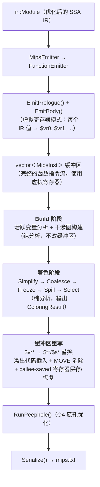
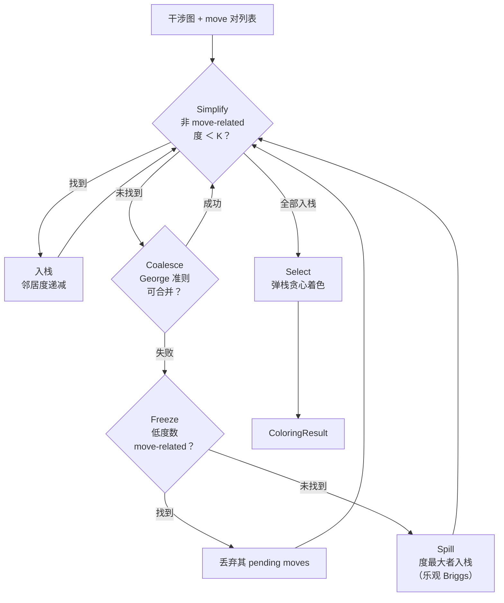
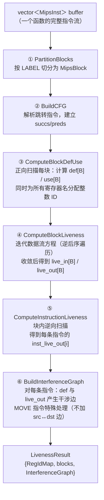
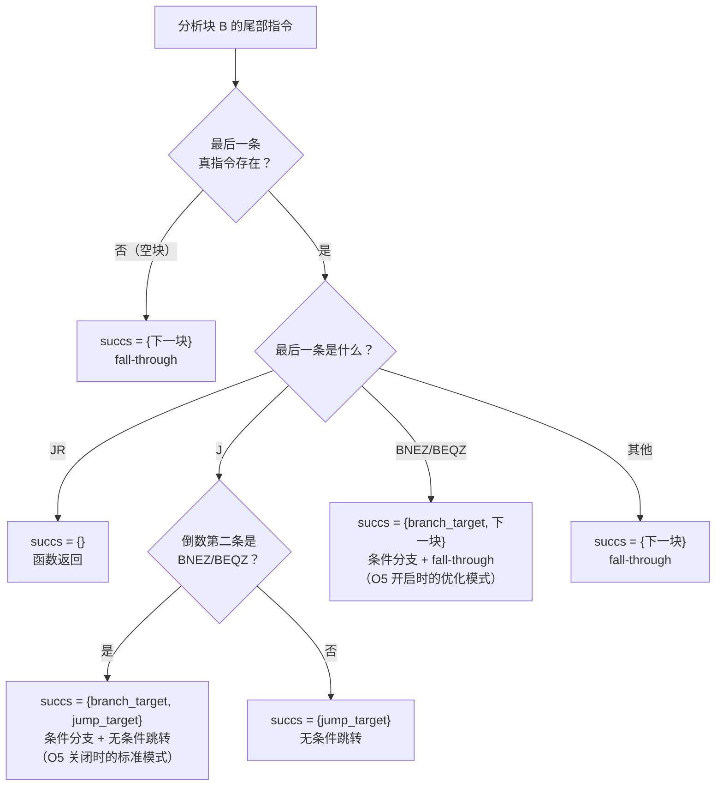
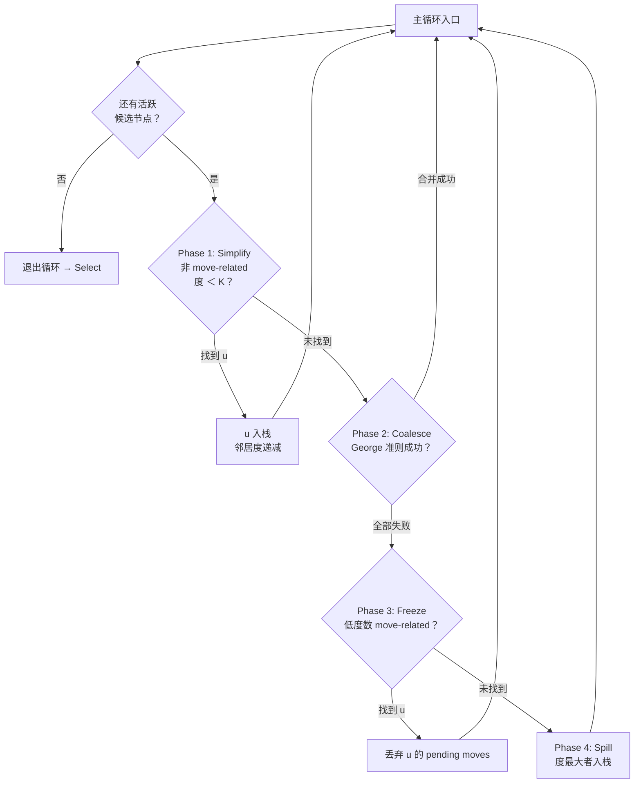
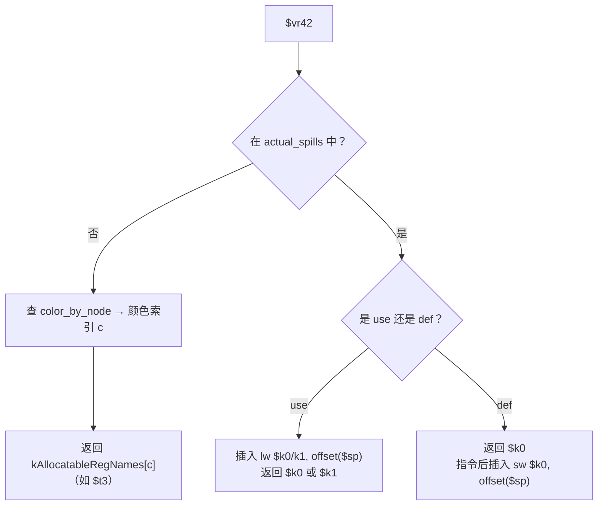

# O7：图染色寄存器分配 (Graph Coloring Register Allocation) 设计文档

本文档描述编译器 **MIPS 后端最重要的优化——图染色寄存器分配**的设计思路与实现细节。寄存器分配的目标是：将尽可能多的 IR 值从栈槽"提升"到物理寄存器中，减少 `lw`/`sw` 内存访问，从而显著提升生成代码的运行效率。

当前已完成的阶段：

| 阶段 | 状态 | 内容 |
|------|------|------|
| **Build** | ✅ 已实现 | 活跃变量分析 + 干涉图构建 |
| **Simplify** | ✅ 已实现 | 非 move-related 低度数节点入栈 |
| **Coalesce** | ✅ 已实现 | George 准则合并 MOVE 对 |
| **Freeze** | ✅ 已实现 | 冻结低度数 move-related 节点 |
| **Spill** | ✅ 已实现 | 乐观溢出（Briggs）+ 溢出代码插入 |
| **Select** | ✅ 已实现 | 弹栈贪心着色 + 合并节点颜色传播 |
| **缓冲区重写** | ✅ 已实现 | vreg→物理寄存器替换 + MOVE 消除 + callee-saved 处理 |

---

## 1. 全局视图：寄存器分配在编译管线中的位置

寄存器分配发生在 MIPS 后端内部，作用于 `AsmWriter` 的结构化指令缓冲区（`vector<MipsInst>`）。它在指令发射完毕之后、peephole 优化和文本序列化之前执行：



**在 `FunctionEmitter::Emit()` 中的具体接入点**（`src/mips/FunctionEmitter.cpp:15-35`）：

```cpp
void FunctionEmitter::Emit() {
    frame_.Build();
    const bool kUseBuffer = options_.enable_peephole || options_.enable_reg_alloc;
    if (kUseBuffer) writer_.BeginBuffer();

    EmitPrologue();
    if (options_.enable_reg_alloc) {
        inst_emitter_.ReservePhiVRegsForFunction();
    }
    EmitBody();

    if (options_.enable_reg_alloc) {
        RegAllocator::Run(writer_.GetBuffer(), inst_emitter_.VRegSpillSlots(),
                          frame_.GetFrameSize());
    }

    if (kUseBuffer) writer_.FlushBuffer();   // peephole + 序列化
}
```

**为什么 `kUseBuffer` 要同时检查两个开关？** 原来只有 `enable_peephole` 会触发 buffer 模式。但寄存器分配也需要在 `vector<MipsInst>` 上工作——它需要遍历完整的函数指令流来做活跃分析。如果用户只开启 `enable_reg_alloc` 而不开 `enable_peephole`，不启用 buffer 模式就没有指令可分析。因此改为两者任一开启即启用缓冲。

**`ReservePhiVRegsForFunction()` 为什么在 `EmitBody()` 之前？** Phi 节点的虚拟寄存器必须在任何块发射之前预分配好——因为 phi 的结果可能在发射顺序上更早的块中被使用（如循环回边），如果不预留，使用侧找不到对应的 vreg 映射。

---

## 2. 算法选择：为什么是 Chaitin-Briggs？

图染色寄存器分配的核心思想：将**寄存器分配问题转化为图论的着色问题**。每个需要寄存器的值是图中的一个节点，如果两个值的生存期重叠（同时活跃），则连一条边（"干涉"）。用 K 种颜色（K = 可用物理寄存器数）对图着色，使得相邻节点颜色不同，就完成了寄存器分配。

Chaitin-Briggs 算法是该领域最经典的算法（LLVM 和 GCC 早期版本采用），核心优势在于：

- **乐观着色（Optimistic Coloring）**：当一个节点的度数 ≥ K 时，不立即判定必须溢出，而是延迟到 Select 阶段——此时邻居的实际着色可能只占用了 < K 种颜色，该节点仍可着色成功
- **Coalesce（合并）**：能消除 `move` 指令——如果 `move $a, $b` 的源和目的不干涉，可以让它们使用同一个寄存器，`move` 指令直接消失
- **可用寄存器数 K=18**：10 个 `$t` 寄存器 + 8 个 `$s` 寄存器，数量充裕，大多数函数无需溢出

完整的算法循环：



---

## 3. Build 阶段：活跃分析与干涉图构建

Build 是 Chaitin-Briggs 的第一步，也是整个寄存器分配的数据基础。它回答两个问题：

1. **每条指令执行后，哪些寄存器是"活的"（live）？** → 活跃变量分析
2. **哪些寄存器的生存期重叠，不能共享同一个物理寄存器？** → 干涉图

Build 阶段是**纯分析**——它只读取指令缓冲区，不做任何修改。

### 3.1 代码导读

> **Build 阶段代码量**：`LivenessAnalysis.h`（145 行）+ `LivenessAnalysis.cpp`（642 行）≈ **787 行**

```
include/mips/LivenessAnalysis.h    — 所有数据结构声明，阅读本节的起点
  ├─ GetDefs() / GetUses()          — 指令级 def/use 提取的接口
  ├─ RegIdMap                       — 寄存器名 ↔ 整数 ID 的双向映射
  │    ├─ IsAllocatable()           — 判断是否为 $t/$s 可分配寄存器
  │    ├─ IsVirtual()               — 判断是否为 $vr* 虚拟寄存器
  │    └─ PaletteIndexOf()          — 物理寄存器 → 调色板颜色索引
  ├─ MipsBlock                      — MIPS 级基本块（buffer 的一个区间）
  ├─ InterferenceGraph              — 干涉图（邻接集 + 度数 + move 对）
  └─ LivenessResult + BuildLiveness — 分析结果捆绑 + 总入口

src/mips/LivenessAnalysis.cpp      — 全部实现，按以下顺序阅读：
  ├─ PushIfValid() / CallerSavedRegs() — 辅助函数
  ├─ GetDefs() / GetUses()             — 每条 MipsOpcode 的 def/use 映射
  ├─ RegIdMap 方法                      — GetOrCreate / Get / GetName / IsAllocatable
  ├─ PartitionBlocks()                 — 按 LABEL 切分指令缓冲区
  ├─ FindTerminators()                 — 找块尾部的控制流指令
  ├─ BuildCFG()                        — 解析跳转目标，填充 succs/preds
  ├─ ComputeBlockDefUse()              — 正向扫描计算块级 def/use 集合
  ├─ ComputeReversePostorder()         — 迭代 DFS 计算逆后序
  ├─ ComputeBlockLiveness()            — 迭代数据流方程至不动点
  ├─ ComputeInstructionLiveness()      — 块内逆向扫描，得到每条指令的 live-out
  ├─ InterferenceGraph 方法             — AddEdge / AddMove / HasEdge / Degree
  ├─ BuildInterferenceGraph()          — 从 def + live-out 构建干涉图
  └─ BuildLiveness()                   — 总入口：串联上述所有步骤
```

### 3.2 Build 的完整流水线



### 3.3 指令级 def/use 提取

#### 为什么需要它？

活跃变量分析的基本输入是：每条指令**定义（写）哪些寄存器**、**使用（读）哪些寄存器**。IR 级别有天然的 def-use 链（SSA 的静态单赋值性质），但 MIPS 汇编级没有这种结构——必须从指令的操作码和字段中推导。

`GetDefs()` 和 `GetUses()` 就是这个推导逻辑的实现。它们接受一条 `MipsInst`，根据 `op` 字段返回被定义/使用的寄存器名列表。

#### 完整的 def/use 映射表

下表覆盖了 `MipsOpcode` 枚举中的所有变体（`src/mips/LivenessAnalysis.cpp:40-188`）：

| 指令类型 | 代表操作码 | def（写） | use（读） | 说明 |
|---------|-----------|----------|----------|------|
| R-type | `ADDU`, `SUBU`, `MUL`, `SLT`... | `{dst}` | `{src1, src2}` | `dst = src1 op src2` |
| Shift | `SLL`, `SRL`, `SRA` | `{dst}` | `{src1}` | `dst = src1 << imm` |
| Division | `DIV` | (无) | `{src1, src2}` | 写入 HI:LO，不显式建模 |
| Move-from | `MFLO`, `MFHI` | `{dst}` | (无) | 读 HI/LO（隐式） |
| I-type | `ADDIU`, `ANDI` | `{dst}` | `{src1}` | `dst = src1 op imm` |
| Load | `LW`, `LBU` | `{dst}` | `{src1}` | 从 `imm(src1)` 加载到 `dst` |
| **Store** | `SW`, `SB` | **(无)** | **`{dst, src1}`** | **`dst` 是被存的值，不是被定义** |
| Pseudo-load | `LI`, `LA` | `{dst}` | (无) | 加载常量/地址 |
| Move | `MOVE` | `{dst}` | `{src1}` | 寄存器复制 |
| Jump | `J` | (无) | (无) | 无条件跳转 |
| **Call** | `JAL` | **caller-saved 全集** | (无) | 见下文详解 |
| Return | `JR` | (无) | `{src1}` | 通常 `src1` = `$ra` |
| Branch | `BNEZ`, `BEQZ` | (无) | `{src1}` | 条件寄存器 |
| **Syscall** | `SYSCALL` | **`{$v0}`** | **`{$v0, $a0}`** | 系统调用号 + 参数 |
| 非指令 | `LABEL`, `DIRECTIVE`... | (无) | (无) | 不参与分析 |

#### SW/SB 的 "dst" 陷阱

`MipsInst` 的字段命名约定中，`SW` 和 `SB` 的 `dst` 字段存放的是**被写入内存的值寄存器**，而非被定义的目标寄存器（见 `include/mips/MipsInst.h:78`）。对活跃分析而言，`sw $t2, 8($sp)` 是在**读取** `$t2` 和 `$sp` 的值，不定义任何寄存器：

```cpp
// src/mips/LivenessAnalysis.cpp:144-149
case MipsOpcode::SW:
case MipsOpcode::SB:
    PushIfValid(uses, inst.dst);   // 值寄存器（被读取，非被定义！）
    PushIfValid(uses, inst.src1);  // 基址寄存器
    break;
```

这是最容易写错的地方——如果把 `SW` 的 `dst` 当作 def，活跃分析会错误地认为该值在 `sw` 之后已"死亡"，导致后续的干涉图缺少关键边。

#### JAL 的 caller-saved clobber 集

函数调用（`JAL`）是 def/use 建模中最复杂的场景。在 MIPS 调用约定中，函数调用后**所有 caller-saved 寄存器的值都可能被破坏**。如果分析不建模这一点，跨调用活跃的值可能被错误地分配到 caller-saved 寄存器中。

```cpp
// src/mips/LivenessAnalysis.cpp:28-34
static const std::vector<std::string>& CallerSavedRegs() {
    static const std::vector<std::string> kRegs = {
        "$v0", "$v1", "$a0", "$a1", "$a2", "$a3",
        "$t0", "$t1", "$t2", "$t3", "$t4", "$t5", "$t6", "$t7", "$t8", "$t9",
        "$ra",
    };
    return kRegs;
}

// JAL 的 def 集 = 全部 caller-saved 寄存器
case MipsOpcode::JAL: defs = CallerSavedRegs(); break;
```

**为什么这样建模？** 考虑以下场景：

```mips
    li    $t0, 42       ; $t0 = 42
    jal   some_func     ; 调用函数——$t0 的值被破坏
    sw    $t0, 8($sp)   ; 错误！$t0 已不是 42
```

如果 `JAL` 的 def 集不包含 `$t0`，活跃分析会认为 `$t0` 从 `li` 一直活到 `sw`，不会与 `JAL` 的输出产生干涉。寄存器分配器可能会把某个值分配到 `$t0`，跨越调用点——值被破坏，程序语义错误。

将 JAL 建模为定义所有 caller-saved 寄存器后，跨调用活跃的值会与这些寄存器产生干涉，分配器会将它们分配到 callee-saved 寄存器（`$s0`-`$s7`）或溢出到栈上。

**JAL 为什么不在 use 集中列出 `$a0`-`$a3`？** 函数调用前设置参数的指令（如 `move $a0, $t0`）会通过正常的 def/use 链让 `$a0` 在调用点之前保持活跃。额外在 JAL 的 use 集中列出它们是冗余的，而且会引入不必要的干涉边。

#### 过滤逻辑：`PushIfValid()`

`MipsInst` 的 `dst`/`src1`/`src2` 字段可能为空字符串（当操作码不使用该字段时），`$zero` 是常量零寄存器（永远不会被"写入"或需要分配）。`PushIfValid` 统一过滤这两类噪音：

```cpp
// src/mips/LivenessAnalysis.cpp:21-24
static void PushIfValid(std::vector<std::string>& out, const std::string& reg) {
    if (!reg.empty() && reg != "$zero" && reg != "$0") {
        out.push_back(reg);
    }
}
```

### 3.4 RegIdMap：寄存器名与整数 ID 的映射

#### 为什么需要映射？

活跃分析的核心操作是集合运算（并集、差集、成员查询）。如果集合的元素是 `std::string`（如 `"$t0"`），每次比较都是 O(n) 的字符串比较，且 `unordered_set<string>` 的哈希计算也不廉价。

将寄存器名映射为连续的整数 ID 后，集合运算变为 `unordered_set<int>` 的操作——哈希是 O(1)，比较也是 O(1)，在迭代数据流的多轮循环中性能差距显著。

#### 映射的时机

`RegIdMap` 不是预先填充的——它在 `ComputeBlockDefUse()` 扫描指令时通过 `GetOrCreate()` **按需填充**。遇到一个从未见过的寄存器名就分配一个新 ID。这意味着：

- 只有实际出现在缓冲区中的寄存器才会被分配 ID
- ID 的分配顺序取决于指令扫描顺序，没有全局保证
- 所有后续阶段（干涉图、着色）都通过同一个 `RegIdMap` 实例做 ID ↔ 名字的翻译

#### 可分配性判断与虚拟寄存器

```cpp
// src/mips/LivenessAnalysis.cpp:213-228
bool RegIdMap::IsAllocatable(const std::string& name) {
    if (name.size() < 3 || name[0] != '$') return false;
    char kind = name[1];
    if (kind == 't') return name.size() == 3 && name[2] >= '0' && name[2] <= '9'; // $t0-$t9
    if (kind == 's') return name.size() == 3 && name[2] >= '0' && name[2] <= '7'; // $s0-$s7
    return false;
}
```

可分配寄存器共 **K = 18** 个（10 个 `$t` + 8 个 `$s`）。此外，`IsVirtual()` 判断 `$vr*` 前缀的虚拟寄存器——它们是着色的**候选节点**（candidate），而 `$t`/`$s` 是**预着色节点**（pre-colored），`$sp`/`$ra`/`$v0`/`$a0`-`$a3` 等参与活跃分析但既不可分配也不预着色。

`PaletteIndexOf()` 将 `$t0`-`$t9` 映射到颜色 0-9，`$s0`-`$s7` 映射到颜色 10-17，供预着色初始化使用。

### 3.5 MIPS 级基本块与 CFG 构建

#### 为什么不复用 IR 级 CFG？

项目已有 IR 级的 `CFGBuilder`（`include/pass/CFGBuilder.h`），但它操作的是 `ir::BasicBlock`。寄存器分配工作在 MIPS 指令缓冲区上——指令发射后，IR 的块结构已经被"展平"为 `vector<MipsInst>` 中的 LABEL + 指令序列。我们需要从这个扁平序列中**重新发现**块边界和控制流。

#### 块切分：`PartitionBlocks()`

算法很直接：扫描缓冲区，遇到 `MipsOpcode::LABEL` 就开始一个新 `MipsBlock`：

```cpp
// src/mips/LivenessAnalysis.cpp:236-255
static std::vector<MipsBlock> PartitionBlocks(const std::vector<MipsInst>& buffer) {
    std::vector<MipsBlock> blocks;
    for (int i = 0; i < static_cast<int>(buffer.size()); ++i) {
        if (buffer[i].op == MipsOpcode::LABEL) {
            if (!blocks.empty()) blocks.back().end = i;  // 关闭上一块
            MipsBlock blk;
            blk.start = i;
            blk.end = static_cast<int>(buffer.size());   // 暂设末尾
            blk.label = buffer[i].label;
            blocks.push_back(std::move(blk));
        }
    }
    if (!blocks.empty()) blocks.back().end = static_cast<int>(buffer.size());
    return blocks;
}
```

每个 `MipsBlock` 记录了它在缓冲区中的 `[start, end)` 范围。`start` 指向 LABEL 本身，LABEL 之后到下一个 LABEL 之前的所有指令都属于该块。

#### 后继识别：五种终结模式

`BuildCFG()`（`src/mips/LivenessAnalysis.cpp:279-351`）通过分析每个块尾部的控制流指令来确定后继。`FindTerminators()` 从块末尾逆向扫描，找到最后两条真指令（跳过 BLANK/DIRECTIVE 等非指令标记）。

后继的判定逻辑覆盖五种模式，对应 `InstructionEmitter::EmitBranchInst()` 可能发射的所有控制流模式：



**为什么需要处理 `BNEZ; J` 和单独 `BNEZ` 两种模式？** 这取决于 O5（冗余跳转消除）是否开启：

- **O5 关闭**：条件分支发射为 `bnez $t0, true_label; j false_label` 两条指令
- **O5 开启**：如果 false 分支恰好是下一块，只发射 `bnez $t0, true_label`，false 分支通过 fall-through

Build 阶段必须正确处理这两种形式，否则 CFG 的后继关系会出错。

### 3.6 块级活跃变量分析

#### 数据流方程

活跃变量是一个**反向数据流问题**：信息从程序的出口向入口传播。对每个基本块 B，定义：

- **def[B]**：在块内**任意位置**出现过定义（写入）的寄存器集合，即数据流方程里的 **kill 集**。凡在本块中有 def，就应进入 `def[B]`，**与**该 def 之前块内是否 use 过同一寄存器**无关**（否则 `out[B] - def[B]` 会偏小，`in[B]` 会错误偏大）。
- **use[B]**：在块内被使用（读取）、且**在该次使用之前**本块内尚未对该寄存器做过定义的寄存器集合（即 **向上暴露的使用**，gen 集）。
- **live_in[B]**：在块 B 入口处活跃的寄存器集合
- **live_out[B]**：在块 B 出口处活跃的寄存器集合

方程：

```
out[B] = ∪ { in[S] | S ∈ succs(B) }       （后继的入口活跃 → 本块的出口活跃）
in[B]  = use[B] ∪ (out[B] - def[B])        （本块使用的 + 穿越本块的）
```

#### 计算 def[B] 和 use[B]

`ComputeBlockDefUse()`（`src/mips/LivenessAnalysis.cpp:358-385`）正向扫描每个块的指令：**use[B]** 只对「尚未记入 `def[B]`」的 use 计入（向上暴露）；**def[B]** 则对每条指令的 def **无条件** `insert`（完整 kill 集）。两者不对称是方程 `in = use ∪ (out - def)` 所要求的。

```cpp
for (int i = blk.start; i < blk.end; ++i) {
    if (!buffer[i].IsInsn()) continue;
    // 先处理 use：如果寄存器 r 尚未在 def[B] 中，说明 r 在本块定义之前就被使用了
    for (const auto& u : GetUses(buffer[i])) {
        int uid = reg_ids.GetOrCreate(u);
        if (block_def[bi].count(uid) == 0) block_use[bi].insert(uid);  // 向上暴露！
    }
    // 再处理 def
    for (const auto& d : GetDefs(buffer[i])) {
        int did = reg_ids.GetOrCreate(d);
        block_def[bi].insert(did);
    }
}
```

**为什么正向扫描而非逆向？** `use[B]` 的定义是"在定义之前使用"——正向扫描时，`block_def[bi]` 逐步积累，恰好可以判断某个 use 发生时该寄存器是否已被定义。逆向扫描虽然也能实现，但判定逻辑更绕。

#### 迭代求解：postorder 遍历

活跃分析是反向问题，信息从后继流向前驱。使用**后序（postorder）** 遍历迭代可以加速收敛——后序保证一个块的后继在大多数情况下已被处理过，减少了"信息还没传到"导致的多余迭代。

实现上，先通过 `ComputeReversePostorder()` 计算逆后序（DFS 后序的 reverse），然后在 fixpoint 循环中**逆向遍历 RPO**（即按后序处理）：

```cpp
// src/mips/LivenessAnalysis.cpp:440-468
std::vector<int> rpo = ComputeReversePostorder(blocks);
bool changed = true;
while (changed) {
    changed = false;
    // 逆向遍历 RPO = 正向后序
    for (int idx = static_cast<int>(rpo.size()) - 1; idx >= 0; --idx) {
        int bi = rpo[idx];
        // out[B] = ∪ in[S]
        std::unordered_set<int> new_out;
        for (int s : blocks[bi].succs)
            for (int r : live_in[s]) new_out.insert(r);
        // in[B] = use[B] ∪ (out[B] - def[B])
        std::unordered_set<int> new_in = block_use[bi];
        for (int r : new_out)
            if (block_def[bi].count(r) == 0) new_in.insert(r);
        if (new_in != live_in[bi]) { changed = true; live_in[bi] = std::move(new_in); }
        live_out[bi] = std::move(new_out);
    }
}
```

**收敛性**：对可约 CFG（绝大多数结构化程序），通常 2-3 轮即收敛。不可约 CFG 在最坏情况下需要 O(循环嵌套深度) 轮。

#### 逆后序的迭代式 DFS

`ComputeReversePostorder()`（`src/mips/LivenessAnalysis.cpp:388-424`）使用显式栈模拟递归 DFS，避免深层函数嵌套带来的栈溢出风险：

```cpp
struct Frame { int block; int child_idx; };
std::vector<Frame> stack;
stack.push_back({0, 0});
visited[0] = true;

while (!stack.empty()) {
    auto& top = stack.back();
    const auto& succs = blocks[top.block].succs;
    if (top.child_idx < static_cast<int>(succs.size())) {
        int child = succs[top.child_idx++];        // 尝试下一个孩子
        if (!visited[child]) {
            visited[child] = true;
            stack.push_back({child, 0});
        }
    } else {
        postorder.push_back(top.block);            // 所有孩子处理完 → 加入后序
        stack.pop_back();
    }
}
std::reverse(postorder.begin(), postorder.end());  // 反转得到逆后序
```

`Frame` 结构记录了"当前正在 DFS 哪个块"以及"已经访问到第几个后继"。当所有后继都访问完毕，才将该块加入后序序列——这与递归版本中"递归返回时追加"完全等价。

### 3.7 指令级活跃变量

#### 为什么还需要指令级？

块级分析只给出了每个块入口/出口的活跃集合。但干涉图需要更细粒度的信息：**每条指令执行后，哪些寄存器是活的？** 只有知道了某条 `def` 指令执行后的 `live_out`，才能确定该 `def` 与哪些寄存器同时活跃（即产生干涉）。

#### 逆向扫描算法

`ComputeInstructionLiveness()`（`src/mips/LivenessAnalysis.cpp:477-504`）对每个块做一次从末尾到开头的逆向扫描：

```cpp
for (int bi = 0; bi < static_cast<int>(blocks.size()); ++bi) {
    std::unordered_set<int> live = block_live_out[bi];  // 从块出口开始

    for (int i = blk.end - 1; i >= blk.start; --i) {
        if (!buffer[i].IsInsn()) continue;

        inst_live_out[i] = live;                        // 记录此指令的 live-out

        for (const auto& d : GetDefs(buffer[i]))        // def 杀死活跃
            live.erase(reg_ids.GetOrCreate(d));
        for (const auto& u : GetUses(buffer[i]))        // use 激活活跃
            live.insert(reg_ids.GetOrCreate(u));
    }
}
```

逻辑直观：从块出口的活跃集开始，逐条指令向前走。遇到 def 就从 live 中移除（"该寄存器在此处被重新定义，之前的值已死"），遇到 use 就加入 live（"该寄存器在此处被需要，必须在此之前是活的"）。

**先记录 live-out、再更新 live** 的顺序至关重要——`inst_live_out[i]` 反映的是指令 i **执行完毕后**的活跃状态，也就是说 i 的 def 已经生效。这与干涉图的构建规则一致："指令 i 定义了 d，d 与 i 执行后仍活跃的所有寄存器产生干涉"。

### 3.8 干涉图构建

#### 核心规则

干涉图是一个无向图：

- **节点**：出现在缓冲区中的所有寄存器
- **边 (u, v)**：u 和 v 的生存期重叠，不能共享同一物理寄存器

构建规则（`src/mips/LivenessAnalysis.cpp:550-592`）：对每条指令 i，令 `defs = GetDefs(buffer[i])`：

> **对每个 d ∈ defs，对每个 r ∈ inst_live_out[i]，若 r ≠ d，则 AddEdge(d, r)。**

直观理解：指令 i 定义了 d，d 的新值从此时刻开始活跃；而 `inst_live_out[i]` 中的每个 r 在此时刻也是活跃的。两个同时活跃的值不能共用寄存器，所以产生干涉。

#### MOVE 指令的特殊处理

MOVE 指令（`move $dst, $src`）是一条寄存器复制。如果 `$dst` 和 `$src` 被分配到同一个物理寄存器，这条 MOVE 就可以被完全消除——这正是 Coalesce 阶段的工作。

为了给 Coalesce 创造机会，Build 阶段**不为 MOVE 的 dst 和 src 添加干涉边**：

```cpp
// src/mips/LivenessAnalysis.cpp:574-587
for (const auto& d : defs) {
    int d_id = reg_ids.GetOrCreate(d);
    for (int r : inst_live_out[i]) {
        if (r == d_id) continue;                               // 不加自环
        if (is_move && !buffer[i].src1.empty() &&
            r == reg_ids.GetOrCreate(buffer[i].src1)) continue; // MOVE 特例！
        ig.AddEdge(d_id, r);
    }
}
```

同时，MOVE 的 `(dst, src)` 对被记录到干涉图的 `moves_` 列表中，供后续 Coalesce 阶段使用：

```cpp
if (is_move && !buffer[i].dst.empty() && !buffer[i].src1.empty()) {
    int dst_id = reg_ids.GetOrCreate(buffer[i].dst);
    int src_id = reg_ids.GetOrCreate(buffer[i].src1);
    if (dst_id != src_id) ig.AddMove(dst_id, src_id);
}
```

**为什么不加边是安全的？** 在 `move $dst, $src` 执行后，`$dst` 和 `$src` 持有**相同的值**。如果它们被分配到同一寄存器，语义不变（复制自身）。但如果后续有指令重新定义了 `$src`，那时 `$dst` 和新的 `$src` 值就不同了——但此时会由那条重新定义指令的 live-out 自然产生正确的干涉边。

#### `InterferenceGraph` 的数据结构

```cpp
class InterferenceGraph {
    int num_nodes_;
    std::vector<std::unordered_set<int>> adj_;  // 邻接集
    std::vector<int> degree_;                    // 每个节点的度数
    std::vector<std::pair<int,int>> moves_;      // MOVE 的 (dst, src) 对
    std::unordered_set<int> move_related_;       // 参与 MOVE 的节点集合
};
```

**为什么用 `unordered_set` 而非邻接矩阵？** MIPS 一个函数中出现的不同寄存器通常不超过数十个，但典型的干涉图远非完全图。邻接集的空间复杂度为 O(V + E)，远优于 O(V²) 的邻接矩阵。同时 `HasEdge()` 和 `AddEdge()` 的 O(1) 平均时间复杂度满足需求。

`degree_` 数组单独维护而非每次调用 `adj_[node].size()` 计算，原因是后续 Simplify 阶段需要频繁查询度数，且节点被"移除"（暂时从图中取出）时度数需要递减更新——用独立数组更方便。

---

## 4. 着色阶段：Simplify → Coalesce → Freeze → Spill → Select

Build 阶段产出了干涉图和 move 对列表；下一步是**着色**——给每个虚拟寄存器分配一个颜色（物理寄存器），使得相邻节点颜色不同。当前实现采用完整的 Chaitin-Briggs 四阶段优先级循环，替代了早期的简化版 `SimplifyAndSelect`。

### 4.1 代码导读

> **着色阶段代码量**：`RegAlloc.h`（62 行）+ `RegAlloc.cpp` 中着色部分（`ColorWithCoalesce`，约 390 行）≈ **450 行**

```
include/mips/RegAlloc.h
  ├─ ColoringResult                 — 着色结果结构体
  │    ├─ kNumPaletteColors = 18    — K 值（$t0-$t9 + $s0-$s7）
  │    ├─ color_by_node             — 每个节点的颜色索引（-1 = 未着色）
  │    ├─ actual_spills             — 实际溢出的节点集合
  │    └─ ColoredAllocatableCount() — 统计着色成功数（仅计 $vr* 节点）
  ├─ ColorWithCoalesce()            — 完整 Chaitin-Briggs 着色入口
  └─ RegAllocator::Run()            — 总流程：Build → 着色 → 重写 → callee-saved

src/mips/RegAlloc.cpp — ColorWithCoalesce()（约 390 行）
  ├─ 预着色初始化                    — 物理寄存器的固定颜色
  ├─ is_cand lambda                 — 候选节点判定（仅 $vr*）
  ├─ 可变工作图                      — adj_work / eff_degree / alias / pending_moves
  ├─ 辅助 lambda 族                 — get_alias / active_adj / move_related_set /
  │                                   decrement_degree / george_ok / george / combine
  ├─ 主循环（while true）
  │    ├─ Phase 1: Simplify         — 非 move-related + 度＜K → 入栈
  │    ├─ Phase 2: Coalesce         — 清理过期 moves → George 尝试 → combine
  │    ├─ Phase 3: Freeze           — 低度数 move-related 节点冻结
  │    └─ Phase 4: Spill            — 度最大者乐观入栈
  ├─ Select 循环                     — 弹栈 → 贪心着色（alias-resolved 邻居颜色）
  └─ 颜色传播                        — 合并节点继承代表的颜色
```

### 4.2 四阶段优先级循环

`ColorWithCoalesce()`（`src/mips/RegAlloc.cpp:87-462`）的核心是一个 `while(true)` 主循环。每次迭代按**优先级从高到低**尝试恰好一个阶段，成功后立即 `continue` 重新开始：



**终止性保证**：每次迭代必定执行以下之一：
- Simplify/Spill：从活跃集中移除 ≥1 个节点（入栈）
- Coalesce：移除 ≥1 个 pending move（并合并一个节点）
- Freeze：移除 ≥1 个 pending move

因此活跃节点数 + pending move 数严格单调递减，循环必然终止。

### 4.3 数据结构与不变量

`ColorWithCoalesce` 内部维护的可变状态：

| 数据结构 | 类型 | 含义 | 不变量 |
|---------|------|------|--------|
| `adj_work[u]` | `vector<unordered_set<int>>` | 工作邻接表 | Coalesce 时 v→u 合并，u 继承 v 的邻居 |
| `eff_degree[u]` | `vector<int>` | 活跃邻居计数 | 只计非 on_stack、非 coalesced 的邻居 |
| `alias[u]` | `vector<int>` | Union-Find 代表（路径折半压缩） | `get_alias(u)` 返回当前有效代表 |
| `on_stack[u]` | `vector<bool>` | 节点已入栈 | 入栈节点不参与 Simplify/Coalesce/Freeze |
| `coalesced_flag[u]` | `vector<bool>` | 节点已被合并 | 被合并节点跟随代表的颜色 |
| `pending_moves` | `list<pair<int,int>>` | 待处理 MOVE 对 | Coalesce/Freeze/Spill 逐步消耗 |

**`get_alias` 的路径折半实现**（`src/mips/RegAlloc.cpp:131-139`）：

```cpp
auto get_alias = [&](int u) -> int {
    while (alias[u] != u) {
        alias[u] = alias[alias[u]];  // 路径折半：跳过一级
        u = alias[u];
    }
    return u;
};
```

路径折半是一种轻量级路径压缩——每次 `get_alias` 调用将链长减半，摊销近乎 O(1)，但实现比完全路径压缩简单得多。

**`active_adj(u)` 为什么需要去重？**（`src/mips/RegAlloc.cpp:144-155`）Coalesce 合并 v→u 后，`adj_work[u]` 中可能出现多个原始 ID 解析到同一个 alias 代表。不去重会导致度数计算错误。

### 4.4 节点分类：候选 vs. 预着色 vs. 非可分配

干涉图中的节点分为三类，这是整个着色的前提：

| 类型 | 寄存器 | 算法中的角色 |
|------|--------|-------------|
| **候选（candidate）** | `$vr0`, `$vr1`, ... | 需要着色，参与 Simplify/Coalesce/Freeze/Spill/Select |
| **预着色（pre-colored）** | `$t0`-`$t9`, `$s0`-`$s7` | 颜色固定为调色板值，**永不入栈**，仅作为邻居约束 |
| **非可分配** | `$sp`, `$ra`, `$v0`, `$a0`-`$a3` | 不参与着色，不消耗调色板颜色 |

```cpp
// src/mips/RegAlloc.cpp:103-108
auto is_cand = [&](int u) -> bool {
    return !precolored[u] && RegIdMap::IsAllocatable(reg_ids.GetName(u));
};
```

> **注意**：`IsAllocatable` 对 `$vr*` 虚拟寄存器也返回 `true`（它们是"可分配"的候选者），但虚拟寄存器不是预着色的。因此 `is_cand` 通过排除 `precolored` 精确匹配虚拟寄存器。

#### 调色板定义

```cpp
// src/mips/RegAlloc.cpp:23-26
const char* const kAllocatableRegNames[ColoringResult::kNumPaletteColors] = {
    "$t0", "$t1", "$t2", "$t3", "$t4", "$t5", "$t6", "$t7", "$t8",
    "$t9", "$s0", "$s1", "$s2", "$s3", "$s4", "$s5", "$s6", "$s7",
};
```

颜色索引 0-9 对应 `$t0`-`$t9`（caller-saved），10-17 对应 `$s0`-`$s7`（callee-saved）。着色完成后，`kAllocatableRegNames[color_by_node[i]]` 就是节点 i 被分配的物理寄存器。

### 4.5 Phase 1: Simplify——低度数非 move-related 节点入栈

#### 核心原理：鸽巢原理

**度数 < K 的节点一定能着色。** 直觉上：即使该节点的所有邻居都被着色且颜色各不相同，最多也只占用了 (度数) < K 种颜色，至少剩余一种颜色可用。

因此可以安全地将度数 < K 的节点从图中"移除"（不实际删除，而是标记 + 度数递减），压入一个栈。移除后，其邻居的度数递减，可能产生新的 < K 节点——形成连锁反应。

#### 为什么要排除 move-related 节点？

与早期的 `SimplifyAndSelect` 不同，完整版 Simplify 只处理**非 move-related** 的节点。move-related 节点（出现在某条 pending MOVE 中的节点）应该先给 Coalesce 阶段机会——如果能合并，可以消除 MOVE 指令；过早地 Simplify 会让合并机会永远丧失。

```cpp
// src/mips/RegAlloc.cpp:264-285（Phase 1 核心）
const auto kMoveRel = move_related_set();
for (int u = 0; u < kN; ++u) {
    if (!is_cand(u) || on_stack[u] || coalesced_flag[u] || kMoveRel.count(u))
        continue;
    if (eff_degree[u] < kK) {
        sel_stack.push(u);
        on_stack[u] = true;
        for (int t : active_adj(u)) {
            decrement_degree(t);
        }
        simplified = true;
        break;    // 重新从头——递减可能解锁新节点
    }
}
```

**为什么每次入栈后 `break` 重新扫描？** 节点 u 入栈后，其邻居的 `eff_degree` 发生了变化。如果不重新扫描，可能会错过因递减而刚好变为 < K 的邻居。虽然用 worklist 可以实现 O(V+E) 的效率，但当前节点数较少（~10-100），O(V²) 的线性扫描完全可接受。

### 4.6 Phase 2: Coalesce——George 准则合并 MOVE 对

#### 何时触发？

当 Simplify 无法找到任何非 move-related 的低度数节点时，进入 Coalesce 阶段。目标是尝试合并 MOVE 指令的两端，使它们共享同一颜色，从而在重写阶段消除 MOVE。

#### George 准则

George 准则判断"将 v 合并到 u 中是否安全"：

> **George(u, v)**: 对于 v 的每个活跃邻居 t，以下至少一项成立：
> 1. t 的度数 < K（t 是低度数节点，合并不会增加着色难度）
> 2. t 是预着色节点（固定颜色，不影响调色板使用）
> 3. t 已经与 u 有干涉边（合并不会创造新的约束）

直觉上：如果 v 的每个邻居要么已经是 u 的邻居（没有新约束），要么度数很低（不会导致着色失败），那么合并 v→u 不会让任何节点变得"更难着色"。

```cpp
// src/mips/RegAlloc.cpp:183-201
auto george_ok = [&](int t, int u) -> bool {
    const int kT = get_alias(t);
    return eff_degree[kT] < kK || precolored[kT] || adj_work[u].count(kT) > 0;
};

auto george = [&](int u, int v) -> bool {
    for (int t : active_adj(v)) {
        if (!george_ok(t, u)) return false;
    }
    return true;
};
```

#### Coalesce 的两步流程

**第一步：清理过期 moves**（`src/mips/RegAlloc.cpp:291-313`）

在尝试 George 之前，先从 `pending_moves` 中移除已经无效的条目：

| 移除条件 | 原因 |
|---------|------|
| `alias(x) == alias(y)` | 两端已经被合并为同一代表 |
| x 或 y 在栈上 / 已被合并 | 节点已离开活跃集 |
| x、y 均为预着色 | 两个物理寄存器无法合并 |
| x 与 y 干涉 | 存在干涉边，合并不安全（constrained move） |
| x 或 y 非可分配且非预着色 | 如 `$v0`、`$a0`——没有调色板颜色可分配 |

**第二步：尝试 George 合并**（`src/mips/RegAlloc.cpp:315-343`）

对每个幸存的 pending move `(u, v)`：

```cpp
// 如果 v 是预着色节点，交换使 u 成为固定颜色的存活者
if (precolored[v]) std::swap(u, v);

// 正向尝试：u 存活，v 被吸收
if (george(u, v)) { combine(u, v); break; }

// 反向尝试（仅当 u 非预着色时）：v 存活，u 被吸收
if (!precolored[u] && george(v, u)) { combine(v, u); break; }
```

**为什么需要双向尝试？** George 准则不是对称的——它检查的是被吸收方的邻居，而非存活方的。对于两个虚拟寄存器，`george(u, v)` 和 `george(v, u)` 可能给出不同结果。

#### `combine(u, v)` 的合并操作

```cpp
// src/mips/RegAlloc.cpp:208-233
auto combine = [&](int u, int v) {
    coalesced_flag[v] = true;
    alias[v] = u;                       // v 跟随 u
    for (int t_raw : adj_work[v]) {
        const int kT = get_alias(t_raw);
        if (kT == u || kT == v) continue;

        const bool kIsNewEdge = adj_work[u].insert(kT).second;
        if (kIsNewEdge) {
            adj_work[kT].insert(u);     // u、kT 互相添加
            ++eff_degree[u];            // u 多了一个活跃邻居
            ++eff_degree[kT];           // kT 多了一个活跃邻居
        }
        decrement_degree(kT);           // kT 少了 v 这个活跃邻居
    }
};
```

**度数变化的净效果**：对于 v 的邻居 kT：
- 如果 (u, kT) 是新边：kT 先 +1（新邻居 u）再 -1（失去邻居 v）= 净变化 0
- 如果 (u, kT) 已存在：kT 不 +1，只 -1 = 净变化 -1

这种度数维护确保了 Simplify 阶段的连锁反应正确触发。

### 4.7 Phase 3: Freeze——冻结低度数 move-related 节点

#### 何时触发？

当 Simplify 和 Coalesce 都无法推进时——所有非 move-related 节点度数 ≥ K，且没有 pending move 满足 George 准则——进入 Freeze 阶段。

#### Freeze 做什么？

找到一个**低度数（< K）的 move-related** 候选节点 u，丢弃它的所有 pending moves：

```cpp
// src/mips/RegAlloc.cpp:348-374（Phase 3 核心）
const auto kMoveRel = move_related_set();
for (int u = 0; u < kN; ++u) {
    if (!is_cand(u) || on_stack[u] || coalesced_flag[u]) continue;
    if (kMoveRel.count(u) && eff_degree[u] < kK) {
        // 移除所有引用 u 的 pending moves
        auto mit = pending_moves.begin();
        while (mit != pending_moves.end()) {
            if (get_alias(mit->first) == u || get_alias(mit->second) == u)
                mit = pending_moves.erase(mit);
            else ++mit;
        }
        frozen = true;
        break;
    }
}
```

**冻结后会发生什么？** u 不再是 move-related（它的 pending moves 全被删了）。下一轮循环中，Simplify 会发现 u 是一个度 < K 的非 move-related 节点，直接入栈——这正是 Freeze 的目的：**放弃合并机会，换取 Simplify 的推进**。

**为什么选低度数节点？** 低度数节点本来就能保证着色成功（鸽巢原理），冻结它损失最小——只是失去了一次 MOVE 消除的机会。如果冻结高度数节点，不仅失去 MOVE 消除，还可能导致该节点溢出。

### 4.8 Phase 4: Spill——乐观溢出

#### 何时触发？

当 Simplify、Coalesce、Freeze 都无法推进时——所有剩余候选节点度数 ≥ K——必须选择一个节点进行"潜在溢出"，强制入栈以解除僵局。

#### 溢出启发式

当前使用**最大度数**启发式——选度数最高的节点入栈：

```cpp
// src/mips/RegAlloc.cpp:382-414（Phase 4 核心）
int victim = -1, best_deg = -1;
for (int u = 0; u < kN; ++u) {
    if (!is_cand(u) || on_stack[u] || coalesced_flag[u]) continue;
    if (eff_degree[u] > best_deg) {
        best_deg = eff_degree[u];
        victim = u;
    }
}
// 清除 victim 的 pending moves，然后入栈
sel_stack.push(victim);
on_stack[victim] = true;
for (int t : active_adj(victim)) decrement_degree(t);
```

**为什么选度数最大？** 移除高度数节点能最大程度释放邻居的度数压力，可能让更多邻居变为 < K，重新启动 Simplify 连锁反应。

**为什么在 Spill 前也清除 pending moves？** victim 即将入栈，它的 MOVE 合并机会已经没有了。清除 pending moves 可以让 victim 的 move-related 邻居变为非 move-related，从而解锁更多 Simplify 机会。

### 4.9 Select：乐观着色

#### Briggs 的核心创新

Chaitin 的原始算法在 Simplify 阶段就决定溢出——度 >= K 的节点直接标记为溢出。Briggs 改进为**乐观（optimistic）**策略：先把度 >= K 的节点也入栈（Phase 4），到 Select 阶段再看能否着色。

关键洞察：度 >= K 意味着**最坏情况下**邻居占满所有颜色，但实际上邻居之间可能共享颜色。例如一个度=20 的节点在 K=18 的图中，如果其 20 个邻居只使用了 15 种颜色，该节点仍然可以着色成功。

#### Select 算法

从栈顶逐个弹出节点，尝试分配第一个未被已着色邻居占用的颜色：

```cpp
// src/mips/RegAlloc.cpp:417-462（Select）
while (!sel_stack.empty()) {
    int u = sel_stack.top();
    sel_stack.pop();

    // 收集已着色邻居使用的颜色（通过 alias 处理合并节点）
    std::vector<bool> used(kK, false);
    for (int nb_raw : adj_work[u]) {
        const int kNb = get_alias(nb_raw);      // ← alias-resolved！
        int c = color[kNb];
        if (c >= 0 && c < kK) used[c] = true;
    }

    // 选第一个未被使用的颜色
    int chosen = -1;
    for (int c = 0; c < kK; ++c) {
        if (!used[c]) { chosen = c; break; }
    }

    if (chosen >= 0) color[u] = chosen;          // 着色成功
    else actual_spills.insert(u);                 // 乐观失败 → 实际溢出
}
```

**为什么需要 `get_alias`？** 在 Coalesce 阶段，节点 v 被合并到 u 中。`adj_work` 中可能仍存放 v 的原始 ID。通过 `get_alias(nb_raw)` 解析到当前代表，才能读取到代表的颜色——否则会访问到 v 的未初始化颜色值。

**Select 的弹出顺序至关重要。** 栈是后进先出的——Simplify 阶段最后入栈的节点最先弹出。最后入栈的通常是"最容易着色的"（因为是在图最稀疏时被移除的），它们先被着色，为后续弹出的高度数节点提供了已知的颜色信息。

### 4.10 颜色传播：合并节点继承代表颜色

Select 完成后，所有入栈节点已着色或标记为溢出。但被 Coalesce 合并的节点从未入栈——它们的颜色需要从代表传播过来：

```cpp
// src/mips/RegAlloc.cpp:451-456
for (int i = 0; i < kN; ++i) {
    if (coalesced_flag[i]) {
        color[i] = color[get_alias(i)];  // 继承代表的颜色
    }
}
```

这正是 Coalesce 消除 MOVE 的机制：如果 `move $vr3, $vr7` 的 `$vr7` 被合并到 `$vr3` 中，两者获得相同颜色——重写阶段将检测到 `$dst == $src` 并删除这条 MOVE。

### 4.11 预着色节点在着色中的表现

预着色节点（`$t0`-`$t9`, `$s0`-`$s7`）从未入栈，所以不会被 Select 弹出处理。但它们的 `color[nb]` 在初始化时已经设置为正确的调色板索引——当某个候选节点查看邻居颜色时，预着色邻居的颜色值会正确标记 `used` 数组。

**非可分配节点**（`$sp`、`$ra` 等）的 `color[nb]` 始终为 -1，不会标记 `used` 的任何位置——它们不在调色板空间中，没有冲突。

---

## 5. 缓冲区重写：从虚拟寄存器到物理寄存器

着色完成后，`ColoringResult` 告诉我们每个虚拟寄存器应该使用哪个物理寄存器（或需要溢出）。重写阶段将缓冲区中的所有 `$vr*` 替换为实际的 `$t*`/`$s*`，并处理溢出和 callee-saved 寄存器保存。

### 5.1 代码导读

> **重写阶段代码量**：`RegAlloc.cpp` 中重写部分（约 290 行）

```
src/mips/RegAlloc.cpp — 缓冲区重写
  ├─ ParseVRegSuffix()              — 从 "$vr42" 提取数字 42
  ├─ MakeLw() / MakeSw()           — 构造 lw/sw 指令的辅助函数
  ├─ IsCalleeSavedReg()            — 判断 $s0-$s7
  ├─ MapRegName()                  — vreg → 物理寄存器名（含溢出 load 插入）
  ├─ MapDefReg()                   — vreg def → 物理寄存器名（含溢出 $k0 替换）
  ├─ SpillStoreIfNeeded()          — 溢出 def 后插入 sw 到栈槽
  ├─ AppendRewritten()             — 组装 prefix + 指令 + suffix
  ├─ RewriteInstruction()          — 单条指令完整重写（含 MOVE 消除）
  ├─ RewriteBuffer()               — 遍历整个缓冲区，逐条重写
  ├─ AdjustStackFrameForCalleeSaved() — 栈帧偏移调整
  └─ ApplyCalleeSaved()            — 扫描 $s* 使用 → 插入 sw/lw 保存/恢复
```

### 5.2 虚拟寄存器映射：`MapRegName` 与 `MapDefReg`

每个虚拟寄存器的重写路径取决于它是否被溢出：



**`$k0`/`$k1` 的角色**：MIPS 架构保留了 `$k0`、`$k1` 作为内核寄存器，用户程序不使用。我们将它们用作溢出代码的临时载体——每条指令最多有 2 个溢出操作数（1 个 def + 1 个 use），正好对应 `$k0` 和 `$k1`。

```cpp
// src/mips/RegAlloc.cpp:464-487（MapRegName 核心逻辑）
static std::string MapRegName(const std::string& reg, /* ... */, bool is_use) {
    if (reg.empty() || !RegIdMap::IsVirtual(reg)) return reg;  // 非虚拟寄存器不动

    int node = reg_ids.Get(reg);
    if (cr.actual_spills.count(node)) {
        // 溢出路径：分配 scratch，use 时插入 lw
        const std::string kTmp = scratch_used == 0 ? "$k0" : "$k1";
        ++scratch_used;
        if (is_use) prefix.push_back(MakeLw(kTmp, offset, "$sp"));
        return kTmp;
    }
    // 着色路径：直接返回物理寄存器名
    return kAllocatableRegNames[cr.color_by_node[node]];
}
```

### 5.3 MOVE 消除

Coalesce 的最终收益在重写阶段兑现。当 MOVE 的 dst 和 src 解析到**同一个物理寄存器**时，这条 MOVE 是一个 no-op，可以直接消除：

```cpp
// src/mips/RegAlloc.cpp:602-610（MOVE 消除）
case MipsOpcode::MOVE:
    m.dst = MapDefReg(inst.dst, reg_ids, cr);
    m.src1 = MapRegName(inst.src1, reg_ids, cr, spill_slots, prefix, scratch, true);
    // 如果 dst == src 且无溢出前缀，MOVE 是 no-op
    if (inst.op == MipsOpcode::MOVE && m.dst == m.src1 && prefix.empty() &&
        m.dst != "$k0" && m.dst != "$k1") {
        return out;  // out 为空：MOVE 被消除
    }
```

**为什么排除 `$k0`/`$k1`？** 当 MOVE 两端都溢出时，`MapDefReg` 和 `MapRegName` 都返回 `$k0`。但这并不意味着值相同——use 端的 `$k0` 是从栈槽 A 加载的，def 端的 `$k0` 需要写回栈槽 B。此时 MOVE 不能消除，后续的 `sw` 仍然需要执行。

### 5.4 溢出代码插入模式

对于一条包含溢出操作数的指令，重写后的输出格式为：

```
[prefix]    lw $k0, offsetA($sp)     ← 溢出 use 的加载
[prefix]    lw $k1, offsetB($sp)     ← 第二个溢出 use 的加载（如有）
[指令本身]   addu $k0, $k0, $k1      ← 原指令，vreg 已替换为 $k0/$k1
[suffix]    sw $k0, offsetC($sp)     ← 溢出 def 的存储
```

`AppendRewritten()` 负责组装这个 prefix + 指令 + suffix 序列。

### 5.5 Callee-saved 寄存器处理

如果着色结果使用了 `$s0`-`$s7` 中的任意寄存器，函数必须在入口保存、出口恢复它们（MIPS 调用约定要求 callee-saved 寄存器由被调用者保存）。

`ApplyCalleeSaved()`（`src/mips/RegAlloc.cpp:674-726`）的处理分三步：

1. **扫描缓冲区**，收集所有出现过的 `$s*` 寄存器
2. **调整栈帧**（`AdjustStackFrameForCalleeSaved`）：将 prologue 的 `addiu $sp, $sp, -F` 扩大 `4 * 使用的 $s 寄存器数`，并把所有 `0($sp)` 以上的偏移都上移相应距离
3. **插入保存/恢复指令**：在 prologue 的 `addiu $sp` 之后插入 `sw $s*, offset($sp)`，在 epilogue 的 `lw $ra` 之前插入 `lw $s*, offset($sp)`


**`AdjustStackFrameForCalleeSaved` 为什么只调整 magnitude == `original_frame_size` 的 `addiu $sp, $sp, ±F`？** 函数中可能存在**调用点的栈帧调整**（`addiu $sp, $sp, ±kExtraArgArea`），它们的 magnitude 不等于 `original_frame_size`。这些调用点的调整不应被修改——它们管理的是传递给被调用者的额外参数区域，与 callee-saved 无关。

---

## 6. `RegAllocator::Run()`：完整流程

`Run()`（`src/mips/RegAlloc.cpp:728-754`）串联所有阶段：

```cpp
void RegAllocator::Run(std::vector<MipsInst>& buffer,
                       const std::vector<int>& vreg_spill_slots,
                       int original_frame_size) {
    // 1. Build：活跃分析 + 干涉图
    LivenessResult result = BuildLiveness(buffer);

    // 2. 着色：Simplify → Coalesce → Freeze → Spill → Select
    ColoringResult cr = ColorWithCoalesce(result.ig, result.reg_ids);

    // 3. 缓冲区重写：$vr* → 物理寄存器 + 溢出代码
    RewriteBuffer(buffer, result.reg_ids, cr, vreg_spill_slots);

    // 4. Callee-saved：扫描 $s* 使用，插入保存/恢复，调整栈帧
    ApplyCalleeSaved(buffer, original_frame_size);
}
```

入参说明：
- `buffer`：`AsmWriter` 的结构化指令缓冲区，重写后原地替换
- `vreg_spill_slots`：第 i 个虚拟寄存器 `$vr<i>` 的栈槽偏移（来自 `InstructionEmitter`），溢出代码使用
- `original_frame_size`：`StackFrame::GetFrameSize()` 的原始值，用于 callee-saved 栈帧调整时区分 prologue/epilogue 与 call-site 的 `addiu $sp`

---

## 7. 文件结构速查

> **整个寄存器分配模块总代码量**：约 **1600 行**（不含 `InstructionEmitter` 的虚拟寄存器发射和 `FunctionEmitter` 的接入胶水代码）

```
include/mips/
  LivenessAnalysis.h  (145 行)  ← GetDefs/GetUses + RegIdMap + MipsBlock + InterferenceGraph
  RegAlloc.h          (62 行)   ← ColoringResult + ColorWithCoalesce() + RegAllocator::Run()

src/mips/
  LivenessAnalysis.cpp (642 行) ← Build 阶段完整实现
    ├─ PushIfValid / CallerSavedRegs    辅助函数
    ├─ GetDefs / GetUses                指令级 def/use 提取
    ├─ RegIdMap                         寄存器名 ↔ 整数 ID
    ├─ PartitionBlocks                  按 LABEL 切分缓冲区
    ├─ FindTerminators / BuildCFG       控制流图构建
    ├─ ComputeBlockDefUse               块级 def/use 集合
    ├─ ComputeReversePostorder          迭代 DFS 求逆后序
    ├─ ComputeBlockLiveness             迭代数据流 fixpoint
    ├─ ComputeInstructionLiveness       块内逆向扫描
    ├─ InterferenceGraph                邻接集 + 度数 + move 对
    ├─ BuildInterferenceGraph           def × live_out → 干涉边
    └─ BuildLiveness                    总入口：串联六个步骤

  RegAlloc.cpp (754 行) ← 着色 + 缓冲区重写
    ├─ kAllocatableRegNames[18]         调色板定义
    ├─ ParseVRegSuffix / MakeLw / MakeSw  辅助函数
    ├─ ColoredAllocatableCount()        统计着色成功数
    ├─ ColorWithCoalesce()              完整 Chaitin-Briggs 着色（~390 行）
    │    ├─ 预着色 + is_cand + 工作图初始化
    │    ├─ 辅助 lambda：get_alias / active_adj / george / combine ...
    │    ├─ 主循环：Simplify → Coalesce → Freeze → Spill
    │    ├─ Select：弹栈贪心着色
    │    └─ 颜色传播：合并节点继承代表颜色
    ├─ MapRegName / MapDefReg           vreg → 物理寄存器映射
    ├─ SpillStoreIfNeeded               溢出 def 后 sw
    ├─ RewriteInstruction               单条指令重写 + MOVE 消除
    ├─ RewriteBuffer                    全缓冲区重写
    ├─ AdjustStackFrameForCalleeSaved   栈帧偏移调整
    ├─ ApplyCalleeSaved                 $s* 保存/恢复插入
    └─ RegAllocator::Run()              Build → 着色 → 重写 → callee-saved

  FunctionEmitter.cpp (76 行) ← Emit() 中的接入点（3 处 RA 相关改动）
  InstructionEmitter.cpp (1018 行) ← 虚拟寄存器发射模式
    ├─ NextVReg() / GetOrCreateVReg()   虚拟寄存器分配
    ├─ ReservePhiVRegsForFunction()     phi 节点预分配
    ├─ EmitIncomingArguments()           $a0-$a3 → $vr* 的参数接收
    └─ 各 Emit*() 方法的 vreg 模式      enable_reg_alloc 分支
```

---

## 8. 验证方法

| 验证项 | 方法 | 预期结果 |
|-------|------|---------|
| 编译通过 | `cmake --build build` | 无错误、无警告 |
| MARS 运行正确 | MARS 4.5 运行 `mips.txt`，对比标准输出 | 与关闭 RA 时输出一致 |
| 干涉图正确 | 小测试用例，对照 stderr 手工验证 | 同时活跃的寄存器之间有边，不同时活跃的无边 |
| 着色合法 | 检查 stderr 着色结果 | 无两个相邻节点被分配同一颜色 |
| MOVE 消除 | 对比开启/关闭 RA 的 `mips.txt` | 合并成功的 MOVE 指令消失 |
| Callee-saved 正确 | 跨调用场景，检查 `$s*` 保存/恢复 | 使用的 `$s` 寄存器在 prologue 保存、epilogue 恢复 |
| 溢出正确 | 高寄存器压力测试用例 | 溢出值通过 `$k0`/`$k1` + `lw`/`sw` 正确中转 |
| JAL clobber | 跨调用场景 | caller-saved 寄存器与跨调用活跃值干涉，分配到 `$s*` |

---

## 9. 后续展望

当前完整 Chaitin-Briggs 流水线（Build → Simplify → Coalesce → Freeze → Spill → Select → Rewrite）已全部实现，O7 优化收工。以下是理论上可进一步改进的方向，当前均因 ROI 不足而不做：

1. **预着色度数修正**：`eff_degree` 当前计入了所有邻居（包括非可分配节点），导致 Simplify 过于保守。可以在初始化时只计可分配 + 预着色邻居
2. **Worklist 优化**：当前 Simplify 每次入栈后 break 重新全扫描（O(V²)）。用 worklist 数据结构可实现 O(V+E)
3. **Briggs 准则**：当前仅实现 George 准则。Briggs 准则（合并后节点度 < K 的邻居数 < K）在某些情况下更激进，可以合并 George 拒绝的 MOVE
4. **溢出代价优化**：当前选度数最大者溢出。更精细的启发式考虑 `use_count / degree` 和循环深度权重，优先溢出"使用次数少且度数高"的值

> **关于 Restart 循环**：标准 Chaitin-Briggs 在 actual spill 后会插入溢出代码、重新 Build → 着色，迭代直至无溢出。当前实现用 `$k0`/`$k1` 做一次性溢出中转，跳过了 Restart。K=18 对课程测试集绑绑有余，几乎不会触发 actual spill，`$k0`/`$k1` 方案已足以兜底，故不实现 Restart。
