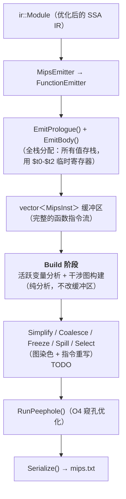
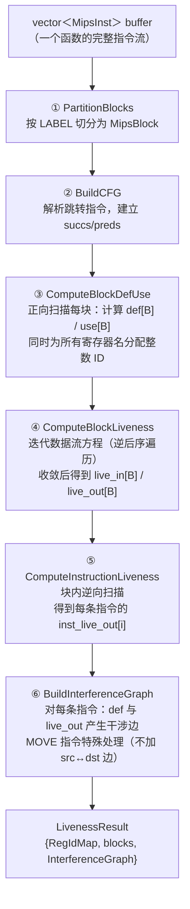
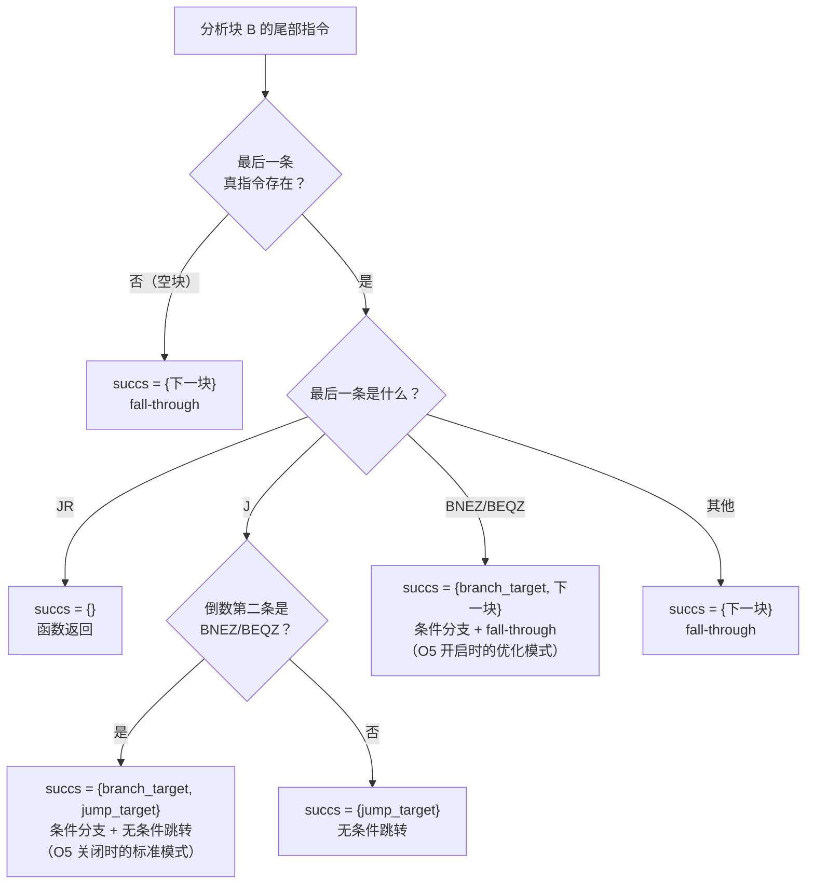

# O7：图染色寄存器分配 (Graph Coloring Register Allocation) 设计文档

本文档描述编译器 **MIPS 后端最重要的优化——图染色寄存器分配**的设计思路与实现细节。寄存器分配的目标是：将尽可能多的 IR 值从栈槽"提升"到物理寄存器中，减少 `lw`/`sw` 内存访问，从而显著提升生成代码的运行效率。

当前已完成的阶段：

| 阶段 | 状态 | 内容 |
|------|------|------|
| **Build** | ✅ 已实现 | 活跃变量分析 + 干涉图构建 |
| Simplify | 🔲 待实现 | 低度数节点入栈 |
| Coalesce | 🔲 待实现 | George 准则合并 MOVE 对 |
| Freeze | 🔲 待实现 | 冻结低度数 move-related 节点 |
| Spill | 🔲 待实现 | 溢出选择 + 代码插入 |
| Select | 🔲 待实现 | 出栈着色 |

---

## 1. 全局视图：寄存器分配在编译管线中的位置

寄存器分配发生在 MIPS 后端内部，作用于 `AsmWriter` 的结构化指令缓冲区（`vector<MipsInst>`）。它在指令发射完毕之后、peephole 优化和文本序列化之前执行：



**在 `FunctionEmitter::Emit()` 中的具体接入点**（`src/mips/FunctionEmitter.cpp:15-31`）：

```cpp
void FunctionEmitter::Emit() {
    frame_.Build();
    // Buffer 模式同时服务于 peephole (O4) 和寄存器分配 (O7)
    const bool kUseBuffer = options_.enable_peephole || options_.enable_reg_alloc;
    if (kUseBuffer) writer_.BeginBuffer();

    EmitPrologue();
    EmitBody();

    if (options_.enable_reg_alloc) {
        RegAllocator::Run(writer_.GetBuffer());  // ← Build 阶段在此触发
    }

    if (kUseBuffer) writer_.FlushBuffer();       // peephole + 序列化
}
```

**为什么 `kUseBuffer` 要同时检查两个开关？** 原来只有 `enable_peephole` 会触发 buffer 模式。但寄存器分配也需要在 `vector<MipsInst>` 上工作——它需要遍历完整的函数指令流来做活跃分析。如果用户只开启 `enable_reg_alloc` 而不开 `enable_peephole`，不启用 buffer 模式就没有指令可分析。因此改为两者任一开启即启用缓冲。

---

## 2. 算法选择：为什么是 Chaitin-Briggs？

图染色寄存器分配的核心思想：将**寄存器分配问题转化为图论的着色问题**。每个需要寄存器的值是图中的一个节点，如果两个值的生存期重叠（同时活跃），则连一条边（"干涉"）。用 K 种颜色（K = 可用物理寄存器数）对图着色，使得相邻节点颜色不同，就完成了寄存器分配。

Chaitin-Briggs 算法是该领域最经典的算法（LLVM 和 GCC 早期版本采用），核心优势在于：

- **乐观着色（Optimistic Coloring）**：当一个节点的度数 ≥ K 时，不立即判定必须溢出，而是延迟到 Select 阶段——此时邻居的实际着色可能只占用了 < K 种颜色，该节点仍可着色成功
- **Coalesce（合并）**：能消除 `move` 指令——如果 `move $a, $b` 的源和目的不干涉，可以让它们使用同一个寄存器，`move` 指令直接消失
- **可用寄存器数 K=18**：10 个 `$t` 寄存器 + 8 个 `$s` 寄存器，数量充裕，大多数函数无需溢出

---

## 3. Build 阶段概述

Build 是 Chaitin-Briggs 的第一步，也是整个寄存器分配的数据基础。它回答两个问题：

1. **每条指令执行后，哪些寄存器是"活的"（live）？** → 活跃变量分析
2. **哪些寄存器的生存期重叠，不能共享同一个物理寄存器？** → 干涉图

Build 阶段是**纯分析**——它只读取指令缓冲区，不做任何修改。

### 3.1 代码导读

```
include/mips/LivenessAnalysis.h    — 所有数据结构声明，阅读本节的起点
  ├─ GetDefs() / GetUses()          — 指令级 def/use 提取的接口
  ├─ RegIdMap                       — 寄存器名 ↔ 整数 ID 的双向映射
  ├─ MipsBlock                      — MIPS 级基本块（buffer 的一个区间）
  ├─ InterferenceGraph              — 干涉图（邻接集 + 度数 + move 对）
  └─ LivenessResult + BuildLiveness — 分析结果捆绑 + 总入口

src/mips/LivenessAnalysis.cpp      — 全部实现，按以下顺序阅读：
  ├─ PushIfValid() / CallerSavedRegs() — 辅助函数
  ├─ GetDefs() / GetUses()             — 每条 MipsOpcode 的 def/use 映射
  ├─ RegIdMap 方法                      — GetOrCreate / Get / GetName / IsAllocatable
  ├─ PartitionBlocks()                 — 按 LABEL 切分指令缓冲区
  ├─ FindTerminators()                 — 找块尾部的控制流指令
  ├─ BuildCFG()                        — 解析跳转目标，填充 succs/preds
  ├─ ComputeBlockDefUse()              — 正向扫描计算块级 def/use 集合
  ├─ ComputeReversePostorder()         — 迭代 DFS 计算逆后序
  ├─ ComputeBlockLiveness()            — 迭代数据流方程至不动点
  ├─ ComputeInstructionLiveness()      — 块内逆向扫描，得到每条指令的 live-out
  ├─ InterferenceGraph 方法             — AddEdge / AddMove / HasEdge / Degree
  ├─ BuildInterferenceGraph()          — 从 def + live-out 构建干涉图
  └─ BuildLiveness()                   — 总入口：串联上述所有步骤

include/mips/RegAlloc.h            — 寄存器分配器入口声明
src/mips/RegAlloc.cpp              — 当前为 stub：调用 BuildLiveness + 输出调试信息
```

### 3.2 Build 的完整流水线



---

## 4. 指令级 def/use 提取

### 4.1 为什么需要它？

活跃变量分析的基本输入是：每条指令**定义（写）哪些寄存器**、**使用（读）哪些寄存器**。IR 级别有天然的 def-use 链（SSA 的静态单赋值性质），但 MIPS 汇编级没有这种结构——必须从指令的操作码和字段中推导。

`GetDefs()` 和 `GetUses()` 就是这个推导逻辑的实现。它们接受一条 `MipsInst`，根据 `op` 字段返回被定义/使用的寄存器名列表。

### 4.2 完整的 def/use 映射表

下表覆盖了 `MipsOpcode` 枚举中的所有变体（`src/mips/LivenessAnalysis.cpp:40-188`）：

| 指令类型 | 代表操作码 | def（写） | use（读） | 说明 |
|---------|-----------|----------|----------|------|
| R-type | `ADDU`, `SUBU`, `MUL`, `SLT`... | `{dst}` | `{src1, src2}` | `dst = src1 op src2` |
| Shift | `SLL`, `SRL`, `SRA` | `{dst}` | `{src1}` | `dst = src1 << imm` |
| Division | `DIV` | (无) | `{src1, src2}` | 写入 HI:LO，不显式建模 |
| Move-from | `MFLO`, `MFHI` | `{dst}` | (无) | 读 HI/LO（隐式） |
| I-type | `ADDIU`, `ANDI` | `{dst}` | `{src1}` | `dst = src1 op imm` |
| Load | `LW`, `LBU` | `{dst}` | `{src1}` | 从 `imm(src1)` 加载到 `dst` |
| **Store** | `SW`, `SB` | **(无)** | **`{dst, src1}`** | **`dst` 是被存的值，不是被定义** |
| Pseudo-load | `LI`, `LA` | `{dst}` | (无) | 加载常量/地址 |
| Move | `MOVE` | `{dst}` | `{src1}` | 寄存器复制 |
| Jump | `J` | (无) | (无) | 无条件跳转 |
| **Call** | `JAL` | **caller-saved 全集** | (无) | 见下文详解 |
| Return | `JR` | (无) | `{src1}` | 通常 `src1` = `$ra` |
| Branch | `BNEZ`, `BEQZ` | (无) | `{src1}` | 条件寄存器 |
| **Syscall** | `SYSCALL` | **`{$v0}`** | **`{$v0, $a0}`** | 系统调用号 + 参数 |
| 非指令 | `LABEL`, `DIRECTIVE`... | (无) | (无) | 不参与分析 |

### 4.3 SW/SB 的 "dst" 陷阱

`MipsInst` 的字段命名约定中，`SW` 和 `SB` 的 `dst` 字段存放的是**被写入内存的值寄存器**，而非被定义的目标寄存器（见 `include/mips/MipsInst.h:78`）。对活跃分析而言，`sw $t2, 8($sp)` 是在**读取** `$t2` 和 `$sp` 的值，不定义任何寄存器：

```cpp
// src/mips/LivenessAnalysis.cpp:144-149
case MipsOpcode::SW:
case MipsOpcode::SB:
    PushIfValid(uses, inst.dst);   // 值寄存器（被读取，非被定义！）
    PushIfValid(uses, inst.src1);  // 基址寄存器
    break;
```

这是最容易写错的地方——如果把 `SW` 的 `dst` 当作 def，活跃分析会错误地认为该值在 `sw` 之后已"死亡"，导致后续的干涉图缺少关键边。

### 4.4 JAL 的 caller-saved clobber 集

函数调用（`JAL`）是 def/use 建模中最复杂的场景。在 MIPS 调用约定中，函数调用后**所有 caller-saved 寄存器的值都可能被破坏**。如果分析不建模这一点，跨调用活跃的值可能被错误地分配到 caller-saved 寄存器中。

```cpp
// src/mips/LivenessAnalysis.cpp:28-34
static const std::vector<std::string>& CallerSavedRegs() {
    static const std::vector<std::string> kRegs = {
        "$v0", "$v1", "$a0", "$a1", "$a2", "$a3",
        "$t0", "$t1", "$t2", "$t3", "$t4", "$t5", "$t6", "$t7", "$t8", "$t9",
        "$ra",
    };
    return kRegs;
}

// JAL 的 def 集 = 全部 caller-saved 寄存器
case MipsOpcode::JAL: defs = CallerSavedRegs(); break;
```

**为什么这样建模？** 考虑以下场景：

```mips
    li    $t0, 42       ; $t0 = 42
    jal   some_func     ; 调用函数——$t0 的值被破坏
    sw    $t0, 8($sp)   ; 错误！$t0 已不是 42
```

如果 `JAL` 的 def 集不包含 `$t0`，活跃分析会认为 `$t0` 从 `li` 一直活到 `sw`，不会与 `JAL` 的输出产生干涉。寄存器分配器可能会把某个值分配到 `$t0`，跨越调用点——值被破坏，程序语义错误。

将 JAL 建模为定义所有 caller-saved 寄存器后，跨调用活跃的值会与这些寄存器产生干涉，分配器会将它们分配到 callee-saved 寄存器（`$s0`-`$s7`）或溢出到栈上。

**JAL 为什么不在 use 集中列出 `$a0`-`$a3`？** 函数调用前设置参数的指令（如 `move $a0, $t0`）会通过正常的 def/use 链让 `$a0` 在调用点之前保持活跃。额外在 JAL 的 use 集中列出它们是冗余的，而且会引入不必要的干涉边。

### 4.5 过滤逻辑：`PushIfValid()`

`MipsInst` 的 `dst`/`src1`/`src2` 字段可能为空字符串（当操作码不使用该字段时），`$zero` 是常量零寄存器（永远不会被"写入"或需要分配）。`PushIfValid` 统一过滤这两类噪音：

```cpp
// src/mips/LivenessAnalysis.cpp:21-24
static void PushIfValid(std::vector<std::string>& out, const std::string& reg) {
    if (!reg.empty() && reg != "$zero" && reg != "$0") {
        out.push_back(reg);
    }
}
```

---

## 5. RegIdMap：寄存器名与整数 ID 的映射

### 5.1 为什么需要映射？

活跃分析的核心操作是集合运算（并集、差集、成员查询）。如果集合的元素是 `std::string`（如 `"$t0"`），每次比较都是 O(n) 的字符串比较，且 `unordered_set<string>` 的哈希计算也不廉价。

将寄存器名映射为连续的整数 ID 后，集合运算变为 `unordered_set<int>` 的操作——哈希是 O(1)，比较也是 O(1)，在迭代数据流的多轮循环中性能差距显著。

### 5.2 映射的时机

`RegIdMap` 不是预先填充的——它在 `ComputeBlockDefUse()` 扫描指令时通过 `GetOrCreate()` **按需填充**。遇到一个从未见过的寄存器名就分配一个新 ID。这意味着：

- 只有实际出现在缓冲区中的寄存器才会被分配 ID
- ID 的分配顺序取决于指令扫描顺序，没有全局保证
- 所有后续阶段（干涉图、着色）都通过同一个 `RegIdMap` 实例做 ID ↔ 名字的翻译

### 5.3 可分配性判断

```cpp
// src/mips/LivenessAnalysis.cpp:213-228
bool RegIdMap::IsAllocatable(const std::string& name) {
    if (name.size() < 3 || name[0] != '$') return false;
    char kind = name[1];
    if (kind == 't') return name.size() == 3 && name[2] >= '0' && name[2] <= '9'; // $t0-$t9
    if (kind == 's') return name.size() == 3 && name[2] >= '0' && name[2] <= '7'; // $s0-$s7
    return false;
}
```

可分配寄存器共 **K = 18** 个（10 个 `$t` + 8 个 `$s`）。其他寄存器（`$sp`, `$ra`, `$v0`, `$a0`-`$a3`, `$zero` 等）参与活跃分析但不作为着色候选——它们是**预着色节点**（pre-colored），在图中有固定颜色。

---

## 6. MIPS 级基本块与 CFG 构建

### 6.1 为什么不复用 IR 级 CFG？

项目已有 IR 级的 `CFGBuilder`（`include/pass/CFGBuilder.h`），但它操作的是 `ir::BasicBlock`。寄存器分配工作在 MIPS 指令缓冲区上——指令发射后，IR 的块结构已经被"展平"为 `vector<MipsInst>` 中的 LABEL + 指令序列。我们需要从这个扁平序列中**重新发现**块边界和控制流。

### 6.2 块切分：`PartitionBlocks()`

算法很直接：扫描缓冲区，遇到 `MipsOpcode::LABEL` 就开始一个新 `MipsBlock`：

```cpp
// src/mips/LivenessAnalysis.cpp:236-255
static std::vector<MipsBlock> PartitionBlocks(const std::vector<MipsInst>& buffer) {
    std::vector<MipsBlock> blocks;
    for (int i = 0; i < static_cast<int>(buffer.size()); ++i) {
        if (buffer[i].op == MipsOpcode::LABEL) {
            if (!blocks.empty()) blocks.back().end = i;  // 关闭上一块
            MipsBlock blk;
            blk.start = i;
            blk.end = static_cast<int>(buffer.size());   // 暂设末尾
            blk.label = buffer[i].label;
            blocks.push_back(std::move(blk));
        }
    }
    if (!blocks.empty()) blocks.back().end = static_cast<int>(buffer.size());
    return blocks;
}
```

每个 `MipsBlock` 记录了它在缓冲区中的 `[start, end)` 范围。`start` 指向 LABEL 本身，LABEL 之后到下一个 LABEL 之前的所有指令都属于该块。

### 6.3 后继识别：五种终结模式

`BuildCFG()`（`src/mips/LivenessAnalysis.cpp:279-351`）通过分析每个块尾部的控制流指令来确定后继。`FindTerminators()` 从块末尾逆向扫描，找到最后两条真指令（跳过 BLANK/DIRECTIVE 等非指令标记）。

后继的判定逻辑覆盖五种模式，对应 `InstructionEmitter::EmitBranchInst()` 可能发射的所有控制流模式：



**为什么需要处理 `BNEZ; J` 和单独 `BNEZ` 两种模式？** 这取决于 O5（冗余跳转消除）是否开启：

- **O5 关闭**：条件分支发射为 `bnez $t0, true_label; j false_label` 两条指令
- **O5 开启**：如果 false 分支恰好是下一块，只发射 `bnez $t0, true_label`，false 分支通过 fall-through

Build 阶段必须正确处理这两种形式，否则 CFG 的后继关系会出错。

---

## 7. 块级活跃变量分析

### 7.1 数据流方程

活跃变量是一个**反向数据流问题**：信息从程序的出口向入口传播。对每个基本块 B，定义：

- **def[B]**：在块内**任意位置**出现过定义（写入）的寄存器集合，即数据流方程里的 **kill 集**。凡在本块中有 def，就应进入 `def[B]`，**与**该 def 之前块内是否 use 过同一寄存器**无关**（否则 `out[B] - def[B]` 会偏小，`in[B]` 会错误偏大）。
- **use[B]**：在块内被使用（读取）、且**在该次使用之前**本块内尚未对该寄存器做过定义的寄存器集合（即 **向上暴露的使用**，gen 集）。
- **live_in[B]**：在块 B 入口处活跃的寄存器集合
- **live_out[B]**：在块 B 出口处活跃的寄存器集合

方程：

```
out[B] = ∪ { in[S] | S ∈ succs(B) }       （后继的入口活跃 → 本块的出口活跃）
in[B]  = use[B] ∪ (out[B] - def[B])        （本块使用的 + 穿越本块的）
```

### 7.2 计算 def[B] 和 use[B]

`ComputeBlockDefUse()`（`src/mips/LivenessAnalysis.cpp:358-385`）正向扫描每个块的指令：**use[B]** 只对「尚未记入 `def[B]`」的 use 计入（向上暴露）；**def[B]** 则对每条指令的 def **无条件** `insert`（完整 kill 集）。两者不对称是方程 `in = use ∪ (out - def)` 所要求的。

```cpp
for (int i = blk.start; i < blk.end; ++i) {
    if (!buffer[i].IsInsn()) continue;
    // 先处理 use：如果寄存器 r 尚未在 def[B] 中，说明 r 在本块定义之前就被使用了
    for (const auto& u : GetUses(buffer[i])) {
        int uid = reg_ids.GetOrCreate(u);
        if (block_def[bi].count(uid) == 0) block_use[bi].insert(uid);  // 向上暴露！
    }
    // 再处理 def
    for (const auto& d : GetDefs(buffer[i])) {
        int did = reg_ids.GetOrCreate(d);
        block_def[bi].insert(did);
    }
}
```

**为什么正向扫描而非逆向？** `use[B]` 的定义是"在定义之前使用"——正向扫描时，`block_def[bi]` 逐步积累，恰好可以判断某个 use 发生时该寄存器是否已被定义。逆向扫描虽然也能实现，但判定逻辑更绕。

### 7.3 迭代求解：postorder 遍历

活跃分析是反向问题，信息从后继流向前驱。使用**后序（postorder）** 遍历迭代可以加速收敛——后序保证一个块的后继在大多数情况下已被处理过，减少了"信息还没传到"导致的多余迭代。

实现上，先通过 `ComputeReversePostorder()` 计算逆后序（DFS 后序的 reverse），然后在 fixpoint 循环中**逆向遍历 RPO**（即按后序处理）：

```cpp
// src/mips/LivenessAnalysis.cpp:440-468
std::vector<int> rpo = ComputeReversePostorder(blocks);
bool changed = true;
while (changed) {
    changed = false;
    // 逆向遍历 RPO = 正向后序
    for (int idx = static_cast<int>(rpo.size()) - 1; idx >= 0; --idx) {
        int bi = rpo[idx];
        // out[B] = ∪ in[S]
        std::unordered_set<int> new_out;
        for (int s : blocks[bi].succs)
            for (int r : live_in[s]) new_out.insert(r);
        // in[B] = use[B] ∪ (out[B] - def[B])
        std::unordered_set<int> new_in = block_use[bi];
        for (int r : new_out)
            if (block_def[bi].count(r) == 0) new_in.insert(r);
        if (new_in != live_in[bi]) { changed = true; live_in[bi] = std::move(new_in); }
        live_out[bi] = std::move(new_out);
    }
}
```

**收敛性**：对可约 CFG（绝大多数结构化程序），通常 2-3 轮即收敛。不可约 CFG 在最坏情况下需要 O(循环嵌套深度) 轮。

### 7.4 逆后序的迭代式 DFS

`ComputeReversePostorder()`（`src/mips/LivenessAnalysis.cpp:388-424`）使用显式栈模拟递归 DFS，避免深层函数嵌套带来的栈溢出风险：

```cpp
struct Frame { int block; int child_idx; };
std::vector<Frame> stack;
stack.push_back({0, 0});
visited[0] = true;

while (!stack.empty()) {
    auto& top = stack.back();
    const auto& succs = blocks[top.block].succs;
    if (top.child_idx < static_cast<int>(succs.size())) {
        int child = succs[top.child_idx++];        // 尝试下一个孩子
        if (!visited[child]) {
            visited[child] = true;
            stack.push_back({child, 0});
        }
    } else {
        postorder.push_back(top.block);            // 所有孩子处理完 → 加入后序
        stack.pop_back();
    }
}
std::reverse(postorder.begin(), postorder.end());  // 反转得到逆后序
```

`Frame` 结构记录了"当前正在 DFS 哪个块"以及"已经访问到第几个后继"。当所有后继都访问完毕，才将该块加入后序序列——这与递归版本中"递归返回时追加"完全等价。

---

## 8. 指令级活跃变量

### 8.1 为什么还需要指令级？

块级分析只给出了每个块入口/出口的活跃集合。但干涉图需要更细粒度的信息：**每条指令执行后，哪些寄存器是活的？** 只有知道了某条 `def` 指令执行后的 `live_out`，才能确定该 `def` 与哪些寄存器同时活跃（即产生干涉）。

### 8.2 逆向扫描算法

`ComputeInstructionLiveness()`（`src/mips/LivenessAnalysis.cpp:477-504`）对每个块做一次从末尾到开头的逆向扫描：

```cpp
for (int bi = 0; bi < static_cast<int>(blocks.size()); ++bi) {
    std::unordered_set<int> live = block_live_out[bi];  // 从块出口开始

    for (int i = blk.end - 1; i >= blk.start; --i) {
        if (!buffer[i].IsInsn()) continue;

        inst_live_out[i] = live;                        // 记录此指令的 live-out

        for (const auto& d : GetDefs(buffer[i]))        // def 杀死活跃
            live.erase(reg_ids.GetOrCreate(d));
        for (const auto& u : GetUses(buffer[i]))        // use 激活活跃
            live.insert(reg_ids.GetOrCreate(u));
    }
}
```

逻辑直观：从块出口的活跃集开始，逐条指令向前走。遇到 def 就从 live 中移除（"该寄存器在此处被重新定义，之前的值已死"），遇到 use 就加入 live（"该寄存器在此处被需要，必须在此之前是活的"）。

**先记录 live-out、再更新 live** 的顺序至关重要——`inst_live_out[i]` 反映的是指令 i **执行完毕后**的活跃状态，也就是说 i 的 def 已经生效。这与干涉图的构建规则一致："指令 i 定义了 d，d 与 i 执行后仍活跃的所有寄存器产生干涉"。

---

## 9. 干涉图构建

### 9.1 核心规则

干涉图是一个无向图：

- **节点**：出现在缓冲区中的所有寄存器
- **边 (u, v)**：u 和 v 的生存期重叠，不能共享同一物理寄存器

构建规则（`src/mips/LivenessAnalysis.cpp:550-592`）：对每条指令 i，令 `defs = GetDefs(buffer[i])`：

> **对每个 d ∈ defs，对每个 r ∈ inst_live_out[i]，若 r ≠ d，则 AddEdge(d, r)。**

直观理解：指令 i 定义了 d，d 的新值从此时刻开始活跃；而 `inst_live_out[i]` 中的每个 r 在此时刻也是活跃的。两个同时活跃的值不能共用寄存器，所以产生干涉。

### 9.2 MOVE 指令的特殊处理

MOVE 指令（`move $dst, $src`）是一条寄存器复制。如果 `$dst` 和 `$src` 被分配到同一个物理寄存器，这条 MOVE 就可以被完全消除——这正是 Coalesce 阶段的工作。

为了给 Coalesce 创造机会，Build 阶段**不为 MOVE 的 dst 和 src 添加干涉边**：

```cpp
// src/mips/LivenessAnalysis.cpp:574-587
for (const auto& d : defs) {
    int d_id = reg_ids.GetOrCreate(d);
    for (int r : inst_live_out[i]) {
        if (r == d_id) continue;                               // 不加自环
        if (is_move && !buffer[i].src1.empty() &&
            r == reg_ids.GetOrCreate(buffer[i].src1)) continue; // MOVE 特例！
        ig.AddEdge(d_id, r);
    }
}
```

同时，MOVE 的 `(dst, src)` 对被记录到干涉图的 `moves_` 列表中，供后续 Coalesce 阶段使用：

```cpp
if (is_move && !buffer[i].dst.empty() && !buffer[i].src1.empty()) {
    int dst_id = reg_ids.GetOrCreate(buffer[i].dst);
    int src_id = reg_ids.GetOrCreate(buffer[i].src1);
    if (dst_id != src_id) ig.AddMove(dst_id, src_id);
}
```

**为什么不加边是安全的？** 在 `move $dst, $src` 执行后，`$dst` 和 `$src` 持有**相同的值**。如果它们被分配到同一寄存器，语义不变（复制自身）。但如果后续有指令重新定义了 `$src`，那时 `$dst` 和新的 `$src` 值就不同了——但此时会由那条重新定义指令的 live-out 自然产生正确的干涉边。

### 9.3 `InterferenceGraph` 的数据结构

```cpp
class InterferenceGraph {
    int num_nodes_;
    std::vector<std::unordered_set<int>> adj_;  // 邻接集
    std::vector<int> degree_;                    // 每个节点的度数
    std::vector<std::pair<int,int>> moves_;      // MOVE 的 (dst, src) 对
    std::unordered_set<int> move_related_;       // 参与 MOVE 的节点集合
};
```

**为什么用 `unordered_set` 而非邻接矩阵？** MIPS 一个函数中出现的不同寄存器通常不超过 30 个，但典型的干涉图远非完全图。邻接集的空间复杂度为 O(V + E)，远优于 O(V²) 的邻接矩阵。同时 `HasEdge()` 和 `AddEdge()` 的 O(1) 平均时间复杂度满足需求。

`degree_` 数组单独维护而非每次调用 `adj_[node].size()` 计算，原因是后续 Simplify 阶段需要频繁查询度数，且节点被"移除"（暂时从图中取出）时度数需要递减更新——用独立数组更方便。

---

## 10. 调试入口：`RegAllocator::Run()` stub

当前 `RegAllocator::Run()`（`src/mips/RegAlloc.cpp:16-53`）只做两件事：调用 `BuildLiveness()` 运行完整的 Build 阶段，然后将干涉图信息输出到 stderr：

```cpp
void RegAllocator::Run(std::vector<MipsInst>& buffer) {
    LivenessResult result = BuildLiveness(buffer);

    // 输出概览
    std::cerr << "[RegAlloc] Build complete: " << n << " registers, "
              << result.blocks.size() << " blocks\n";

    // 输出每个有邻居的节点及其邻接表
    for (int i = 0; i < n; ++i) {
        if (ig.Degree(i) == 0) continue;
        std::cerr << "  " << name << " (deg=" << ig.Degree(i) << ")";
        if (RegIdMap::IsAllocatable(name)) std::cerr << " [alloc]";
        std::cerr << ": ...neighbors...\n";
    }

    // 输出 MOVE 对
    for (const auto& [dst, src] : ig.GetMoves())
        std::cerr << "  " << reg_ids.GetName(dst) << " <- " << reg_ids.GetName(src) << "\n";
}
```

这个 stub 不修改缓冲区——开启 `enable_reg_alloc` 后，MIPS 输出应与关闭时完全一致，仅 stderr 多出干涉图信息，可用于手工验证。

---

## 11. 文件结构速查

```
include/mips/
  LivenessAnalysis.h    ← GetDefs/GetUses + RegIdMap + MipsBlock + InterferenceGraph + BuildLiveness
  RegAlloc.h            ← RegAllocator::Run() 入口声明

src/mips/
  LivenessAnalysis.cpp  ← Build 阶段的完整实现（~350 行）
    ├─ PushIfValid / CallerSavedRegs    辅助函数
    ├─ GetDefs / GetUses                指令级 def/use 提取
    ├─ RegIdMap                         寄存器名 ↔ 整数 ID
    ├─ PartitionBlocks                  按 LABEL 切分缓冲区
    ├─ FindTerminators / BuildCFG       控制流图构建
    ├─ ComputeBlockDefUse               块级 def/use 集合
    ├─ ComputeReversePostorder          迭代 DFS 求逆后序
    ├─ ComputeBlockLiveness             迭代数据流 fixpoint
    ├─ ComputeInstructionLiveness       块内逆向扫描
    ├─ InterferenceGraph                邻接集 + 度数 + move 对
    ├─ BuildInterferenceGraph           def × live_out → 干涉边
    └─ BuildLiveness                    总入口：串联六个步骤
  RegAlloc.cpp          ← 调用 BuildLiveness + stderr debug dump（~50 行）
  FunctionEmitter.cpp   ← Emit() 中的 RegAllocator::Run() 接入（3 行改动）
```

---

## 12. 验证方法

| 验证项 | 方法 | 预期结果 |
|-------|------|---------|
| 编译通过 | `cmake --build build` | 无错误、无警告 |
| 输出不变 | 开启 `enable_reg_alloc`，对比 `mips.txt` | 与关闭时完全一致（Build 不改缓冲区） |
| 干涉图正确 | 小测试用例，对照 stderr 输出手工验证 | 同时活跃的寄存器之间有边，不同时活跃的无边 |
| MOVE 对记录 | 检查 stderr 的 Moves 部分 | 每条 `move` 指令对应一条记录 |
| JAL clobber | 跨调用场景 | 调用前后活跃的寄存器与所有 caller-saved 寄存器有干涉边 |
