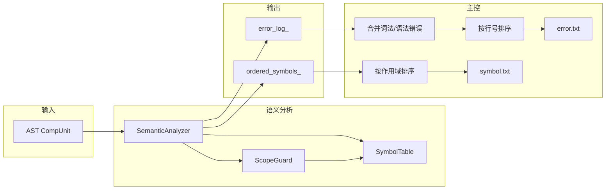
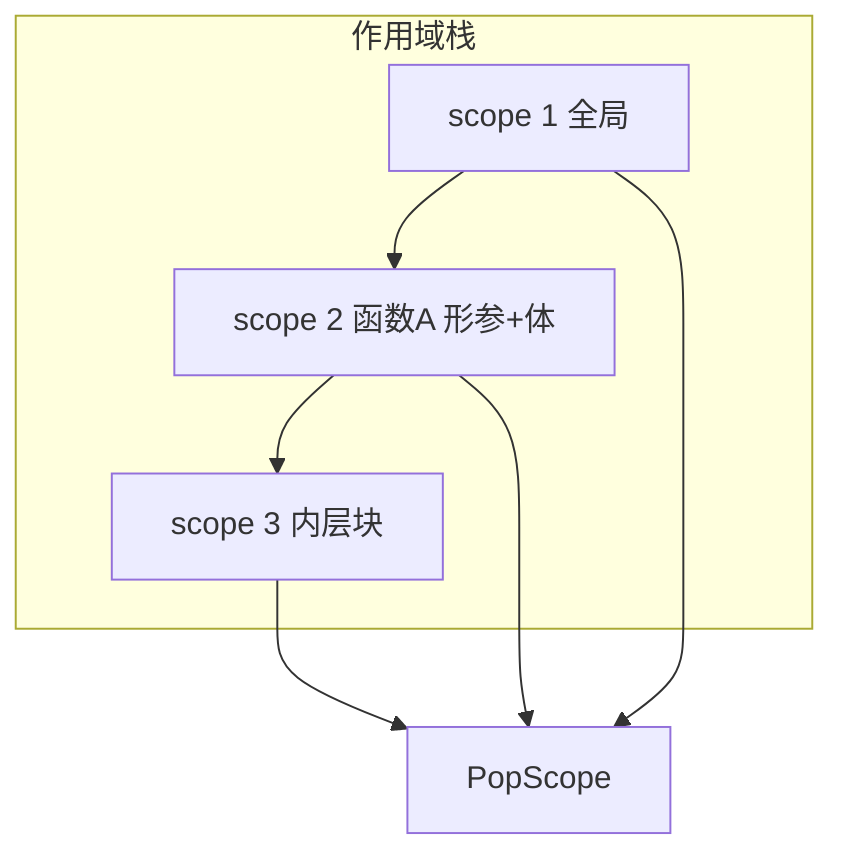

# 语义分析器 (Semantic Analyzer) 设计文档

## 1. 概述 (Overview)

### 1.1 模块职责

语义分析模块在**语法分析产生的 AST 之上**，完成**符号表构建、作用域管理、类型与语义约束检查**，并收集所有语义错误；对正确源程序按课程要求输出符号表（symbol.txt），对含错源程序输出错误列表（error.txt）。

**一句话**：在 AST 上做一遍 Visitor 遍历，维护作用域栈与符号表，在声明处注册符号、在引用处查找并做语义检查，同时做常量折叠以支持 ConstExp/数组维度的求值。

### 1.2 输入 / 输出

| 类型 | 内容 |
|------|------|
| **输入** | 语法分析得到的 **AST 根节点** `CompUnit`（由 Parser 产出，无语法错误或带语法错误均可能传入）；课程规定的 **testfile.txt** 由主控在语义分析前已读入并驱动 Lexer→Parser→AST。 |
| **输出** | **正确程序**：`GetOrderedSymbols()` 得到 `(scope_id, symbol)` 序列，主控按作用域序排序后写入 **symbol.txt**（作用域序号、标识符、类型名）。**错误程序**：`GetErrorLog()` 得到 `(line, error_code)` 列表，主控与词法/语法错误合并、按行号排序后写入 **error.txt**。 |

### 1.3 核心策略

- **遍历策略**：**Visitor 驱动**——由 `SemanticAnalyzer` 继承 `ASTVisitor`，各 `VisitXxx` 显式递归到子节点，**遍历顺序与作用域语义一致**（如先 PushScope 再访问 Block 内元素）。
- **作用域策略**：**栈式符号表 + RAII**：进入 Block/FuncDef 时 `ScopeGuard` 构造即 `PushScope`，离开时析构即 `PopScope`，保证异常或提前 return 也不会漏 Pop。
- **错误恢复策略**：**收集型、不中断**——发现语义错误只 `RecordError(line, code)` 并继续分析，以便多报错误；不因单点错误停止遍历。
- **符号输出可关闭**：主控通过 `emit_symbol_output` 控制是否写 symbol.txt，符号表内部仍完整构建，便于后续中间代码阶段使用。

---

## 2. 总体架构 (Architecture)

### 2.1 模块划分

| 文件 | 职责 |
|------|------|
| **SemanticAnalyzer.h /.cpp** | `ASTVisitor` 的实现类；持有 `SymbolTable`、错误列表、有序符号列表及遍历状态（当前函数类型、循环深度、左值赋值标记等）；实现各 `VisitXxx` 的注册/查找/检查逻辑及常量折叠。 |
| **SymbolTable.h /.cpp** | 作用域栈：`PushScope`/`PopScope`、当前作用域 id、按“当前→外链”的 `Lookup`、仅当前层的 `Register`；内部用 `vector<Scope>` + 每层 `map<string, Symbol>` 实现。 |
| **Symbol.h /.cpp** | 符号值类型 `Symbol`（类型枚举、名字、作用域 id、常量值/形参类型/数组大小等）及课程要求的类型名字符串输出 `ToString`/`FormatForOutput`。 |
| **ScopeGuard.h /.cpp** | RAII：构造时对传入的 `SymbolTable` 执行 `PushScope`，析构时 `PopScope`，用于 Block/FuncDef/MainFuncDef。 |
| **ASTVisitor.h** | 抽象 Visitor 接口，声明所有 `VisitXxx(ConcreteNode&)`，由 AST 节点 `Accept(Visitor&)` 双分派调用。 |
| **AST.h /.cpp** | AST 节点定义及 `Accept` 实现（调用 `visitor.VisitXxx(*this)`），语义分析只读 AST，不修改结构。 |

### 2.2 数据流视图



**说明**：AST 仅作为只读输入；`SemanticAnalyzer` 在遍历过程中通过 `SymbolTable` 与 `ScopeGuard` 管理作用域，结果写入内部 `error_log_` 与 `ordered_symbols_`，由主控统一做排序与文件输出。

---

## 3. 关键数据结构 (Key Data Structures)

### 3.1 符号类型与符号条目 (Symbol.h)

- **SymbolType**：枚举，与课程要求的类型名一一对应（ConstInt, Int, VoidFunc, IntFunc, …），用于输出与语义判断；辅以 `IsConst()`、`IsFunc()`、`IsArray()` 等内联谓词。
- **Symbol**：纯数据 struct，无 AST 指针，便于符号表与后续 IR 共用。

**定义与字段含义**（代码级）：

```cpp
// Symbol.h
enum class SymbolType { CONST_CHAR, CHAR, VOID_FUNC, CONST_INT, INT, CHAR_FUNC,
    CONST_CHAR_ARRAY, CHAR_ARRAY, INT_FUNC, CONST_INT_ARRAY, INT_ARRAY };

struct Symbol {
    SymbolType type;
    std::string name;
    int scope_id;
    std::vector<int> const_values;           // 常量：折叠后的值（标量或数组初值列表）
    std::vector<std::pair<BType, bool>> param_types;  // 函数：形参 (BType, is_array)
    std::optional<int> array_size;          // 数组：ConstExp 求得的长度
    std::string FormatForOutput() const;     // "scope_id name TypeName"
};
```

- 变量/常量：用 `type`、`name`、`scope_id`，常量用 `const_values`，数组用 `array_size`。
- 函数：用 `param_types` 记录形参类型与是否数组，用于实参匹配（错误 **e**）。

**设计取舍**：单一 struct 而非 `std::variant<VarSymbol, FuncSymbol, ...>`，便于与课程输出一一对应；输出格式集中在 `FormatForOutput()`，主控只决定是否写文件。

### 3.2 符号表 (SymbolTable.h /.cpp) 与“双重存储”

**内部结构**（代码级）：

```cpp
// SymbolTable.h (节选)
class SymbolTable {
public:
    void PushScope();
    void PopScope();
    const Symbol* Lookup(const std::string& name) const;
    bool Register(const std::string& name, Symbol symbol);
    int GetCurrentScopeId() const;
    using OrderedSymbolList = std::vector<std::pair<int, Symbol>>;
private:
    struct Scope {
        int id;
        std::map<std::string, Symbol> map;
    };
    std::vector<Scope> scopes_;
    int next_scope_id_ = 1;
    int current_scope_id_ = 0;
};
```

**PushScope / PopScope**：压入时分配新 id 并追加空 map；弹出时 `scopes_.pop_back()`，并更新 `current_scope_id_` 为新的栈顶 id（空栈则为 0）。

```cpp
// SymbolTable.cpp
void SymbolTable::PushScope() {
    current_scope_id_ = next_scope_id_++;
    scopes_.push_back(Scope{current_scope_id_, {}});
}
void SymbolTable::PopScope() {
    if (scopes_.empty()) return;
    scopes_.pop_back();
    current_scope_id_ = scopes_.empty() ? 0 : scopes_.back().id;
}
```

**Lookup**：从当前层向外层遍历，先找到先返回；未找到返回 `nullptr`。

```cpp
const Symbol* SymbolTable::Lookup(const std::string& name) const {
    for (auto it = scopes_.rbegin(); it != scopes_.rend(); ++it) {
        auto i = it->map.find(name);
        if (i != it->map.end()) return &i->second;
    }
    return nullptr;
}
```

**Register**：仅写 `scopes_.back().map`；若当前层已有同名则返回 false（重定义），否则写入并设 `symbol.scope_id = current_scope_id_` 后返回 true。

- **Scope**：`id` + `map<string, Symbol>`，同层 O(log n) 查找与重定义判断。
- **作用域序号**：课程定义“进入该作用域之前进入的作用域数量 + 1”；PushScope 时 `current_scope_id_ = next_scope_id_++`，全局为第一次 Push 后的 1。

**为什么需要“双重存储”？** 符号表用 **map 按名字查找**，但课程要求 symbol.txt 的输出顺序是**按作用域序号升序、同一作用域内按声明先后**。若只依赖 `SymbolTable`：
- 每层是 `map<string, Symbol>`，map 的迭代顺序是**按 key 排序**，与“声明顺序”无关；
- 跨层时若要“先输出 scope 1 再 scope 2 …”，要么遍历所有层再每层按某种顺序输出，要么在 Push/Pop 时维护“当前层声明顺序”，但 map 本身不保证插入顺序（C++11 起 map 按 key 有序，插入顺序仍不等于声明顺序）。

因此 **SemanticAnalyzer** 在每次 **Register 成功** 时，向成员 **`ordered_symbols_`（vector）** 追加 `(scope_id, Symbol)`。这样：
- **查找**：继续用 SymbolTable 的 map，O(log n) 按名查找，不关心顺序；
- **输出**：主控对 `GetOrderedSymbols()` 返回的 vector 按 `scope_id` 做一次稳定排序，同 scope_id 内即声明顺序（因为我们是按访问顺序 push 的）。

用空间换来了“查找性能”与“输出顺序”的解耦，避免在 SymbolTable 里为输出顺序引入额外结构或复杂迭代。

**设计取舍**：
- 每层用 **map 而非 unordered_map**：作用域内符号数量通常很小；若改为 `unordered_map` 可得到平均 O(1) 查找，但迭代顺序未定义，对当前“输出在 Analyzer 侧用 vector 维护”无影响。
- **Lookup 返回 `const Symbol*`**：只读视图，未找到返回 `nullptr`，由调用方统一报错 **c**。

### 3.3 作用域守卫 (ScopeGuard) 与 RAII

**问题**：作用域栈必须严格 **Push/Pop 配对**。若在 Java 或手写 C++ 里在“进入 Block”时 `PushScope()`、在“离开 Block”时 `PopScope()`，一旦中间有 **多个 return**、**异常**或**后续维护时新增出口**，很容易漏掉一次 `PopScope()`，导致：
- **Leak**：栈只增不减，后续 Lookup 会错误地看到已离开的作用域；
- **Mismatch**：下一层 Block 的 Push 与再上一层离开时的 Pop 错位，scope_id 与语义错乱。

**做法**：用 **RAII** 把“进入时 Push、离开时 Pop”绑定到对象生命周期上：**构造 = Push，析构 = Pop**。C++ 保证无论正常离开、return 还是异常栈展开，析构函数都会执行，从而保证配对。

```cpp
// ScopeGuard.h
class ScopeGuard {
public:
    explicit ScopeGuard(SymbolTable& table);
    ~ScopeGuard();
    ScopeGuard(const ScopeGuard&) = delete;
    ScopeGuard& operator=(const ScopeGuard&) = delete;
private:
    SymbolTable* table_;
};

// ScopeGuard.cpp
ScopeGuard::ScopeGuard(SymbolTable& table) : table_(&table) {
    table_->PushScope();
}
ScopeGuard::~ScopeGuard() {
    if (table_) {
        table_->PopScope();
    }
}
```

**使用方式**：在需要“进入一层作用域”的 Visit 里，栈上构造一个 `ScopeGuard`，作用域即生效；函数返回（或块结束）时栈帧弹出，`ScopeGuard` 析构，自动 `PopScope()`。例如：

```cpp
void SemanticAnalyzer::VisitBlock(Block& block) {
    ScopeGuard guard(symbol_table_);   // 构造 → PushScope
    for (auto& item : block.block_items) {
        item->Accept(*this);
    }
}   // guard 析构 → PopScope，无论循环中是否有 return 或后续抛异常
```

**与 Java 的对比**：Java 没有析构，只能手动在 finally 或 try-with-resources 里写 Pop；若用 `try { PushScope(); ... } finally { PopScope(); }` 可以近似，但每个“作用域入口”都要写一对 try/finally，且 PopScope 若抛异常会掩盖原异常。C++ 的 RAII 把配对写在一处（ScopeGuard），调用方只需 `ScopeGuard guard(table);`，不会漏、不会多。

### 3.4 语义分析器状态 (SemanticAnalyzer 私有成员)

| 成员 | 作用 |
|------|------|
| **symbol_table_** | 栈式符号表，贯穿整棵 AST 遍历。 |
| **error_log_** | `vector<pair<int, string>>`，(行号, 错误码)。 |
| **ordered_symbols_** | 即 3.2 中“双重存储”的**第二份**：vector 按访问顺序追加，仅当 Register 成功时 push，供主控按 scope_id 排序后写 symbol.txt。 |
| **current_func_type_** | 当前函数返回类型（void/int/char），用于 return 语句检查（f：void 函数带返回值）及函数末 return 检查（g：非 void 无 return）。 |
| **loop_depth_** | 当前所处 for 的嵌套层数，用于 break/continue 是否在循环内（m）。 |
| **current_decl_btype_** | 当前 ConstDecl/VarDecl 的 BType，供 ConstDef/VarDef 确定 SymbolType。 |
| **lval_is_left_of_assign_** | 标记当前访问的 LVal 是否为赋值左端，用于禁止对常量赋值（h）。 |
| **last_value_ / last_values_** | 常量折叠结果：ConstExp 或单值/列表初值求值后写入，供数组维度、ConstInitVal 等使用。 |
| **current_exp_is_array_** | 当前表达式作为实参时是否为“数组类型”（无下标的数组名），用于函数实参与形参的标量/数组匹配（e）。 |

---

## 4. 核心算法与理论映射 (Core Algorithms & Theory Mapping)

### 4.1 作用域管理与“函数作用域扁平化”(Function Scope Flattening)

**静态作用域**：Lookup 从当前层向外层遍历，先找到的声明生效；Register 仅写当前层，当前层重定义即报 **b**。进入/离开作用域用 **ScopeGuard** 绑定 Push/Pop（见 3.3）。

**难点**：课程规定 **“函数的参数属于函数内部的作用域”**。即形参和函数体里的局部变量应在**同一层**作用域、同一 scope_id 下，且输出时形参在前、局部变量按声明顺序在后。但 AST 结构是：

```
FuncDef
  ├── func_f_params (形参列表)
  └── block (Block 节点，内含 block_items)
```

若我们**复用** `VisitBlock` 来遍历函数体，会得到：

```cpp
// 错误做法示意
void VisitFuncDef(FuncDef& func_def) {
    RegisterSymbol(func_def.ident, ...);   // 函数名进全局
    ScopeGuard guard(symbol_table_);       // 进入“函数层”
    for (auto& p : func_def.func_f_params)
        p->Accept(*this);                  // 形参进当前层
    func_def.block->Accept(*this);         // 调用 Block::Accept
}
```

而 **Block::Accept** 会调用 **VisitBlock**，VisitBlock 里又会 **再 Push 一层** 并遍历 `block_items`：

```cpp
void VisitBlock(Block& block) {
    ScopeGuard guard(symbol_table_);   // 又 Push 了一层！
    for (auto& item : block.block_items)
        item->Accept(*this);
}
```

这样形参在 scope_id=2，函数体局部变量在 scope_id=3，**违反**“参数属于函数内部作用域”且与课程样例输出（形参与局部变量同 scope_id）不符。

**解决**：引入 **VisitBlockContents(Block&)** —— 只做“遍历 block 的 block_items”，**不** Push 新作用域。函数/主函数入口处：**只 Push 一次**，先访问形参，再**直接**调用 `VisitBlockContents(*func_def.block)`，不再调用 `block->Accept(*this)`。

```cpp
// SemanticAnalyzer.cpp 中 VisitFuncDef 的实际做法
void SemanticAnalyzer::VisitFuncDef(FuncDef& func_def) {
    RegisterSymbol(func_def.ident, sym, line);

    ScopeGuard guard(symbol_table_);   // 唯一一次 Push：函数作用域
    current_func_type_ = func_def.func_type;

    for (auto& p : func_def.func_f_params)
        p->Accept(*this);              // 形参进当前层
    VisitBlockContents(*func_def.block);  // 直接遍历 block_items，不再 Accept(block)

    current_func_type_ = prev;
}

// 仅遍历块内项，不压栈
void SemanticAnalyzer::VisitBlockContents(Block& block) {
    for (auto& item : block.block_items)
        item->Accept(*this);
    // ... 非 void 函数末条非 return 时报 g ...
}
```

这样形参和函数体内的声明都在**同一层**，scope_id 一致，且声明顺序为形参 → 块内声明，与要求一致。**普通语句块**（如 `if` 内的 `{ ... }`）仍通过 **BlockStmt → block->Accept(*this) → VisitBlock** 走 ScopeGuard，会 Push 新层，嵌套正确。

| 入口 | 是否 Push | 如何遍历函数体/块体 |
|------|-----------|----------------------|
| VisitBlock（语句块） | 是，ScopeGuard | 遍历 block_items |
| VisitFuncDef / VisitMainFuncDef | 是，一次 ScopeGuard | VisitBlockContents(block)，不调用 block->Accept |



### 4.2 Visitor 与双分派

AST 节点 `Accept(Visitor&)` 调用 `visitor.VisitXxx(*this)`，实现双分派；遍历顺序由各 `VisitXxx` 内显式递归子节点决定（如 VisitBlock 先 ScopeGuard 再遍历 block_items）。语义分析独立成 Visitor，与 Parser 解耦，便于单测与后续 IR Visitor 复用同一 AST。

### 4.3 常量折叠：“Visitor as Evaluator”

**需求**：ConstExp（数组维度、常量初值等）必须在编译期求值；文法要求其中出现的 Ident 只能是常量。若单独做一个 **ConstExpEvaluator**，需要再走一遍 AST、再维护一套 Lookup/类型检查，与语义分析重复且易不一致。

**做法**：不引入独立求值器，而是让 **SemanticAnalyzer 在遍历时兼做求值**：用成员 **`last_value_`**（以及列表初值的 **`last_values_`**）作为“当前表达式求值结果”的**单一槽位**。访问完一棵 ConstExp 子树后，调用方从 `last_value_` 读结果；子节点在递归过程中不断**覆盖**该槽位，最终根节点访问结束时槽位里就是整棵表达式的值。

**数据流**：
- **Number / Character**：直接 `last_value_ = number.int_const` 或 `last_value_ = (int)char_const`。
- **LVal（常量）**：Lookup 得到常量符号后，从 `sym->const_values` 取标量或下标元素写回 `last_value_`（若在赋值左侧则不写，见 4.4）。
- **BinaryExp**：先递归左子，保存 `left = last_value_`；再递归右子，得到 `right = last_value_`；然后 `last_value_ = left op right`（加减乘除、关系、逻辑均按 C 语义）。
- **UnaryExp**：递归 operand 后 `last_value_ = op last_value_`（如 `!`、`-`）。

**调用方**：谁需要“一个整数结果”谁就先 Accept 再读 `last_value_`。例如 ConstDef 的数组维度：

```cpp
// VisitConstDef 片段
if (const_def.array_size.has_value()) {
    const auto& p = *const_def.array_size;
    p->Accept(*this);        // 遍历 ConstExp，求值完成后
    sym.array_size = last_value_;  // 从“槽位”取出维度
}
```

ConstInitVal 的列表初值则在每次 Accept 一个 ConstExp 后 `last_values_.push_back(last_value_)`，最后把 `last_values_` 赋给 Symbol 的 `const_values`，供后续 LVal 引用常量时读取。

这样 **Visitor 即求值器**：同一套递归、同一套符号查找与常量性检查，无需第二个类，也保证 ConstExp 里只能出现常量（LVal 会 Lookup，非常量符号仍会报错 **c**，常量则贡献值到 `last_value_`）。

```cpp
// VisitBinaryExp 核心：先左后右，再写回 last_value_
void SemanticAnalyzer::VisitBinaryExp(BinaryExp& binary_exp) {
    if (binary_exp.lhs) binary_exp.lhs->Accept(*this);
    int left = last_value_;
    if (binary_exp.rhs) binary_exp.rhs->Accept(*this);
    int right = last_value_;
    current_exp_is_array_ = false;
    last_value_ = binary_exp.op == OpType::PLUS ? left + right :
                  binary_exp.op == OpType::MINU ? left - right :
                  /* ... MUL, DIV, MOD, LT, ... */ ;
}
```

### 4.4 左值上下文：`lval_is_left_of_assign_` 标志位

**问题**：同一个 **LVal** 节点在语法上可能出现在 **赋值号左边**（`a = 1`、`a = getint();`、`for (a = 0; ...)`）或 **右边/单独表达式**（`b = a`、`a + 1`）。语义上：
- **左侧**：表示“写入”，必须检查不能对常量赋值（错误 **h**）；且此时不应把常量值写进 `last_value_`（否则会误把左值当右值求值）。
- **右侧/单值**：表示“读取”，需要做 Lookup、未定义报 **c**，若是常量则要贡献到 `last_value_`（常量折叠），并设置 `current_exp_is_array_`（实参类型检查 **e**）。

AST 里只有一种 **LVal** 节点，没有“左值 LVal”和“右值 LVal”两种类型，因此必须在**访问 LVal 时**根据“当前是否在赋值左侧”来分支行为。

**做法**：在 SemanticAnalyzer 里加一个 **布尔标志 `lval_is_left_of_assign_`**。在**所有“赋值左端”的入口**先置为 true，再 Accept 左端 LVal，然后置回 false，再处理右端。LVal 的 Visit 里根据该标志决定：是否检查 IsConst 并报 **h**；是否写入 `last_value_` 和 `current_exp_is_array_`（仅当非左侧时）。

**置位点**（三处）：
1. **VisitAssignStmt**：`lval_is_left_of_assign_ = true` → `lval->Accept(*this)` → `false` → `exp->Accept(*this)`。
2. **VisitGetintStmt / VisitGetcharStmt**：左端 LVal 访问前 true、后 false。
3. **VisitForInitOrStep**：for 的 init/step 是 `LVal '=' Exp`，同样 true → lval->Accept → false → exp->Accept。

```cpp
void SemanticAnalyzer::VisitAssignStmt(AssignStmt& assign_stmt) {
    lval_is_left_of_assign_ = true;
    if (assign_stmt.lval) assign_stmt.lval->Accept(*this);
    lval_is_left_of_assign_ = false;
    if (assign_stmt.exp) assign_stmt.exp->Accept(*this);
}

void SemanticAnalyzer::VisitLVal(LVal& lval) {
    const Symbol* sym = symbol_table_.Lookup(lval.ident);
    if (!sym) { RecordError(lval.GetLine(), "c"); return; }
    if (lval_is_left_of_assign_ && IsConst(sym->type))
        RecordError(lval.GetLine(), "h");
    if (lval.index) lval.index->Accept(*this);
    if (!lval_is_left_of_assign_) {
        current_exp_is_array_ = IsArray(sym->type) && !lval.index;
        if (IsConst(sym->type) && !sym->const_values.empty())
            last_value_ = /* 标量或 const_values[last_value_] */;
    }
}
```

这样**一个 LVal 节点、一套 VisitLVal**，通过“调用前设置的上下文标志”区分左右，避免为左值/右值复制两套逻辑或引入额外节点类型。

### 4.5 语义错误与文法标注的对应

课程在文法后标注了错误码（b, c, d, e, f, g, h, …）。本模块实现的**语义错误**与触发点如下（不涉及词法/语法错误）：

| 错误码 | 含义 | 触发位置 |
|--------|------|----------|
| **b** | 重定义 | `Register` 时当前作用域已存在同名符号（变量/常量/形参/函数）。 |
| **c** | 未定义 / 非函数 | LVal 或 FuncCall 的 `Lookup` 未找到；或 FuncCall 的标识符对应符号不是函数。 |
| **d** | 函数实参个数与形参不一致 | FuncCall 中实参个数 ≠ 形参个数。 |
| **e** | 函数实参类型与形参不匹配 | 实参为“数组类型”而形参为标量，或反之（通过 `current_exp_is_array_` 与 `param_types[i].second` 比较）。 |
| **f** | void 函数存在带表达式的 return | ReturnStmt 带 Exp 且 `current_func_type_ == BType::VOID`。 |
| **g** | 非 void 函数存在控制流路径无 return | 在 **VisitBlockContents** 末尾，若当前函数非 void 且函数体最后一条不是 ReturnStmt，则在 Block 的行号上报 g。 |
| **h** | 对常量赋值 | LVal 作为赋值左端（`lval_is_left_of_assign_` 为真）且 Lookup 得到的是常量（IsConst）。 |
| **l** | printf 格式串与实参个数不匹配 | 统计格式串中 `%d`/`%c` 个数（忽略 `%%`），与 `exp_list.size()` 比较。 |
| **m** | break/continue 不在循环内 | BreakStmt/ContinueStmt 时 `loop_depth_ == 0`。 |

其他文法标注（如 i, j, k 等）若涉及类型或更细的语义，可在后续阶段或本阶段扩展时补全；当前实现覆盖课程要求的语义错误集合。

### 4.6 控制流与上下文（return / 循环）

- **return**：进入 FuncDef/MainFuncDef 时设置 `current_func_type_`，在 ReturnStmt 中若带 Exp 且为 void 则报 **f**；在 **VisitBlockContents** 结束时若当前函数非 void 且最后一条不是 return，则报 **g**（行号取 Block 的 `line_`，需 Parser 将 `}` 所在行赋给 Block）。
- **循环**：进入 ForStmt 时 `loop_depth_++`，离开 body 后 `loop_depth_--`；BreakStmt/ContinueStmt 仅当 `loop_depth_ > 0` 合法，否则报 **m**。

---

## 5. 接口规约 (API Specification)

### 5.1 对外（主控 / 测试）接口

| 接口 | 说明 |
|------|------|
| **bool Analyze(CompUnit& root)** | 对整棵 AST 做一次语义分析；内部先构造全局 ScopeGuard，再 `root.Accept(*this)`。返回 `error_log_.empty()`，即无错误为 true。 |
| **const std::vector\<std::pair\<int, std::string\>\>& GetErrorLog() const** | 返回 (行号, 错误码) 列表，只读；主控与词法/语法错误合并后按行号排序写 error.txt。 |
| **const SymbolTable::OrderedSymbolList& GetOrderedSymbols() const** | 返回 (scope_id, Symbol) 列表，只读；主控按 scope_id 排序（同作用域内已按声明顺序）后写 symbol.txt。 |

**设计理由**：
- **Analyze 只接受 CompUnit&**：语义分析不拥有 AST，与 Parser 约定由主控持有 `unique_ptr<CompUnit>`，分析时传引用即可。
- **GetErrorLog / GetOrderedSymbols 返回 const 引用**：避免拷贝，调用方只读；主控需要排序时对副本排序，不修改分析器内部状态。
- **OrderedSymbolList 在 Register 成功时追加**：保证“先作用域、同层按声明顺序”与课程要求一致；主控仅需按 scope_id 稳定排序即可得到“按作用域序号、同层按声明顺序”的输出。

### 5.2 符号表对外接口

| 接口 | 说明 |
|------|------|
| **void PushScope()** | 压入新作用域，分配新 scope_id。 |
| **void PopScope()** | 弹出当前作用域。 |
| **const Symbol* Lookup(const std::string& name) const** | 从当前作用域向外查找，返回指针或 nullptr。 |
| **bool Register(const std::string& name, Symbol symbol)** | 在当前作用域注册；若当前层已有同名则返回 false，否则写入并返回 true。 |
| **int GetCurrentScopeId() const** | 当前作用域序号，用于写入 Symbol 与 ordered_symbols。 |

Symbol 与 ScopeGuard 无对外“业务”接口，仅被 SemanticAnalyzer 与主控（仅用 Symbol 的 FormatForOutput）使用。

---

## 6. 错误处理 (Error Handling)

### 6.1 设计决策（简述）

- **不抛异常**：语义错误统一 **RecordError(line, code)** 写入 `error_log_`，Analyze 正常返回；主控用 `GetErrorLog()` 写 error.txt。重定义（b）时不向 `ordered_symbols_` 追加；VisitFuncDef 不因重定义 return，继续分析函数体以多报错。未定义（c）时在该 Visit 内 return，避免空指针，上层遍历不终止。
- **行号**：来自 AST `GetLine()`；RecordError 内 `line <= 0` 置为 1。
- **与主控约定**：主控合并三阶段错误、按行号排序写 error.txt；仅当无错误且 `emit_symbol_output` 时写 symbol.txt。
- **不做短语级恢复**：只 RecordError 后继续遍历；AST 缺子树时 Visitor 判空避免崩溃。

### 6.2 核心错误检测机制（实现逻辑）

以下为语义分析中**依赖 AST 结构与 Visitor 状态**的几类检测，直接对应代码实现。

---

#### 6.2.1 控制流检查：错误 g（Missing Return）

**课程要求的简化**：根据 **`docs/course_info/2024_SysY_detailed.md`**，**g 类错误**采用简化规则——只需考虑函数末尾是否存在 return，**无需考虑控制流**；**报错行号为函数结尾的 `}` 所在行号**。本实现仅检查函数体 Block 的**最后一条语句是否为 return**，不做完整控制流分析。

**实现难点：行号从 Lexer 到 Block 的传递**  
判断“最后一条是否为 return”本身只需在 VisitBlockContents 末尾对 `block.block_items.back()` 做 **dynamic_cast\<ReturnStmt*\>**，逻辑简单。真正需要特别维护的是 **g 所要求的行号**：课程规定 g 必须报在**函数结尾的 `}` 所在行**，而不是 return 所在行或第一行。因此语义分析必须能拿到“该 Block 对应的 `}` 的行号”，即 **Block 节点必须携带并暴露这一行号**（通过 `GetLine()`），且该行号必须在**前端链路中一致传递**：

1. **Lexer**：在识别每个 Token 时维护当前行号（如 `line_num_`），并在构造 Token 时写入 **Token.line_num**，保证每个 Token 都带有其所在行。
2. **Parser**：在 **Advance()** 时将**当前消费的 Token 的行号**记入 **last_consumed_line_**（例如 `last_consumed_line_ = Cur()->line_num`）。解析 **Block → `'{' { BlockItem } '}'`** 时，在匹配到右花括号并 Advance 之后，**last_consumed_line_** 即为该 `}` 所在行。构造 Block 节点后必须执行 **block->SetLine(last_consumed_line_)**，把“Block 对应的 `}` 的行号”固化到 AST 节点上。
3. **SemanticAnalyzer**：在 VisitBlockContents 末尾若需报 g，则 **RecordError(block.GetLine(), "g")**，此时 Block 的 line 即来自 Parser 的上述设置。

若 Lexer 未给 Token 带行号、或 Parser 未在解析 Block 时用“消费 `}` 后的 last_consumed_line_”设置 Block，则 g 会报错行号与课程要求不符。这是该检测在工程上需要**跨阶段约定**的点。

**检测逻辑（简述）**：在 **VisitBlockContents** 末尾，遍历完 block_items 后，若当前函数非 void，则取 `block.block_items.back()` 做 **dynamic_cast\<ReturnStmt*\>**；若不为 ReturnStmt，则 **RecordError(block.GetLine(), "g")**。

```cpp
// Parser: ParseBlock() 中，消费 '}' 后把其行号赋给 Block
// Advance() 内: last_consumed_line_ = Cur()->line_num;
auto block = std::make_unique<Block>(std::move(block_items));
block->SetLine(last_consumed_line_);   // '}' 所在行

// SemanticAnalyzer::VisitBlockContents 末尾
if (current_func_type_ != BType::VOID) {
    bool has_return_at_end = !block.block_items.empty() &&
        (dynamic_cast<ReturnStmt*>(block.block_items.back().get()) != nullptr);
    if (!has_return_at_end)
        RecordError(block.GetLine(), "g");   // 使用 Block 携带的 '}' 行号
}
```

---

#### 6.2.2 参数类型匹配：错误 e（实参数组/标量与形参不一致）

**需求**：函数调用时实参与形参在**类型**上匹配。课程仅要求区分**数组 vs 标量**（不区分 int/char 等更细类型）：形参为数组则实参必须是“数组类型”的表达式，形参为标量则实参必须是标量。所谓“数组类型”的实参，在 SysY 里即**数组名（无下标）或数组名取元素后的结果**——无下标的数组名表示传首地址，视为“数组”；带下标的 `a[i]` 是标量。

**实现难点**：实参是任意 Exp（可能是 LVal、Number、FuncCall、BinaryExp 等）。Visitor 在访问完一棵表达式子树后，需要知道“该表达式的值在作为实参时是数组还是标量”，以便与形参的 `is_array` 比对。若为每种 Exp 写一遍“求类型”逻辑会分散且易漏。

**状态位 `current_exp_is_array_`**：在 SemanticAnalyzer 中维护一个**单槽位**，表示“刚访问完的表达式作为实参时是否为数组”。遍历实参列表时：**每访问一个实参前**将 `current_exp_is_array_ = false`，再 Accept(exp)；各 Visit 在结束时根据语义写回该标志：
- **VisitLVal**：若当前不是赋值左侧且符号为数组且无下标，则 `current_exp_is_array_ = true`，否则 false（有下标或非数组则为标量）。
- **VisitNumber / VisitCharacter / VisitBinaryExp / VisitUnaryExp / VisitFuncCall**：结果均为标量，置 `current_exp_is_array_ = false`。

**VisitFuncCall 中的使用**：先 Lookup 得到函数符号，再若有 func_r_params 则对每个实参：置 false → Accept(exp) → 将当前 `current_exp_is_array_` push 进 `actual_is_array`。遍历完后与 `sym->param_types[i].second`（形参的 is_array）逐位比较，不一致则 RecordError("e")。课程不要求更复杂类型，故只比较这一位。

```cpp
// VisitFuncCall 中实参类型收集与比对
std::vector<bool> actual_is_array;
if (func_call.func_r_params) {
    for (auto& exp : func_call.func_r_params->exp_list) {
        current_exp_is_array_ = false;
        exp->Accept(*this);
        actual_is_array.push_back(current_exp_is_array_);
    }
}
// ...
for (size_t i = 0; i < param_count && i < sym->param_types.size(); ++i) {
    if (actual_is_array[i] != sym->param_types[i].second) {
        RecordError(func_call.GetLine(), "e");
        break;
    }
}
```

---

#### 6.2.3 上下文相关合法性：错误 f（Void 带返回值）与 h（对常量赋值）

**f (void 函数存在带表达式的 return)**  
- **状态**：`current_func_type_` 在 VisitFuncDef / VisitMainFuncDef 入口处被设为当前函数返回类型（void / int / char），在离开时恢复。
- **检测点**：VisitReturnStmt。若 `return_stmt.exp` 存在且非空（即 `return exp;` 而非 `return;`），且 `current_func_type_ == BType::VOID`，则 RecordError(return_stmt.GetLine(), "f")。无论是否报错，若 exp 存在则继续 Accept(exp) 做类型/常量等检查。

```cpp
void SemanticAnalyzer::VisitReturnStmt(ReturnStmt& return_stmt) {
    if (return_stmt.exp.has_value() && *return_stmt.exp) {
        if (current_func_type_ == BType::VOID)
            RecordError(return_stmt.GetLine(), "f");
        (*return_stmt.exp)->Accept(*this);
    }
}
```

**h (对常量赋值)**  
- **上下文**：同一 LVal 在赋值左侧表示“写入”，在右侧表示“读取”（见 4.4）。写入常量非法。
- **检测机制**：在 VisitAssignStmt、VisitGetintStmt、VisitGetcharStmt、VisitForInitOrStep 中，在访问左端 LVal **之前**置 `lval_is_left_of_assign_ = true`，访问后置回 false。VisitLVal 内：Lookup 得到符号后，若 `lval_is_left_of_assign_ && IsConst(sym->type)` 则 RecordError(lval.GetLine(), "h")。这样在“写入”路径上统一拦截对常量的赋值，无需在语法层面区分左值/右值节点类型。

---

## 附录：与课程要求的对应

- **作用域序号**：等于“进入该作用域之前已进入的作用域数 + 1”，全局为 1；由 `PushScope` 时递增 `next_scope_id_` 实现。
- **main 不纳入符号表**：VisitMainFuncDef 中不调用 Register，仅 PushScope 后 VisitBlockContents。
- **symbol.txt 格式**：`scope_id name TypeName`（如 `1 year ConstInt`），由 `Symbol::FormatForOutput()` 生成；输出顺序为按作用域序号升序、同作用域按声明顺序，由主控对 `GetOrderedSymbols()` 按 `scope_id` 排序后逐行输出。
- **error.txt 格式**：`line code`（如 `4 h`），行号 1-based，错误码小写字母；主控合并多阶段错误并按行号排序后输出。
